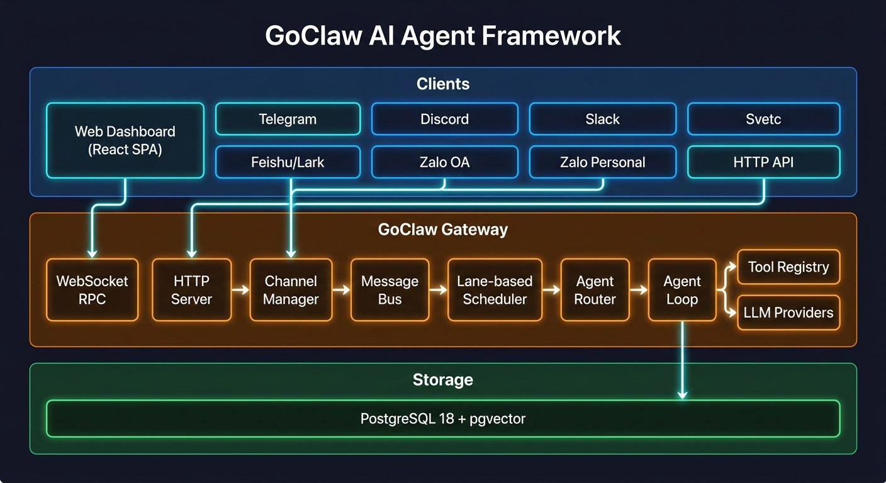
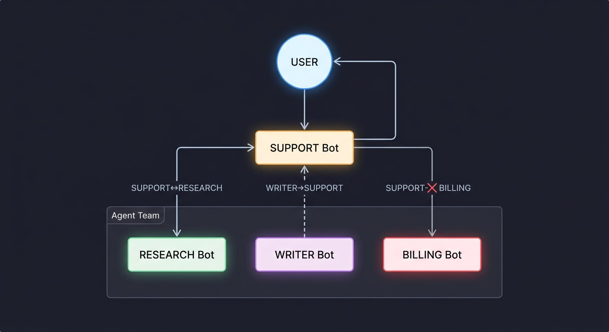
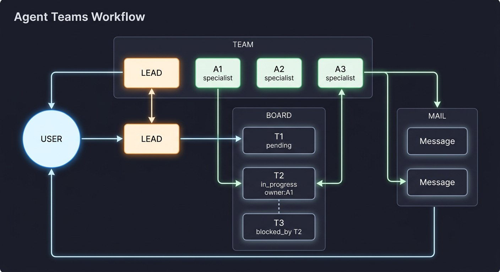

<p align="center">
  
</p>

<h1 align="center">GoClaw</h1>

<p align="center"><strong>Enterprise AI Agent Platform</strong></p>

<p align="center">
Multi-agent AI gateway built in Go. 20+ LLM providers. 7 channels. Multi-tenant PostgreSQL.<br/>
Single binary. Production-tested. Agents that orchestrate for you.
</p>

<p align="center">
  <a href="https://docs.goclaw.sh">Dokumentation</a> •
  <a href="https://docs.goclaw.sh/#quick-start">Hurtig Start</a> •
  <a href="https://x.com/nlb_io">Twitter / X</a>
</p>

<p align="center">
  <a href="https://go.dev/"></a>
  <a href="https://www.postgresql.org/"></a>
  <a href="https://www.docker.com/"></a>
  <a href="https://developer.mozilla.org/en-US/docs/Web/API/WebSocket"></a>
  <a href="https://opentelemetry.io/"></a>
  <a href="https://www.anthropic.com/"></a>
  <a href="https://openai.com/"></a>
  
</p>

**GoClaw** er en multi-agent AI-gateway, der forbinder LLM'er til dine værktøjer, kanaler og data — deployeret som en enkelt Go-binær uden runtime-afhængigheder. Den orkestrerer agent-teams og inter-agent-delegering på tværs af 20+ LLM-udbydere med fuld multi-tenant-isolation.

En Go-port af [OpenClaw](https://github.com/openclaw/openclaw) med forbedret sikkerhed, multi-tenant PostgreSQL og produktionsklar observabilitet.

🌐 **Sprog:**
[🇺🇸 English](../README.md) ·
[🇨🇳 简体中文](README.zh-CN.md) ·
[🇯🇵 日本語](README.ja.md) ·
[🇰🇷 한국어](README.ko.md) ·
[🇻🇳 Tiếng Việt](README.vi.md) ·
[🇵🇭 Tagalog](README.tl.md) ·
[🇪🇸 Español](README.es.md) ·
[🇧🇷 Português](README.pt.md) ·
[🇮🇹 Italiano](README.it.md) ·
[🇩🇪 Deutsch](README.de.md) ·
[🇫🇷 Français](README.fr.md) ·
[🇸🇦 العربية](README.ar.md) ·
[🇮🇳 हिन्दी](README.hi.md) ·
[🇷🇺 Русский](README.ru.md) ·
[🇧🇩 বাংলা](README.bn.md) ·
[🇮🇱 עברית](README.he.md) ·
[🇵🇱 Polski](README.pl.md) ·
[🇨🇿 Čeština](README.cs.md) ·
[🇳🇱 Nederlands](README.nl.md) ·
[🇹🇷 Türkçe](README.tr.md) ·
[🇺🇦 Українська](README.uk.md) ·
[🇮🇩 Bahasa Indonesia](README.id.md) ·
[🇹🇭 ไทย](README.th.md) ·
[🇵🇰 اردو](README.ur.md) ·
[🇷🇴 Română](README.ro.md) ·
[🇸🇪 Svenska](README.sv.md) ·
[🇬🇷 Ελληνικά](README.el.md) ·
[🇭🇺 Magyar](README.hu.md) ·
[🇫🇮 Suomi](README.fi.md) ·
[🇩🇰 Dansk](README.da.md) ·
[🇳🇴 Norsk](README.nb.md)

## Hvad Gør Det Anderledes

- **Agent-teams og orkestrering** — Teams med delte opgavetavler, inter-agent-delegering (synkron/asynkron) og hybrid agent-opdagelse
- **Multi-tenant PostgreSQL** — Per-bruger arbejdsrum, per-bruger kontekstfiler, krypterede API-nøgler (AES-256-GCM), isolerede sessioner
- **Enkelt binær** — ~25 MB statisk Go-binær, ingen Node.js-runtime, <1s opstartstid, kører på en $5 VPS
- **Produktionssikkerhed** — 5-lags tilladelsessystem (gateway-godkendelse → global værktøjspolitik → per-agent → per-kanal → kun ejere) plus hastighedsbegrænsning, prompt-injektionsdetektering, SSRF-beskyttelse, shell-nægtelsesmønstre og AES-256-GCM-kryptering
- **20+ LLM-udbydere** — Anthropic (native HTTP+SSE med prompt-caching), OpenAI, OpenRouter, Groq, DeepSeek, Gemini, Mistral, xAI, MiniMax, Cohere, Perplexity, DashScope, Bailian, Zai, Ollama, Ollama Cloud, Claude CLI, Codex, ACP og ethvert OpenAI-kompatibelt endpoint
- **7 beskedkanaler** — Telegram, Discord, Slack, Zalo OA, Zalo Personal, Feishu/Lark, WhatsApp
- **Extended Thinking** — Per-udbyder tænkningstilstand (Anthropic budget tokens, OpenAI reasoning effort, DashScope thinking budget) med streaming-understøttelse
- **Heartbeat** — Periodiske agent-check-ins via HEARTBEAT.md-tjeklister med undertrykkelse-ved-OK, aktive timer, genforsøgslogik og kanal-levering
- **Planlægning og Cron** — `at`, `every` og cron-udtryk til automatiserede agentopgaver med bane-baseret samtidighed
- **Observabilitet** — Indbygget LLM-opkaldssporing med spans og prompt-cache-metrikker, valgfri OpenTelemetry OTLP-eksport

## Claw-økosystemet

|                 | OpenClaw        | ZeroClaw | PicoClaw | **GoClaw**                              |
| --------------- | --------------- | -------- | -------- | --------------------------------------- |
| Sprog           | TypeScript      | Rust     | Go       | **Go**                                  |
| Binær størrelse | 28 MB + Node.js | 3.4 MB   | ~8 MB    | **~25 MB** (basis) / **~36 MB** (+ OTel) |
| Docker-image    | —               | —        | —        | **~50 MB** (Alpine)                     |
| RAM (inaktiv)   | > 1 GB          | < 5 MB   | < 10 MB  | **~35 MB**                              |
| Opstart         | > 5 s           | < 10 ms  | < 1 s    | **< 1 s**                               |
| Målhardware     | $599+ Mac Mini  | $10 edge | $10 edge | **$5 VPS+**                             |

| Funktion                   | OpenClaw                             | ZeroClaw                                     | PicoClaw                              | **GoClaw**                     |
| -------------------------- | ------------------------------------ | -------------------------------------------- | ------------------------------------- | ------------------------------ |
| Multi-tenant (PostgreSQL)  | —                                    | —                                            | —                                     | ✅                             |
| MCP-integration            | — (bruger ACP)                       | —                                            | —                                     | ✅ (stdio/SSE/streamable-http) |
| Agent-teams                | —                                    | —                                            | —                                     | ✅ Opgavetavle + postkasse     |
| Sikkerhedshærdning         | ✅ (SSRF, stiovergang, injektion)    | ✅ (sandkasse, hastighedsbegrænsning, injektion, parring) | Grundlæggende (arbejdsrum-begrænsning, exec-nægtelse) | ✅ 5-lags forsvar |
| OTel-observabilitet        | ✅ (opt-in udvidelse)                | ✅ (Prometheus + OTLP)                       | —                                     | ✅ OTLP (opt-in build tag)     |
| Prompt-caching             | —                                    | —                                            | —                                     | ✅ Anthropic + OpenAI-compat   |
| Videngraf                  | —                                    | —                                            | —                                     | ✅ LLM-udtrækning + gennemgang |
| Skill-system               | ✅ Embeddings/semantisk              | ✅ SKILL.md + TOML                           | ✅ Grundlæggende                      | ✅ BM25 + pgvector hybrid      |
| Bane-baseret planlægger    | ✅                                   | Begrænset samtidighed                        | —                                     | ✅ (main/subagent/team/cron)   |
| Beskedkanaler              | 37+                                  | 15+                                          | 10+                                   | 7+                             |
| Ledsager-apps              | macOS, iOS, Android                  | Python SDK                                   | —                                     | Web-dashboard                  |
| Live Canvas / Voice        | ✅ (A2UI + TTS/STT)                  | —                                            | Stemmeskrivning                       | TTS (4 udbydere)               |
| LLM-udbydere               | 10+                                  | 8 native + 29 compat                         | 13+                                   | **20+**                        |
| Per-bruger arbejdsrum      | ✅ (filbaseret)                      | —                                            | —                                     | ✅ (PostgreSQL)                |
| Krypterede hemmeligheder   | — (kun env-variabler)                | ✅ ChaCha20-Poly1305                         | — (klartekst JSON)                    | ✅ AES-256-GCM i DB            |

## Arkitektur

<p align="center">
  
</p>

## Hurtig Start

**Forudsætninger:** Go 1.26+, PostgreSQL 18 med pgvector, Docker (valgfrit)

### Fra Kildekode

```bash
git clone https://github.com/nextlevelbuilder/goclaw.git && cd goclaw
make build
./goclaw onboard        # Interaktiv opsætningsguide
source .env.local && ./goclaw
```

### Med Docker

```bash
# Generer .env med auto-genererede hemmeligheder
chmod +x prepare-env.sh && ./prepare-env.sh

# Tilføj mindst én GOCLAW_*_API_KEY til .env, derefter:
docker compose -f docker-compose.yml -f docker-compose.postgres.yml \
  -f docker-compose.selfservice.yml up -d

# Web Dashboard på http://localhost:3000
# Sundhedstjek: curl http://localhost:18790/health
```

Når `GOCLAW_*_API_KEY`-miljøvariabler er sat, onboarder gatewayen automatisk uden interaktive prompter — registrerer udbyder, kører migrationer og seeder standarddata.

> For build-varianter (OTel, Tailscale, Redis), Docker-image-tags og compose-overlays, se [Deployeringsguide](https://docs.goclaw.sh/#deploy-docker-compose).

## Multi-Agent-orkestrering

GoClaw understøtter agent-teams og inter-agent-delegering — hver agent kører med sin egen identitet, værktøjer, LLM-udbyder og kontekstfiler.

### Agent-delegering

<p align="center">
  
</p>

| Tilstand | Sådan fungerer det | Bedst til |
|----------|--------------------|-----------|
| **Synkron** | Agent A spørger Agent B og **venter** på svaret | Hurtige opslag, faktakontrol |
| **Asynkron** | Agent A spørger Agent B og **fortsætter**. B annoncerer senere | Lange opgaver, rapporter, dybdegående analyse |

Agenter kommunikerer via eksplicitte **tilladelseslinks** med retningskontrol (`outbound`, `inbound`, `bidirectional`) og samtidige begrænsninger på både per-link- og per-agent-niveau.

### Agent-teams

<p align="center">
  
</p>

- **Delt opgavetavle** — Opret, påkræv, afslut og søg opgaver med `blocked_by`-afhængigheder
- **Team-postkasse** — Direkte peer-to-peer-beskeder og broadcasts
- **Værktøjer**: `team_tasks` til opgavestyring, `team_message` til postkassen

> For delegationsdetaljer, tilladelseslinks og samtidige begrænsninger, se [Agent Teams-dokumentationen](https://docs.goclaw.sh/#teams-what-are-teams).

## Indbyggede Værktøjer

| Værktøj            | Gruppe        | Beskrivelse                                                  |
| ------------------ | ------------- | ------------------------------------------------------------ |
| `read_file`        | fs            | Læs filindhold (med virtuel FS-routing)                      |
| `write_file`       | fs            | Skriv/opret filer                                            |
| `edit_file`        | fs            | Anvend målrettede redigeringer på eksisterende filer         |
| `list_files`       | fs            | Vis mappeindhold                                             |
| `search`           | fs            | Søg filindhold efter mønster                                 |
| `glob`             | fs            | Find filer med glob-mønster                                  |
| `exec`             | runtime       | Udfør shell-kommandoer (med godkendelsesworkflow)            |
| `web_search`       | web           | Søg på nettet (Brave, DuckDuckGo)                            |
| `web_fetch`        | web           | Hent og fortolk webindhold                                   |
| `memory_search`    | memory        | Søg i langtidshukommelse (FTS + vector)                      |
| `memory_get`       | memory        | Hent hukommelsesposter                                       |
| `skill_search`     | —             | Søg skills (BM25 + embedding hybrid)                         |
| `knowledge_graph_search` | memory  | Søg entiteter og gennemgå videngraf-relationer               |
| `create_image`     | media         | Billedgenerering (DashScope, MiniMax)                        |
| `create_audio`     | media         | Lydgenerering (OpenAI, ElevenLabs, MiniMax, Suno)            |
| `create_video`     | media         | Videogenerering (MiniMax, Veo)                               |
| `read_document`    | media         | Dokumentlæsning (Gemini File API, udbyderchain)              |
| `read_image`       | media         | Billedanalyse                                                |
| `read_audio`       | media         | Lydtransskription og -analyse                                |
| `read_video`       | media         | Videoanalyse                                                 |
| `message`          | messaging     | Send beskeder til kanaler                                    |
| `tts`              | —             | Text-to-Speech-syntese                                       |
| `spawn`            | —             | Opret en subagent                                            |
| `subagents`        | sessions      | Styr kørende subagenter                                      |
| `team_tasks`       | teams         | Delt opgavetavle (vis, opret, påkræv, afslut, søg)           |
| `team_message`     | teams         | Team-postkasse (send, broadcast, læs)                        |
| `sessions_list`    | sessions      | Vis aktive sessioner                                         |
| `sessions_history` | sessions      | Vis sessionshistorik                                         |
| `sessions_send`    | sessions      | Send besked til en session                                   |
| `sessions_spawn`   | sessions      | Opret en ny session                                          |
| `session_status`   | sessions      | Tjek sessionsstatus                                          |
| `cron`             | automation    | Planlæg og administrer cron-job                              |
| `gateway`          | automation    | Gateway-administration                                       |
| `browser`          | ui            | Browser-automatisering (naviger, klik, skriv, skærmbillede)  |
| `announce_queue`   | automation    | Asynkron resultatannoncering (til asynkrone delegeringer)    |

## Dokumentation

Fuld dokumentation på **[docs.goclaw.sh](https://docs.goclaw.sh)** — eller gennemse kilden i [`goclaw-docs/`](https://github.com/nextlevelbuilder/goclaw-docs)

| Sektion | Emner |
|---------|-------|
| [Kom i gang](https://docs.goclaw.sh/#what-is-goclaw) | Installation, Hurtig Start, Konfiguration, Web Dashboard-rundvisning |
| [Kernebegreber](https://docs.goclaw.sh/#how-goclaw-works) | Agent Loop, Sessioner, Værktøjer, Hukommelse, Multi-Tenancy |
| [Agenter](https://docs.goclaw.sh/#creating-agents) | Opret agenter, Kontekstfiler, Personlighed, Deling og adgang |
| [Udbydere](https://docs.goclaw.sh/#providers-overview) | Anthropic, OpenAI, OpenRouter, Gemini, DeepSeek, +15 flere |
| [Kanaler](https://docs.goclaw.sh/#channels-overview) | Telegram, Discord, Slack, Feishu, Zalo, WhatsApp, WebSocket |
| [Agent-teams](https://docs.goclaw.sh/#teams-what-are-teams) | Teams, Opgavetavle, Beskeder, Delegering og overdragelse |
| [Avanceret](https://docs.goclaw.sh/#custom-tools) | Brugerdefinerede værktøjer, MCP, Skills, Cron, Sandkasse, Hooks, RBAC |
| [Deployering](https://docs.goclaw.sh/#deploy-docker-compose) | Docker Compose, Database, Sikkerhed, Observabilitet, Tailscale |
| [Reference](https://docs.goclaw.sh/#cli-commands) | CLI-kommandoer, REST API, WebSocket-protokol, Miljøvariabler |

## Test

```bash
go test ./...                                    # Enhedstests
go test -v ./tests/integration/ -timeout 120s    # Integrationstests (kræver kørende gateway)
```

## Projektstatus

Se [CHANGELOG.md](CHANGELOG.md) for detaljeret funktionsstatus, herunder hvad der er testet i produktion, og hvad der stadig er under udvikling.

## Anerkendelser

GoClaw er bygget på det originale [OpenClaw](https://github.com/openclaw/openclaw)-projekt. Vi er taknemmelige for den arkitektur og vision, der inspirerede denne Go-port.

## Licens

MIT
