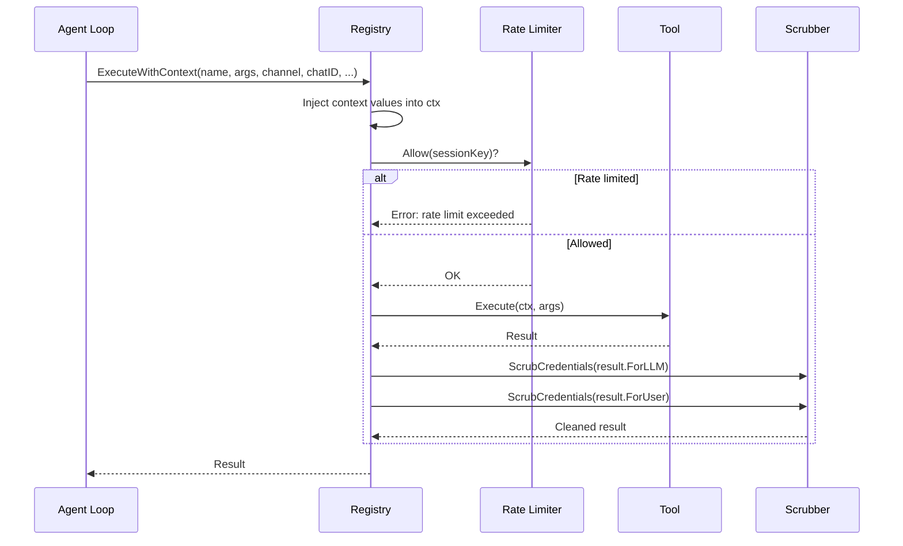
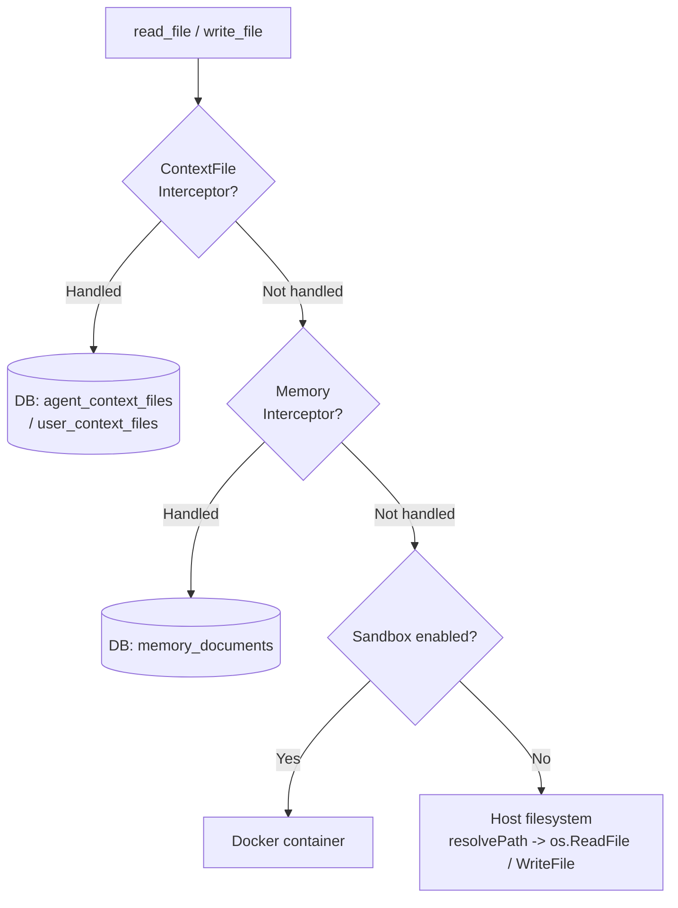
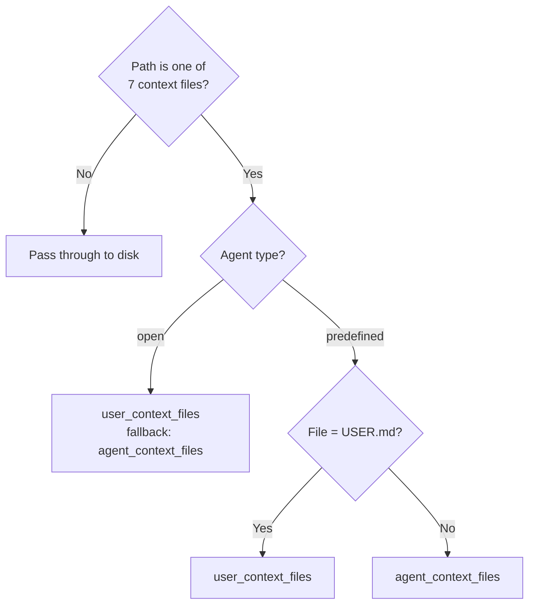
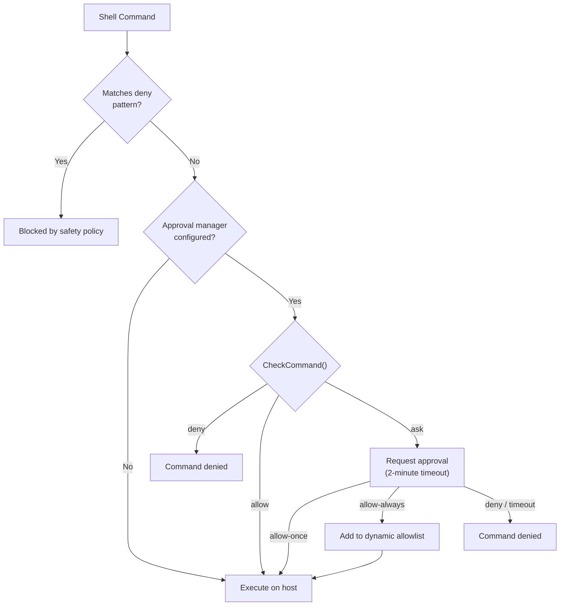
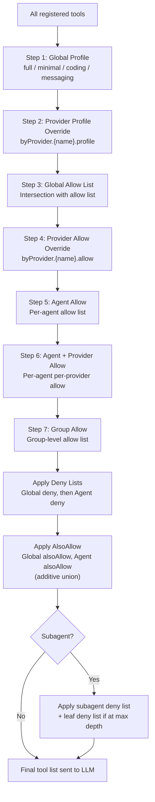
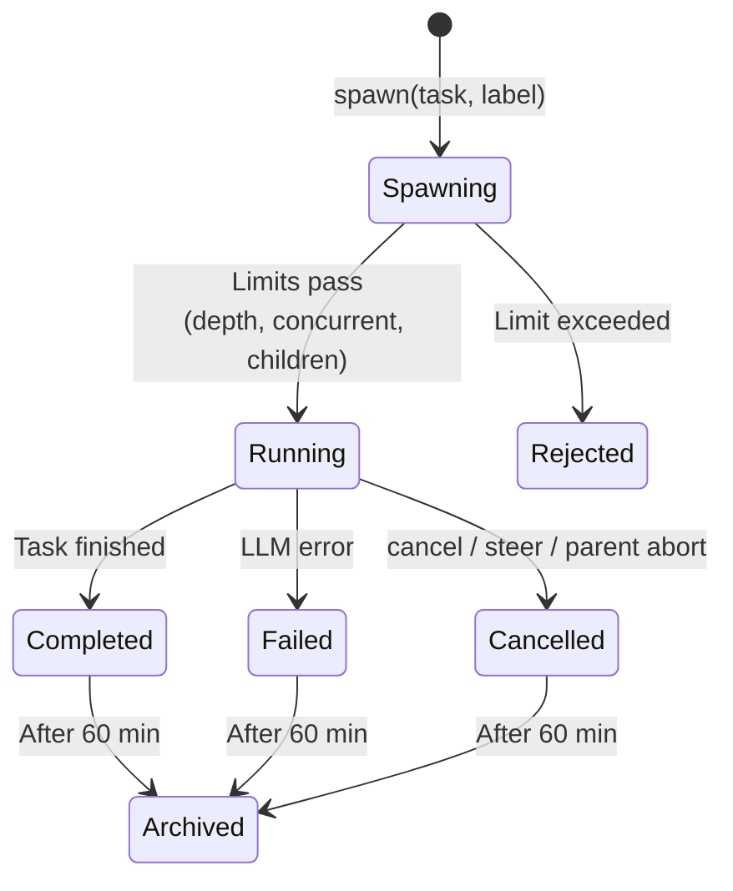
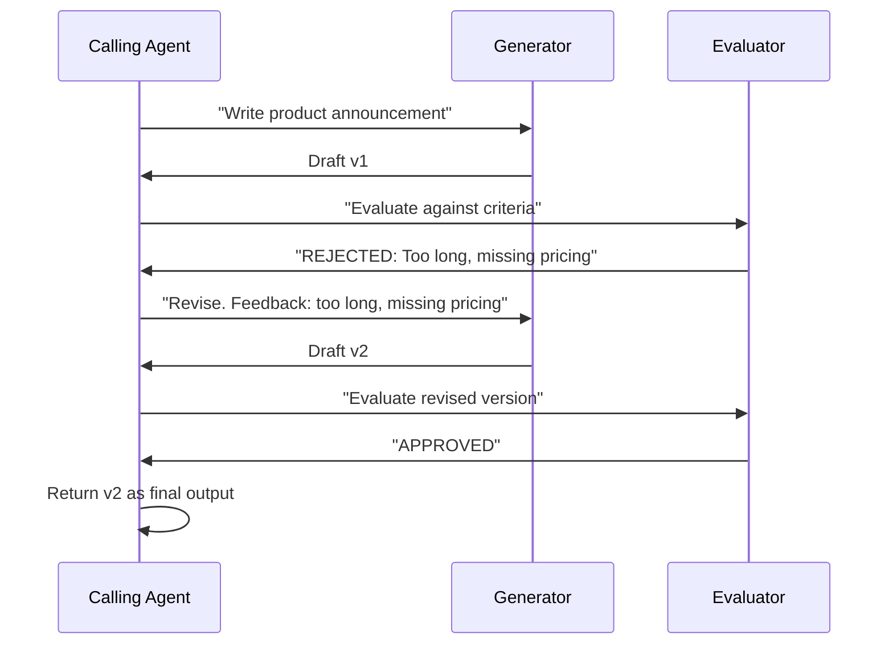
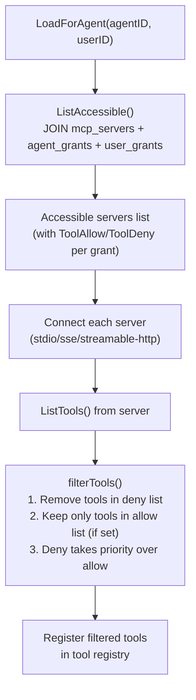
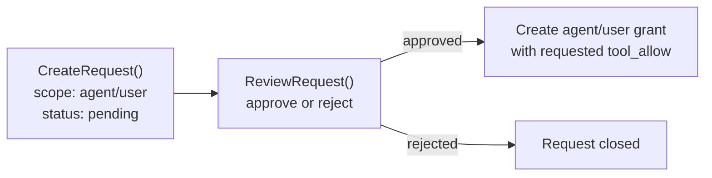
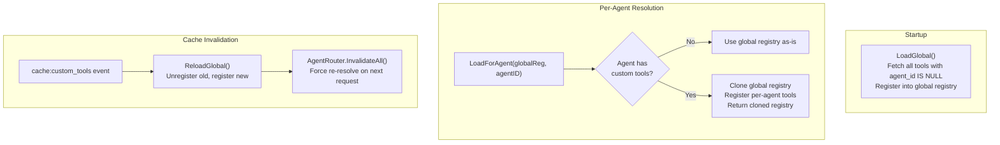

# 03 - Tools System

The tools system is the bridge between the agent loop and the external environment. When the LLM emits a tool call, the agent loop delegates execution to the tool registry, which handles rate limiting, credential scrubbing, policy enforcement, and virtual filesystem routing before returning results for the next LLM iteration.

---

## 1. Tool Execution Flow



ExecuteWithContext performs 8 steps:

1. Lock registry, find tool by name, unlock
2. Inject `WithToolChannel(ctx, channel)`
3. Inject `WithToolChatID(ctx, chatID)`
4. Inject `WithToolPeerKind(ctx, peerKind)`
5. Inject `WithToolSandboxKey(ctx, sessionKey)`
6. Rate limit check via `rateLimiter.Allow(sessionKey)`
7. Execute `tool.Execute(ctx, args)`
8. Scrub credentials from both `ForLLM` and `ForUser` output, log duration

Context keys ensure each tool call receives the correct per-call values without mutable fields, allowing tool instances to be shared safely across concurrent goroutines.

---

## 2. Complete Tool Inventory

### Filesystem (group: `fs`)

| Tool | Description |
|------|-------------|
| `read_file` | Read file contents with optional line range |
| `write_file` | Write or create a file |
| `edit_file` | Apply targeted edits to a file |
| `list_files` | List directory contents |
| `search` | Search file contents with regex |
| `glob` | Find files matching a glob pattern |

### Runtime (group: `runtime`)

| Tool | Description |
|------|-------------|
| `exec` | Execute a shell command |
| `process` | Manage running processes |

### Web (group: `web`)

| Tool | Description |
|------|-------------|
| `web_search` | Search the web |
| `web_fetch` | Fetch and parse a URL |

### Memory (group: `memory`)

| Tool | Description |
|------|-------------|
| `memory_search` | Search memory documents |
| `memory_get` | Retrieve a specific memory document |

### Sessions (group: `sessions`)

| Tool | Description |
|------|-------------|
| `sessions_list` | List active sessions |
| `sessions_history` | View session message history |
| `sessions_send` | Send a message to a session |
| `spawn` | Spawn subagent or delegate to another agent |
| `session_status` | Get current session status |

### UI (group: `ui`)

| Tool | Description |
|------|-------------|
| `browser` | Browser automation via Rod + CDP |
| `canvas` | Visual canvas operations |

### Automation (group: `automation`)

| Tool | Description |
|------|-------------|
| `cron` | Manage scheduled tasks |
| `gateway` | Gateway administration commands |

### Messaging (group: `messaging`)

| Tool | Description |
|------|-------------|
| `message` | Send a message to a channel |
| `create_forum_topic` | Create a Telegram forum topic |

### Delegation (group: `delegation`)

| Tool | Description |
|------|-------------|
| `delegate` | Delegate task to another agent (actions: delegate, cancel, list, history) |
| `delegate_search` | Hybrid FTS + semantic agent discovery for delegation targets |
| `evaluate_loop` | Generate-evaluate-revise cycle with two agents (max 5 rounds) |
| `handoff` | Transfer conversation to another agent (routing override) |

### Teams (group: `teams`)

| Tool | Description |
|------|-------------|
| `team_tasks` | Task board: list, create, claim, complete, search |
| `team_message` | Mailbox: send, broadcast, read unread messages |

### Other Tools

| Tool | Description |
|------|-------------|
| `skill_search` | Search available skills (BM25 + vector) |
| `image` | Generate images |
| `read_image` | Read/analyze an image file |
| `create_image` | Create an image from description |
| `tts` | Text-to-speech synthesis (OpenAI, ElevenLabs, Edge, MiniMax) |
| `nodes` | Node graph operations |

---

## 3. Filesystem Tools and Virtual FS Routing

Filesystem operations are intercepted before hitting the host disk. Two interceptor layers route specific paths to the database instead.



### ContextFileInterceptor -- 7 Routed Files

| File | Description |
|------|-------------|
| `SOUL.md` | Agent personality and behavior |
| `IDENTITY.md` | Agent identity information |
| `AGENTS.md` | Sub-agent definitions |
| `TOOLS.md` | Tool usage guidance |
| `USER.md` | Per-user preferences and context |
| `BOOTSTRAP.md` | First-run instructions (write empty = delete row) |

### Routing by Agent Type



- **Open agents**: All 7 files are per-user. If a user file does not exist, the agent-level template is returned as fallback.
- **Predefined agents**: Only `USER.md` is per-user. All other files come from the agent-level store.

### MemoryInterceptor

Routes `MEMORY.md`, `memory.md`, and `memory/*` paths. Per-user results take priority with a fallback to global scope. Writing a `.md` file automatically triggers `IndexDocument()` (chunking + embedding).

### PathDenyable Interface

Tools that access the filesystem implement the `PathDenyable` interface, allowing specific path prefixes to be denied at runtime:

```go
type PathDenyable interface {
    DenyPaths(...string)
}
```

All four filesystem tools (`read_file`, `write_file`, `list_files`, `edit_file`) implement it. `list_files` additionally filters denied directories from its output entirely -- the agent doesn't even know the directory exists. Used to prevent agents from accessing `.goclaw` directories within workspaces.

### Workspace Context Injection

Filesystem and shell tools read their workspace from `ToolWorkspaceFromCtx(ctx)`, which is injected by the agent loop based on the current user and agent. This enables per-user workspace isolation without changing any tool code. Falls back to the struct field for backward compatibility.

### Path Security

`resolvePath()` joins relative paths with the workspace root, applies `filepath.Clean()`, and verifies the result with `HasPrefix()`. This prevents path traversal attacks (e.g., `../../../etc/passwd`). The extended `resolvePathWithAllowed()` permits additional prefixes for skills directories.

---

## 4. Shell Execution

The `exec` tool allows the LLM to run shell commands, with multiple defense layers.

### Credentialed CLI Tools

**Direct Exec Mode** allows secure credential injection for CLI tools without exposing credentials via shell. Credentials are auto-injected as environment variables directly into the child process (no shell involved).

**How it works:**
1. **Credential lookup** — Administrator configures binary → encrypted env vars in `secure_cli_binaries` table
2. **Shell operator detection** — Blocks unsafe command chaining (`;`, `|`, `&&`, `||`, `>`, `<`, `$()`, backticks)
3. **Path verification** — Binary is resolved to absolute path and matched against configured path
4. **Per-binary deny check** — Optional regex patterns block specific arguments (e.g., `auth\s+`, `ssh-key`)
5. **Direct exec** — Command runs as `exec.CommandContext(binary, args...)` with credentials in env

**Available presets:** `gh`, `gcloud`, `aws`, `kubectl`, `terraform`

**Security layers:**
- **No shell** — Direct exec prevents shell command injection
- **Path verification** — Binary spoofing (e.g., `./gh` in workspace) is blocked
- **Per-binary deny** — Admins can block sensitive operations per CLI
- **Output scrubbing** — Credential values registered for automatic redaction

**Configuration (JSON in `secure_cli_binaries` table):**
```json
{
  "binary_name": "gh",
  "encrypted_env": {"GH_TOKEN": "ghp_..."},
  "deny_args": ["auth\\s+", "ssh-key"],
  "deny_verbose": ["--verbose", "-v"],
  "timeout_seconds": 30,
  "tips": "GitHub CLI. Available: gh api, gh repo, gh issue, etc."
}
```

---

### Deny Patterns

| Category | Blocked Patterns |
|----------|------------------|
| Destructive file ops | `rm -rf`, `del /f`, `rmdir /s` |
| Disk destruction | `mkfs`, `dd if=`, `> /dev/sd*` |
| System control | `shutdown`, `reboot`, `poweroff` |
| Fork bombs | `:(){ ... };:` |
| Remote code exec | `curl \| sh`, `wget -O - \| sh` |
| Reverse shells | `/dev/tcp/`, `nc -e` |
| Eval injection | `eval $()`, `base64 -d \| sh` |

### Approval Workflow



### Sandbox Routing

When a sandbox manager is configured and a `sandboxKey` exists in context, commands execute inside a Docker container. The host working directory maps to `/workspace` in the container. Host timeout is 60 seconds; sandbox timeout is 300 seconds. If sandbox returns `ErrSandboxDisabled`, execution falls back to the host.

---

## 5. Policy Engine

The policy engine determines which tools the LLM can use through a 7-step allow pipeline followed by deny subtraction and additive alsoAllow.



### Profiles

| Profile | Tools Included |
|---------|---------------|
| `full` | All registered tools (no restriction) |
| `coding` | `group:fs`, `group:runtime`, `group:sessions`, `group:memory`, `group:web`, `read_image`, `create_image`, `skill_search` |
| `messaging` | `group:messaging`, `group:web`, `group:sessions`, `read_image`, `skill_search` |
| `minimal` | `session_status` only |

### Tool Groups

| Group | Members |
|-------|---------|
| `fs` | `read_file`, `write_file`, `list_files`, `edit`, `search`, `glob` |
| `runtime` | `exec` |
| `web` | `web_search`, `web_fetch` |
| `memory` | `memory_search`, `memory_get` |
| `sessions` | `sessions_list`, `sessions_history`, `sessions_send`, `spawn`, `session_status` |
| `ui` | `browser` |
| `automation` | `cron` |
| `messaging` | `message`, `create_forum_topic` |
| `delegation` | `handoff`, `delegate_search`, `evaluate_loop` |
| `team` | `team_tasks`, `team_message` |
| `goclaw` | All native tools (composite group) |

Groups can be referenced in allow/deny lists with the `group:` prefix (e.g., `group:fs`). The MCP manager dynamically registers `mcp` and `mcp:{serverName}` groups at runtime.

### Per-Request Tool Allow List

In addition to the static policy pipeline, channels can inject a per-request tool allow list via message metadata. For example, Telegram forum topics can restrict tools per-topic (see [05-channels-messaging.md](./05-channels-messaging.md) Section 5). The allow list is applied as a final intersection step after the policy pipeline completes.

---

## 6. Subagent System

Subagents are child agent instances spawned to handle parallel or complex tasks. They run in background goroutines with restricted tool access.

### Lifecycle



### Limits

| Constraint | Default | Description |
|------------|---------|-------------|
| MaxConcurrent | 8 | Total running subagents across all parents |
| MaxSpawnDepth | 1 | Maximum nesting depth |
| MaxChildrenPerAgent | 5 | Maximum children per parent agent |
| ArchiveAfterMinutes | 60 | Auto-archive completed tasks |
| Max iterations | 20 | LLM loop iterations per subagent |

### Subagent Actions

| Action | Behavior |
|--------|----------|
| `spawn` (async) | Launch in goroutine, return immediately with acceptance message |
| `run` (sync) | Block until subagent completes, return result directly |
| `list` | List all subagent tasks with status |
| `cancel` | Cancel by specific ID, `"all"`, or `"last"` |
| `steer` | Cancel + settle 500ms + respawn with new message |

### Tool Deny Lists

| List | Denied Tools |
|------|-------------|
| Always denied (all depths) | `gateway`, `agents_list`, `whatsapp_login`, `session_status`, `cron`, `memory_search`, `memory_get`, `sessions_send` |
| Leaf denied (max depth) | `sessions_list`, `sessions_history`, `sessions_spawn`, `spawn`, `subagent` |

Results are announced back to the parent agent via the message bus, optionally batched through an AnnounceQueue with debouncing.

---

## 7. Delegation System

Delegation allows named agents to delegate tasks to other fully independent agents (each with its own identity, tools, provider, model, and context files). Unlike subagents (anonymous clones), delegation crosses agent boundaries via explicit permission links.

### DelegateManager

The `DelegateManager` in `internal/tools/delegate.go` orchestrates all delegation operations:

| Action | Mode | Behavior |
|--------|------|----------|
| `delegate` | `sync` | Caller waits for result (quick lookups, fact checks) |
| `delegate` | `async` | Caller moves on; result announced later via message bus (`delegate:{id}`) |
| `cancel` | -- | Cancel a running async delegation by ID |
| `list` | -- | List active delegations |
| `history` | -- | Query past delegations from `delegation_history` table |

### Callback Pattern

The `tools` package cannot import `agent` (import cycle). A callback function bridges the gap:

```go
type AgentRunFunc func(ctx context.Context, agentKey string, req DelegateRunRequest) (*DelegateRunResult, error)
```

The `cmd` layer provides the implementation at wiring time. The `tools` package never knows `agent` exists.

### Agent Links (Permission Control)

Delegation requires an explicit link in the `agent_links` table. Links are directed edges:

- **outbound** (A→B): Only A can delegate to B
- **bidirectional** (A↔B): Both can delegate to each other

Each link has `max_concurrent` and per-user `settings` (JSONB) for deny/allow lists.

### Concurrency Control

Two layers prevent overload:

| Layer | Config | Scope |
|-------|--------|-------|
| Per-link | `agent_links.max_concurrent` | A→B specifically |
| Per-agent | `other_config.max_delegation_load` | B from all sources |

When limits hit, the error message is written for LLM reasoning: *"Agent at capacity (5/5). Try a different agent or handle it yourself."*

### DELEGATION.md Auto-Injection

During agent resolution, `DELEGATION.md` is auto-generated and injected into the system prompt:

- **≤15 targets**: Full inline list with agent keys, names, and frontmatter
- **>15 targets**: Search instruction pointing to the `delegate_search` tool (hybrid FTS + pgvector cosine)

### Context File Merging (Open Agents)

For open agents, per-user context files merge with resolver-injected base files. Per-user files override same-name base files, but base-only files like `DELEGATION.md` are preserved:

```
Base files (resolver):     DELEGATION.md
Per-user files (DB):       AGENTS.md, SOUL.md, TOOLS.md, USER.md, ...
Merged result:             AGENTS.md, SOUL.md, TOOLS.md, USER.md, ..., DELEGATION.md ✓
```

---

## 8. Agent Teams

Teams add a shared coordination layer on top of delegation: a task board for parallel work and a mailbox for peer-to-peer communication.

### Architecture

An admin creates a team via the dashboard, assigns a **lead** and **members**. When a user messages the lead:
1. The lead sees `TEAM.md` in its system prompt (teammate list + role)
2. The lead posts tasks to the board
3. Teammates are activated, claim tasks, and work in parallel
4. Teammates message each other for coordination
5. The lead synthesizes results and replies to the user

### Task Board (`team_tasks` tool)

| Action | Description |
|--------|-------------|
| `list` | List tasks (filter: active/completed/all, order: priority/newest) |
| `create` | Create task with subject, description, priority, blocked_by |
| `claim` | Atomically claim a pending task (race-safe via row-level lock) |
| `complete` | Mark task done with result; auto-unblocks dependent tasks |
| `search` | FTS search over task subject + description |

### Mailbox (`team_message` tool)

| Action | Description |
|--------|-------------|
| `send` | Send direct message to a specific teammate |
| `broadcast` | Send message to all teammates |
| `read` | Read unread messages |

### Lead-Centric Design

Only the lead gets `TEAM.md` in its system prompt. Teammates discover context on demand through tools -- no wasted tokens on idle agents. When a teammate message arrives, the message itself carries context (e.g., *"[Team message from lead]: please claim a task from the board."*).

### Message Routing

Teammate results route through the message bus with a `"teammate:"` prefix. The consumer publishes the outbound response so the lead (and ultimately the user) sees the result.

---

## 9. Evaluate-Optimize Loop

A structured revision cycle between two agents: a generator and an evaluator.



The `evaluate_loop` tool orchestrates this. Parameters: generator agent, evaluator agent, pass criteria, and max rounds (default 3, cap 5). Each round is a pair of sync delegations. If the evaluator responds with "APPROVED" (case-insensitive prefix match), the loop exits. If "REJECTED: feedback", the generator gets another shot.

Internal delegations use `WithSkipHooks(ctx)` to prevent quality gates from triggering recursion.

---

## 10. Agent Handoff

Handoff transfers a conversation from one agent to another. Unlike delegation (which keeps the source agent in the loop), handoff removes it entirely.

| | Delegation | Handoff |
|---|---|---|
| Who talks to the user? | Source agent (always) | Target agent (after transfer) |
| Source agent involvement | Waits for result, reformulates | Steps away completely |
| Session | Target runs in source's context | Target gets a new session |
| Duration | One task | Until cleared or handed back |

### Mechanism

When agent A calls `handoff(agent="billing", reason="billing question")`:
1. A row is written to `handoff_routes`: this channel + chat ID now routes to billing
2. A `handoff` event is broadcast (WS clients can react)
3. An initial message is published to billing via the message bus with conversation context

Subsequent messages from the user on that channel are routed to billing (consumer checks `handoff_routes` before normal routing). Billing can hand back via `handoff(action="clear")`.

---

## 11. Quality Gates (Hook System)

A general-purpose hook system for validating agent output before it reaches the user. Located in `internal/hooks/`.

### Evaluator Types

| Type | How it works | Example |
|------|-------------|---------|
| **command** | Run a shell command. Exit 0 = pass. Stderr = feedback. | `npm test`, `eslint --stdin` |
| **agent** | Delegate to a reviewer agent. Parse "APPROVED" or "REJECTED: feedback". | QA reviewer checks tone/accuracy |

### Configuration

Quality gates live in the source agent's `other_config` JSON:

```json
{
  "quality_gates": [
    {
      "event": "delegation.completed",
      "type": "agent",
      "agent": "qa-reviewer",
      "block_on_failure": true,
      "max_retries": 2
    }
  ]
}
```

When `block_on_failure` is true and retries remain, the system re-runs the target agent with the evaluator's feedback injected as a revision prompt.

### Recursion Prevention

Quality gates with agent evaluators can cause infinite recursion (gate delegates to reviewer → reviewer completes → gate fires again). The fix is a context flag: `hooks.WithSkipHooks(ctx, true)`. Three places set it:
1. **Agent evaluator** -- when delegating to the reviewer
2. **Evaluate loop** -- for all internal generator/evaluator delegations
3. **Agent eval callback in cmd layer** -- when the hook engine itself triggers delegation

`DelegateManager.Delegate()` checks `hooks.SkipHooksFromContext(ctx)` before applying gates. If set, gates are skipped.

---

## 12. MCP Bridge Tools

GoClaw integrates with Model Context Protocol (MCP) servers via `internal/mcp/`. The MCP Manager connects to external tool servers and registers their tools in the tool registry with a configurable prefix.

### Transports

| Transport | Description |
|-----------|-------------|
| `stdio` | Launch process with command + args, communicate via stdin/stdout |
| `sse` | Connect to SSE endpoint via URL |
| `streamable-http` | Connect to HTTP streaming endpoint |

### Behavior

- Health checks run every 30 seconds per server
- Reconnection uses exponential backoff (2s initial, 60s max, 10 attempts)
- Tools are registered with a prefix (e.g., `mcp_servername_toolname`)
- Dynamic tool group registration: `mcp` and `mcp:{serverName}` groups

### Access Control

MCP server access is controlled through per-agent and per-user grants stored in PostgreSQL.



**Grant types**:

| Grant | Table | Scope | Fields |
|-------|-------|-------|--------|
| Agent grant | `mcp_agent_grants` | Per server + agent | `tool_allow`, `tool_deny` (JSONB arrays), `config_overrides`, `enabled` |
| User grant | `mcp_user_grants` | Per server + user | `tool_allow`, `tool_deny` (JSONB arrays), `enabled` |

**Access request workflow**: Users can request access to MCP servers. Admins review and approve or reject. On approval, a corresponding grant is created transactionally.



---

## 13. Custom Tools

Define shell-based tools at runtime via the HTTP API -- no recompile or restart needed. Custom tools are stored in the `custom_tools` PostgreSQL table and loaded dynamically into the agent's tool registry.

### Lifecycle



### Scope

| Scope | `agent_id` | Behavior |
|-------|-----------|----------|
| Global | `NULL` | Available to all agents |
| Per-agent | UUID | Available only to the specified agent |

### Command Execution

1. **Template rendering**: `{{.key}}` placeholders replaced with shell-escaped argument values (single-quote wrapping with embedded quote escaping)
2. **Deny pattern check**: Same deny patterns as the `exec` tool (blocks `curl|sh`, reverse shells, etc.)
3. **Execution**: `sh -c <rendered_command>` with configurable timeout (default 60s) and optional working directory
4. **Environment variables**: Stored encrypted (AES-256-GCM) in the database, decrypted at runtime and injected into the command environment

### JSON Config Example

```json
{
  "name": "dns_lookup",
  "description": "Look up DNS records for a domain",
  "parameters": {
    "type": "object",
    "properties": {
      "domain": { "type": "string", "description": "Domain name" },
      "record_type": { "type": "string", "enum": ["A", "AAAA", "MX", "CNAME", "TXT"] }
    },
    "required": ["domain"]
  },
  "command": "dig +short {{.record_type}} {{.domain}}",
  "timeout_seconds": 10,
  "enabled": true
}
```

---

## 14. Credential Scrubbing

Tool output is automatically scrubbed before being returned to the LLM. Enabled by default in the registry.

### Static Patterns

| Type | Pattern |
|------|---------|
| OpenAI | `sk-[a-zA-Z0-9]{20,}` |
| Anthropic | `sk-ant-[a-zA-Z0-9-]{20,}` |
| GitHub PAT | `ghp_`, `gho_`, `ghu_`, `ghs_`, `ghr_` + 36 alphanumeric characters |
| AWS | `AKIA[A-Z0-9]{16}` |
| Generic key-value | `(api_key\|token\|secret\|password\|bearer\|authorization)[:=]value` (case-insensitive) |
| Connection strings | `postgres://`, `mysql://`, `mongodb://`, `redis://` patterns |
| Env var patterns | `KEY=`, `SECRET=`, `CREDENTIAL=`, `DSN=`, `VIRTUAL_*=` patterns |
| Long hex strings | 64+ character hex strings (potential encryption keys) |

All matches are replaced with `[REDACTED]`.

### Dynamic Scrubbing

In addition to static patterns, values can be registered at runtime for scrubbing. This is used for server IPs and other deployment-specific secrets that are not known at compile time. The `AddDynamicScrubValues()` function thread-safely adds values to a scrub list that is checked alongside static patterns.

---

## 15. Rate Limiter

The tool registry supports per-session rate limiting via `ToolRateLimiter`. When configured, each `ExecuteWithContext` call checks `rateLimiter.Allow(sessionKey)` before tool execution. Rate-limited calls receive an error result without executing the tool.

---

## File Reference

| File | Purpose |
|------|---------|
| `internal/tools/registry.go` | Registry: Register, Execute, ExecuteWithContext, ProviderDefs |
| `internal/tools/types.go` | Tool interface, ContextualTool, InterceptorAware, and other config interfaces |
| `internal/tools/policy.go` | PolicyEngine: 7-step pipeline, tool groups, profiles, subagent deny lists |
| `internal/tools/filesystem.go` | read_file, write_file, edit_file with interceptor support |
| `internal/tools/filesystem_list.go` | list_files tool |
| `internal/tools/filesystem_write.go` | Additional write operations |
| `internal/tools/shell.go` | ExecTool: deny patterns, approval workflow, sandbox routing |
| `internal/tools/scrub.go` | ScrubCredentials: credential pattern matching and redaction |
| `internal/tools/subagent.go` | SubagentManager: spawn, cancel, steer, run sync, deny lists |
| `internal/tools/delegate.go` | DelegateManager: sync, async, cancel, concurrency, per-user checks |
| `internal/tools/delegate_tool.go` | Delegate tool wrapper (action: delegate/cancel/list/history) |
| `internal/tools/delegate_search_tool.go` | Hybrid FTS + semantic agent discovery |
| `internal/tools/evaluate_loop_tool.go` | Generate-evaluate-revise loop (max 5 rounds) |
| `internal/tools/handoff_tool.go` | Conversation transfer (routing override + context carry) |
| `internal/tools/team_tool_manager.go` | Shared backend for team tools |
| `internal/tools/team_tasks_tool.go` | Task board: list, create, claim, complete, search |
| `internal/tools/team_message_tool.go` | Mailbox: send, broadcast, read |
| `internal/hooks/engine.go` | Hook engine: evaluator registry, EvaluateHooks |
| `internal/hooks/command_evaluator.go` | Shell command evaluator |
| `internal/hooks/agent_evaluator.go` | Agent delegation evaluator |
| `internal/hooks/context.go` | WithSkipHooks / SkipHooksFromContext |
| `internal/tools/context_file_interceptor.go` | ContextFileInterceptor: 7-file routing by agent type |
| `internal/tools/memory_interceptor.go` | MemoryInterceptor: MEMORY.md and memory/* routing |
| `internal/tools/skill_search.go` | Skill search tool (BM25) |
| `internal/tools/tts.go` | Text-to-speech tool (4 providers) |
| `internal/mcp/manager.go` | MCP Manager: server connections, health checks, tool registration |
| `internal/mcp/bridge_tool.go` | MCP bridge tool implementation |
| `internal/tools/dynamic_loader.go` | DynamicLoader: LoadGlobal, LoadForAgent, ReloadGlobal |
| `internal/tools/dynamic_tool.go` | DynamicTool: template rendering, shell escaping, execution |
| `internal/store/custom_tool_store.go` | CustomToolStore interface |
| `internal/store/pg/custom_tools.go` | PostgreSQL custom tools implementation |
| `internal/store/mcp_store.go` | MCPServerStore interface (grants, access requests) |
| `internal/store/pg/mcp_servers.go` | PostgreSQL MCP implementation |
