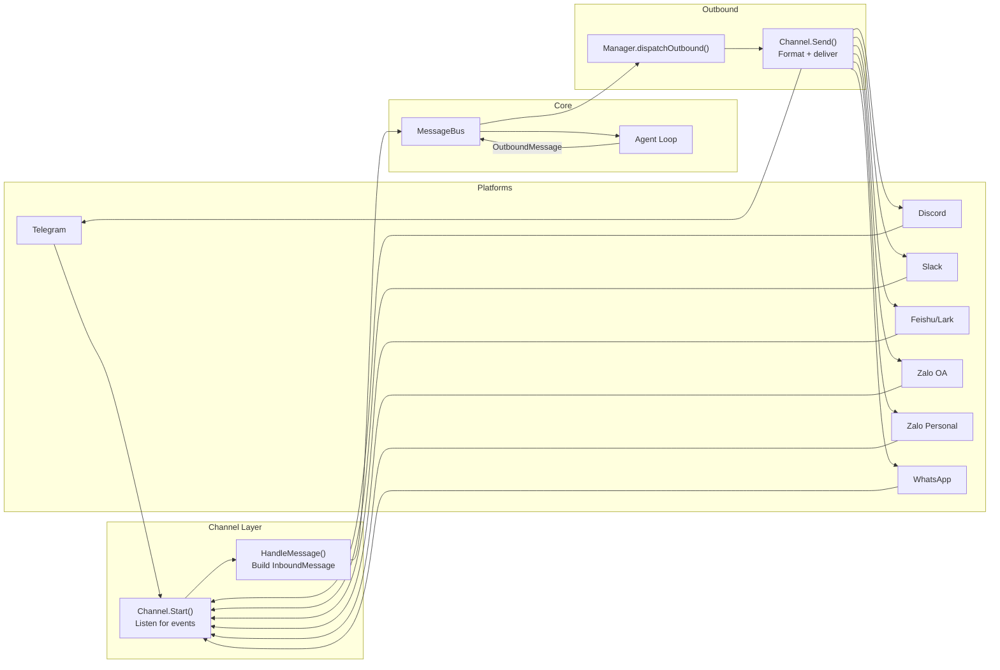
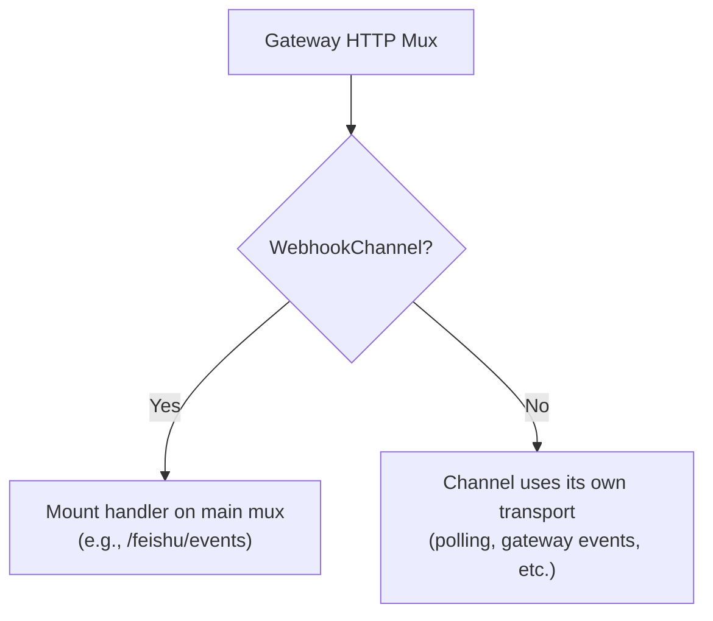
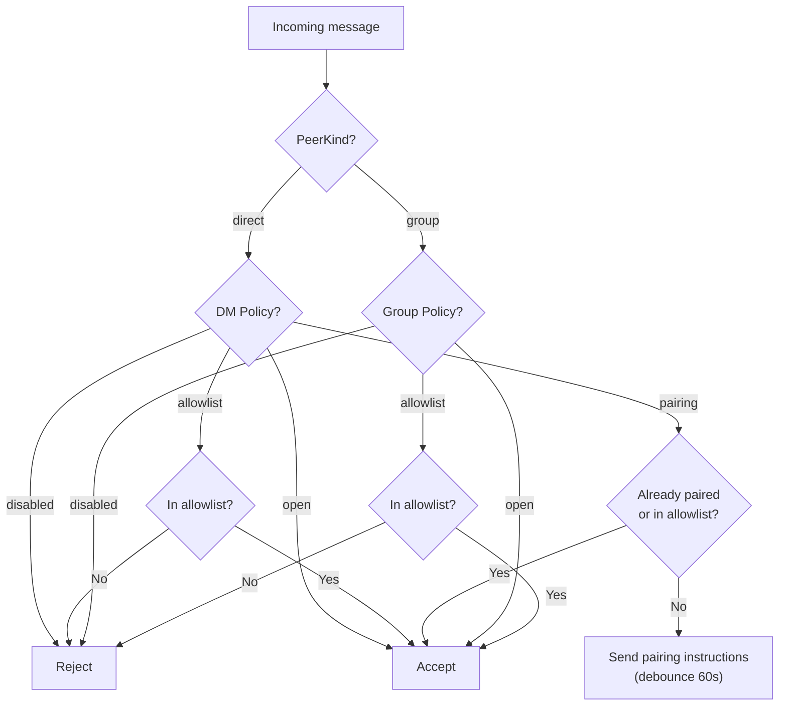
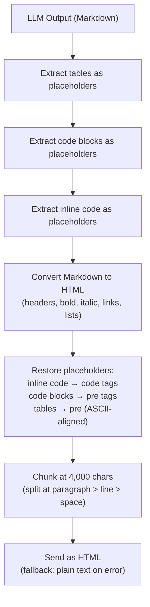
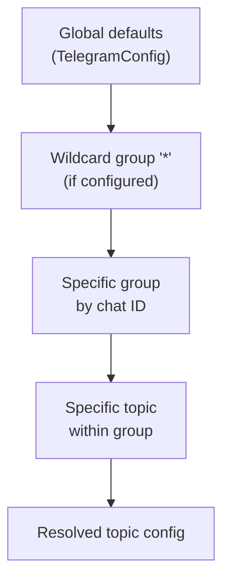
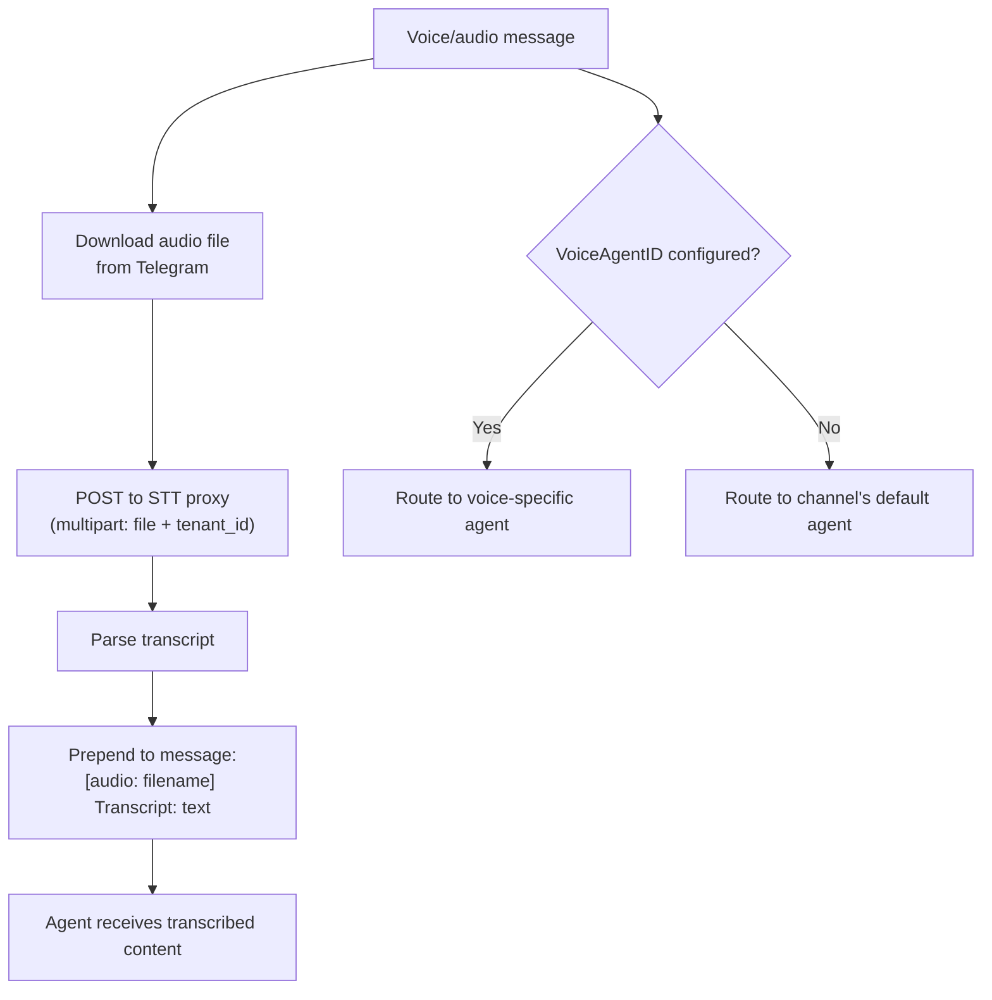
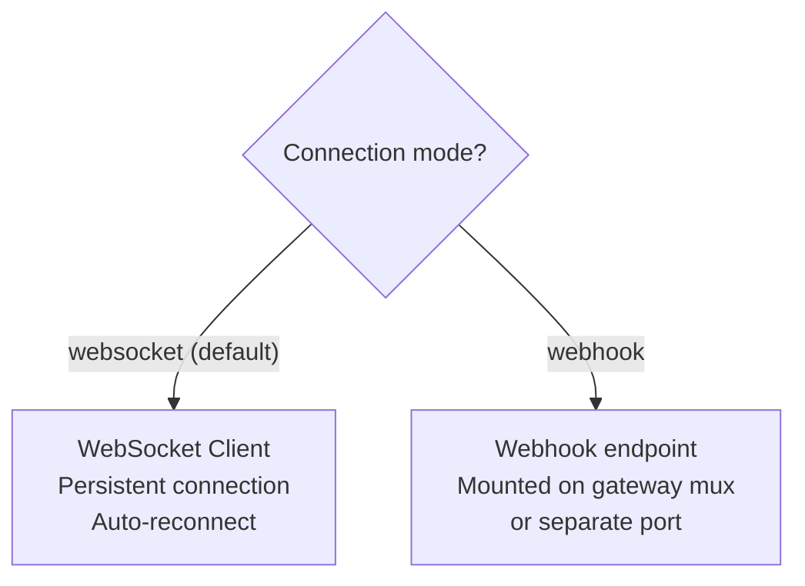
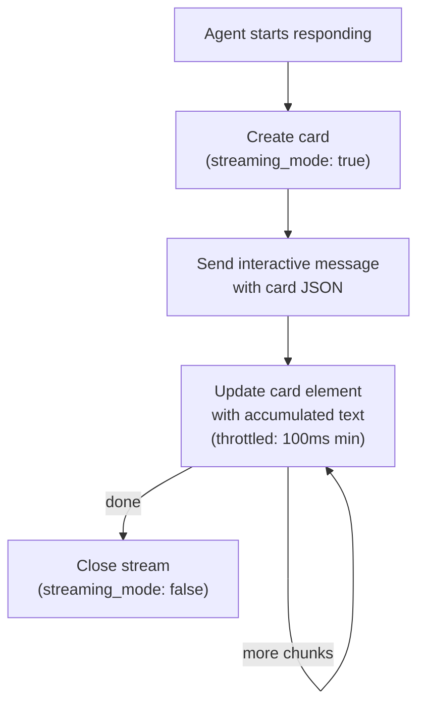
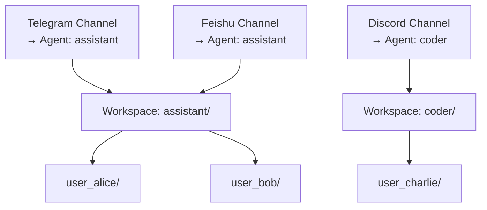
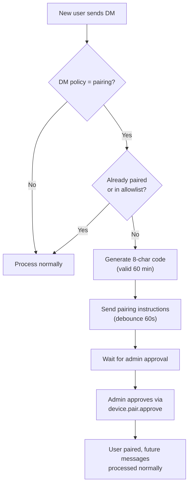

# 05 - Channels and Messaging

Channels connect external messaging platforms to the GoClaw agent runtime via a shared message bus. Each channel implementation translates platform-specific events into a unified `InboundMessage`, and converts agent responses into platform-appropriate outbound messages.

---

## 1. Message Flow



Internal channels (`cli`, `system`, `subagent`, `browser`) are silently skipped by the outbound dispatcher and never forwarded to external platforms. The `browser` channel uses WebSocket directly on the gateway connection.

### Message Routing Prefixes

The consumer routes system messages based on sender ID prefixes:

| Prefix | Route | Scheduler Lane |
|--------|-------|:-:|
| `subagent:` | Parent session queue | subagent |
| `delegate:` | Parent agent's original session (legacy session key format) | team |
| `teammate:` | Target agent session | team |

---

## 2. Channel Interfaces

Every channel must implement the base interface:

| Method | Description |
|--------|-------------|
| `Name()` | Channel instance name (e.g., `"telegram"`, `"discord"`) |
| `Type()` | Platform type identifier (e.g., `"telegram"`, `"zalo_personal"`). For config-based channels equals `Name()`; for DB instances may differ. |
| `Start(ctx)` | Begin listening for messages (non-blocking) |
| `Stop(ctx)` | Graceful shutdown |
| `Send(ctx, msg)` | Deliver an outbound message to the platform |
| `IsRunning()` | Whether the channel is actively processing |
| `IsAllowed(senderID)` | Check if a sender passes the allowlist |

### Extended Interfaces

| Interface | Purpose | Implemented By |
|-----------|---------|----------------|
| `StreamingChannel` | Real-time streaming updates | Telegram, Slack |
| `WebhookChannel` | Webhook HTTP handler mounting | Feishu |
| `ReactionChannel` | Status reactions on messages | Telegram, Slack, Feishu |
| `BlockReplyChannel` | Override gateway block_reply setting | Slack |

`BaseChannel` provides a shared implementation that all channels embed: allowlist matching, `HandleMessage()`, `CheckPolicy()`, and user ID extraction.

### Webhook Mount

Channels implementing `WebhookChannel` expose an HTTP handler that can be mounted on the gateway's main HTTP mux. This enables single-port operation — no separate webhook server needed.



---

## 3. Channel Policy

### DM Policies

| Policy | Behavior |
|--------|----------|
| `pairing` | Require pairing code for new senders |
| `allowlist` | Only whitelisted senders accepted |
| `open` | Accept all DMs |
| `disabled` | Reject all DMs |

### Group Policies

| Policy | Behavior |
|--------|----------|
| `open` | Accept all group messages |
| `allowlist` | Only whitelisted groups accepted |
| `disabled` | No group messages processed |

### Policy Evaluation



---

## 4. Channel Comparison

| Feature | Telegram | Feishu/Lark | Discord | Slack | WhatsApp | Zalo OA | Zalo Personal |
|---------|----------|-------------|---------|-------|----------|---------|---------------|
| Connection | Long polling | WS (default) / Webhook | Gateway events | Socket Mode | External WS bridge | Long polling | Internal protocol |
| DM support | Yes | Yes | Yes | Yes | Yes | Yes (DM only) | Yes |
| Group support | Yes (mention gating) | Yes | Yes | Yes (mention gating + thread cache) | Yes | No | Yes |
| Forum/Topics | Yes (per-topic config) | Yes (topic session mode) | -- | -- | -- | -- | -- |
| Message limit | 4,096 chars | Configurable (default 4,000) | 2,000 chars | 4,000 chars | N/A (bridge) | 2,000 chars | 2,000 chars |
| Streaming | Typing indicator | Streaming message cards | Edit "Thinking..." | Edit "Thinking..." (throttled 1s) | No | No | No |
| Media | Photos, voice, files | Images, files (30 MB) | Files, embeds | Files (download w/ SSRF protection) | JSON messages | Images (5 MB) | -- |
| Speech-to-text | Yes (STT proxy) | -- | -- | -- | -- | -- | -- |
| Voice routing | Yes (VoiceAgentID) | -- | -- | -- | -- | -- | -- |
| Rich formatting | Markdown → HTML | Card messages | Markdown | Markdown → mrkdwn | Plain text | Plain text | Plain text |
| Bot commands | 10+ commands | -- | -- | -- | -- | -- | -- |
| Tool allow list | Per-topic | -- | -- | -- | -- | -- | -- |
| Pairing support | Yes | Yes | Yes | Yes | Yes | Yes | Yes |
| Status reactions | Yes | Yes | -- | Yes | -- | -- | -- |

---

## 5. Telegram

The Telegram channel uses long polling via the `telego` library (Telegram Bot API).

### Core Behaviors

- **Group mention gating**: By default, bot must be @mentioned in groups (`requireMention: true`). Pending messages without a mention are stored in a history buffer (default 50 messages) and included as context when the bot is eventually mentioned.
- **Typing indicator**: A "typing" action is sent while the agent is processing.
- **Proxy support**: Optional HTTP proxy configured via channel config.
- **Cancel commands**: `/stop` and `/stopall` intercepted before the 800ms debouncer. See [08-scheduling-cron.md](./08-scheduling-cron.md) for details.
- **Concurrent group support**: Group sessions support up to 3 concurrent agent runs.
- **Bot reply as implicit mention**: Replying to a bot message in a group counts as mentioning the bot.

### Formatting Pipeline



Tables are rendered as ASCII-aligned text inside `<pre>` tags. CJK and emoji characters are counted as 2-column width for proper alignment.

### Forum Topics

Telegram forum topics (supergroup threads) get per-topic configuration with layered merging.



**Configurable per topic:**

| Field | Description |
|-------|-------------|
| `groupPolicy` | open, allowlist, pairing, disabled |
| `requireMention` | Override mention gating for this topic |
| `allowFrom` | User/ID allowlist for this topic |
| `enabled` | Enable/disable this specific topic |
| `skills` | Override available skills (nil=inherit, []=none, ["x","y"]=whitelist) |
| `tools` | Override available tools (supports `group:xxx` syntax) |
| `systemPrompt` | Additional system prompt (concatenated at topic level) |

**Session key format:**

| Context | Key Format |
|---------|------------|
| Regular chat | `"-12345"` |
| Forum topic | `"-12345:topic:99"` |
| DM thread | `"-12345:thread:55"` |

General topic (ID=1) is stripped during send — Telegram API requires no thread ID for the general topic. Deleted topics are detected via error message matching and retried without the thread ID.

### Tool Allow List (Per-Topic)

Each topic can restrict which tools the agent may use. The `tools` field accepts tool names and group references:

- `nil` = inherit all tools (no restriction)
- `[]` = no tools for this topic
- `["web_search", "group:fs"]` = only web search and filesystem tools

The tool allow list is passed via message metadata and applied by the policy engine before the LLM sees the tool definitions.

### Speech-to-Text

Voice and audio messages can be transcribed via an external STT proxy service.



**Configuration**: STT proxy URL, timeout (default 30s), optional tenant ID and API key. If transcription fails, the media placeholder remains — no error is surfaced.

**Voice routing**: When `VoiceAgentID` is configured, audio/voice messages are routed to a different agent (e.g., a speech-specialized agent) instead of the channel's default agent.

### Bot Commands

Commands are processed before enriching content with reply/forward context (to prevent parsing issues).

| Command | Description | Group Restriction |
|---------|-------------|:-:|
| `/help` | Show command list | -- |
| `/start` | Passthrough to agent | -- |
| `/stop` | Cancel current run | -- |
| `/stopall` | Cancel all runs | -- |
| `/reset` | Clear session history | Writers only |
| `/status` | Bot status + username | -- |
| `/tasks` | Team task list | -- |
| `/task_detail <id>` | View task detail | -- |
| `/addwriter` | Add group file writer (reply to target user) | Writers only |
| `/removewriter` | Remove group file writer | Writers only |
| `/writers` | List group file writers | -- |

### Group File Writer Restrictions

In group chats, write-sensitive operations (file writes, `/reset`) are restricted to designated writers. The group ID format is `group:telegram:{chatID}`.

- Permission check queries the database: `IsGroupFileWriter(agentID, groupID, senderID)`
- Fail-open on database errors (security logged as `security.reset_writer_check_failed`)
- Writers are managed via `/addwriter` and `/removewriter` commands

---

## 6. Feishu/Lark

The Feishu/Lark channel connects via native HTTP with two transport modes.

### Transport Modes



When using webhook mode with port=0, the handler is mounted directly on the gateway's main HTTP mux (see webhook mount in Section 2). If a separate port is configured, a dedicated server is started.

### Configuration

| Field | Default | Description |
|-------|---------|-------------|
| `ConnectionMode` | `"websocket"` | `"websocket"` or `"webhook"` |
| `WebhookPort` | 0 | 0 = mount on gateway mux; >0 = separate server |
| `WebhookPath` | `"/feishu/events"` | Webhook endpoint path |
| `RenderMode` | `"auto"` | `"auto"` (detect code/tables), `"card"`, or default text |
| `TextChunkLimit` | 4,000 | Max characters per text message |
| `MediaMaxMB` | 30 | Max file size for media (MB) |
| `TopicSessionMode` | disabled | `"enabled"` for thread-per-topic session isolation |
| `RequireMention` | true | Require bot mention in group |
| `GroupAllowFrom` | -- | Group-level allowlist (separate from DM) |
| `ReactionLevel` | -- | `"off"`, `"minimal"` (terminal only), or full |

### Streaming Message Cards

Responses are delivered as interactive card messages with real-time streaming updates.



Each update increments a sequence number for ordering. Updates are throttled at 100ms minimum intervals to avoid API rate limiting. The streaming card displays content with a print animation effect (50ms frequency, 2-character steps).

### Media Handling

**Receive (inbound)**: Images, files, audio, video, and stickers are downloaded from the Feishu API with configurable size limits (default 30 MB). Oversized files are silently skipped.

| Media Type | Saved As |
|------------|----------|
| Image | `.png` |
| File | Original extension |
| Audio | `.opus` |
| Video | `.mp4` |
| Sticker | `.png` |

**Send (outbound)**: Files are uploaded to Feishu with automatic type detection (opus, mp4, pdf, doc, xls, ppt, or generic stream).

### Mention Resolution

Feishu sends content with placeholder tokens (e.g., `@_user_1`) for mentioned users. GoClaw processes these:

- **Bot mentions**: Stripped entirely (just the trigger, not meaningful content)
- **User mentions**: Replaced with `@DisplayName` from the mention list
- Fallback detection when bot ID is unknown

### Topic Session Mode

When enabled, each thread gets an isolated session:
- Session key includes the thread root message ID: `"{chatID}:topic:{rootID}"`
- Different threads within the same group maintain separate conversation histories
- Disabled by default

---

## 7. Discord

The Discord channel uses the `discordgo` library to connect via the Discord Gateway.

### Key Behaviors

- **Gateway intents**: Requests `GuildMessages`, `DirectMessages`, and `MessageContent` intents
- **Message limit**: 2,000-character limit with automatic splitting at newlines
- **Placeholder editing**: Sends "Thinking..." → edits with actual response
- **Mention gating**: `requireMention` default true; bot mention stripped from content
- **Bot identity**: Fetches `@me` on startup to detect and ignore own messages
- **Typing indicator**: 9-second keepalive while agent processes
- **Group history**: Pending message buffer for context when mentioned

---

## 8. Slack

The Slack channel uses the `slack-go/slack` library to connect via Socket Mode (WebSocket).

### Key Behaviors

- **Socket Mode**: Uses `xapp-` App-Level Token for WebSocket connection (no public URL needed)
- **Three token types**: `xoxb-` (Bot Token, required), `xapp-` (App-Level Token, required), `xoxp-` (User Token, optional for custom identity)
- **Token prefix validation**: Tokens validated at startup (`xoxb-`, `xapp-`, `xoxp-` prefixes)
- **Message limit**: 4,000-character limit with automatic splitting at newline boundaries
- **Placeholder editing**: Sends "Thinking..." → edits with actual response (same as Discord)
- **Mention gating**: `requireMention` default true; `<@botUserID>` stripped from content
- **Thread participation cache**: After bot replies in a thread, subsequent messages in that thread auto-trigger response without @mention (24h TTL)
- **Message dedup**: `channel+ts` key prevents duplicate processing on Socket Mode reconnect
- **Message debounce**: Per-thread batching of rapid messages (300ms default, configurable)
- **Dead socket classification**: Non-retryable auth errors (invalid_auth, token_revoked) fail fast instead of infinite reconnect
- **Streaming**: Edit-in-place via `chat.update` with 1000ms throttle (Slack Tier 3 rate limit)
- **Reactions**: Status emoji on user messages (thinking_face, hammer_and_wrench, white_check_mark, x, hourglass_flowing_sand)
- **SSRF protection**: File download hostname allowlist (*.slack.com, *.slack-edge.com, *.slack-files.com), auth token stripped on redirect
- **Health probe**: `auth.test()` with 2.5s timeout for monitoring integration

### Formatting Pipeline

```
LLM markdown → htmlTagsToMarkdown() → extractSlackTokens() → escapeHTMLEntities()
→ extractCodeBlocks() → convertTablesToCodeBlocks() → bold/strike/header/link conversion
→ restore tokens/code blocks → Slack mrkdwn
```

Key conversions: `**bold**` → `*bold*`, `~~strike~~` → `~strike~`, `[text](url)` → `<url|text>`, `# Header` → `*Header*`, tables → code blocks.

### Environment Variables

```
GOCLAW_SLACK_BOT_TOKEN   → channels.slack.bot_token
GOCLAW_SLACK_APP_TOKEN   → channels.slack.app_token
GOCLAW_SLACK_USER_TOKEN  → channels.slack.user_token (optional)
```

Auto-enables when both bot_token and app_token are set.

---

## 9. WhatsApp

The WhatsApp channel communicates through an external WebSocket bridge (e.g., whatsapp-web.js based). GoClaw does not implement the WhatsApp protocol directly.

### Key Behaviors

- **Bridge connection**: Connects to configurable `bridge_url` via WebSocket
- **JSON format**: Messages sent/received as JSON objects
- **Auto-reconnect**: Exponential backoff (1s → 30s max)
- **DM and group support**: Group detection via `@g.us` suffix in chat ID
- **Media handling**: Array of file paths from bridge protocol

---

## 10. Zalo OA

The Zalo OA (Official Account) channel connects to the Zalo OA Bot API.

### Key Behaviors

- **DM only**: No group support. Only direct messages are processed
- **Text limit**: 2,000-character maximum per message
- **Long polling**: Default 30-second timeout, 5-second backoff on errors
- **Media**: Image support with 5 MB default limit
- **Default DM policy**: `"pairing"` (requires pairing code)
- **Pairing debounce**: 60-second debounce on pairing instructions

---

## 11. Zalo Personal

The Zalo Personal channel provides access to personal Zalo accounts using a reverse-engineered protocol. This is an unofficial integration.

### Key Differences from Zalo OA

| Aspect | Zalo OA | Zalo Personal |
|--------|---------|---------------|
| Protocol | Official Bot API | Reverse-engineered (zcago, MIT) |
| DM support | Yes | Yes |
| Group support | No | Yes |
| Default DM policy | `pairing` | `allowlist` (restrictive) |
| Default group policy | N/A | `allowlist` (restrictive) |
| Authentication | API credentials | Pre-loaded credentials or QR scan |
| Risk | None | Account may be locked/banned |

### Security Warning

Zalo Personal uses an unofficial, reverse-engineered protocol. The account used may be locked or banned by Zalo at any time. A security warning is logged on startup: `security.unofficial_api`.

### Resilience

- Maximum 10 restart attempts
- Exponential backoff up to 60 seconds
- Special handling for error code 3000: 60-second initial delay
- Typing controller per thread

---

## 12. Channel-Isolated Workspaces

Each channel instance can target a specific agent, providing workspace isolation across channels.



Channel instances are loaded from the database with their assigned agent ID. The agent key is resolved and propagated through the message pipeline, ensuring all filesystem tools, context files, and memory operations use the correct workspace.

---

## 13. Local Key Propagation

Thread/topic context is preserved through the entire message pipeline using a `local_key` in message metadata. This ensures subagent, delegation, and team message results land in the correct thread — not the root chat.

| Platform | Local Key Format |
|----------|-----------------|
| Telegram (chat) | `"-12345"` |
| Telegram (topic) | `"-12345:topic:99"` |
| Telegram (thread) | `"-12345:thread:55"` |
| Feishu (chat) | `"oc_xyz"` |
| Feishu (topic) | `"oc_xyz:topic:{root_msg_id}"` |

All channel state — placeholders, streams, reactions, typing controllers, thread IDs — is keyed by this composite `local_key`. When delegation or team messages complete, the `local_key` from the original message is preserved in metadata and used to route the response back to the correct location.

---

## 14. Per-User Isolation

Channels provide per-user isolation through compound sender IDs and context propagation:

- **User scoping**: Each channel constructs a compound sender ID (e.g., `telegram:123456`) which maps to a `user_id`. The session key format `agent:{agentId}:{channel}:direct:{peerId}` ensures each user has isolated conversation history per agent.
- **Context propagation**: `HandleMessage()` injects `AgentID`, `UserID`, and `AgentType` into the context. These flow to the ContextFileInterceptor, MemoryInterceptor, and per-user file seeding.
- **Pairing storage**: PostgreSQL (`pairing_requests` and `paired_devices` tables).
- **Session persistence**: PostgreSQL `sessions` table with write-behind caching.

---

## 15. Pairing System

The pairing system provides a DM authentication flow for channels using the `pairing` DM policy.



### Code Specification

| Aspect | Value |
|--------|-------|
| Length | 8 characters |
| Alphabet | `ABCDEFGHJKLMNPQRSTUVWXYZ23456789` (excludes ambiguous: 0, O, 1, I, L) |
| TTL | 60 minutes |
| Max pending per account | 3 |
| Reply debounce | 60 seconds per sender |

---

## File Reference

| File | Purpose |
|------|---------|
| `internal/channels/channel.go` | Channel interface, BaseChannel, extended interfaces, HandleMessage, Type() method |
| `internal/channels/manager.go` | Manager: registration, StartAll, StopAll, channel lifecycle, webhook collection |
| `internal/channels/dispatch.go` | Outbound message dispatcher, send error formatting |
| `internal/channels/instance_loader.go` | DB-based channel instance loading |
| `internal/channels/telegram/channel.go` | Telegram core: long polling, mention gating, typing indicators |
| `internal/channels/telegram/handlers.go` | Message handling, media processing, forum topic detection |
| `internal/channels/telegram/topic_config.go` | Per-topic config layering and resolution |
| `internal/channels/telegram/commands.go` | Bot commands: /stop, /reset, /tasks, /addwriter, etc. |
| `internal/channels/telegram/stt.go` | Speech-to-text proxy integration, voice agent routing |
| `internal/channels/telegram/stream.go` | Streaming placeholder management |
| `internal/channels/telegram/reactions.go` | Status reactions on messages |
| `internal/channels/telegram/format.go` | Markdown → Telegram HTML pipeline, table rendering |
| `internal/channels/feishu/feishu.go` | Feishu core: WS/Webhook modes, config, reactions |
| `internal/channels/feishu/larkclient_messaging.go` | Streaming card create/update/close, message sending |
| `internal/channels/feishu/media.go` | Media upload/download, type detection |
| `internal/channels/feishu/bot_parse.go` | Mention resolution, message event parsing |
| `internal/channels/feishu/bot.go` | Bot message handlers |
| `internal/channels/feishu/bot_policy.go` | Policy evaluation |
| `internal/channels/discord/discord.go` | Discord: gateway setup, session management, lifecycle |
| `internal/channels/discord/handler.go` | Message handling, typing indicators, placeholder management |
| `internal/channels/slack/channel.go` | Slack: Socket Mode, mention gating, thread caching, streaming |
| `internal/channels/slack/handlers.go` | Message and event handling, pairing, group policy |
| `internal/channels/slack/format.go` | Markdown → Slack mrkdwn pipeline |
| `internal/channels/slack/reactions.go` | Status emoji reactions on messages |
| `internal/channels/slack/stream.go` | Streaming message updates via placeholder editing |
| `internal/channels/whatsapp/whatsapp.go` | WhatsApp: external WS bridge |
| `internal/channels/zalo/zalo.go` | Zalo OA: Bot API, long polling |
| `internal/channels/zalo/personal/channel.go` | Zalo Personal: reverse-engineered protocol |
| `internal/store/pg/pairing.go` | Pairing: code generation, approval, persistence (database-backed) |
| `cmd/gateway_consumer.go` | Message routing: prefixes, cancel interception |

---

## Cross-References

| Document | Relevant Content |
|----------|-----------------|
| [00-architecture-overview.md](./00-architecture-overview.md) | Channel startup in gateway sequence |
| [03-tools-system.md](./03-tools-system.md) | Tool policy engine, per-request tool allow list |
| [08-scheduling-cron.md](./08-scheduling-cron.md) | /stop and /stopall commands, scheduler lanes, cron |
| [09-security.md](./09-security.md) | Group file writer restrictions, security logging |
| [11-agent-teams.md](./11-agent-teams.md) | Team message routing, delegation result delivery |
