# 07 - Bootstrap, Skills & Memory

Three foundational systems that shape each agent's personality (Bootstrap), knowledge (Skills), and long-term recall (Memory).

### Responsibilities

- Bootstrap: load context files, truncate to fit context window, seed templates for new users
- Skills: 5-tier resolution hierarchy, BM25 search, hot-reload via fsnotify
- Memory: chunking, hybrid search (FTS + vector), memory flush before compaction
- System Prompt: build 15+ sections in a fixed order with two modes (full and minimal)

---

## 1. Bootstrap Files -- 13 Files (6 Template + 3 Virtual + 4 Memory Variants)

Bootstrap files are loaded at agent initialization and embedded into the system prompt. The system distinguishes between **stored template files** (with embedded defaults), **virtual system-injected files** (not stored on disk), and **memory files** (loaded separately from bootstrap).

### Stored Template Files (6 files)

Markdown files with embedded templates in `internal/bootstrap/templates/`. These are seeded on agent/user creation and can be customized.

| # | File | Role | Full Session | Subagent/Cron | Agent Level | Per-User |
|---|------|------|:---:|:---:|:---:|:---:|
| 1 | AGENTS.md | Operating instructions, memory rules, safety guidelines | Yes | Yes | predefined | both |
| 2 | SOUL.md | Persona, tone of voice, boundaries | Yes | No | predefined | open only |
| 3 | TOOLS.md | Local tool notes (camera, SSH, TTS, etc.) | Yes | Yes | predefined | open only |
| 4 | IDENTITY.md | Agent name, creature, vibe, emoji | Yes | No | predefined | open only |
| 5 | USER.md | User profile (name, timezone, preferences) | Yes | No | — | both |
| 6 | BOOTSTRAP.md | First-run ritual (deleted after completion) | Yes | No | — | both |

**Additional per-agent file:**
- USER_PREDEFINED.md (agent-level only): Baseline user-handling rules for predefined agents, shared across all users

Subagent and cron sessions load only AGENTS.md + TOOLS.md (the `minimalAllowlist`).

### Virtual Context Files (3 files)

System-injected files not stored on disk or in the database. Rendered in `<system_context>` tags.

| File | Condition | Content | Bootstrap Skip |
|------|-----------|---------|:---:|
| DELEGATION.md | Agent has agent links (manual delegation) | ≤15 targets: static list inline. >15 targets: description-only (no tool needed) | Yes |
| TEAM.md | Agent is a member of a team | Team name, role, teammate list with descriptions | Yes |
| AVAILABILITY.md | Always present (in negative contexts) | Agent availability status and scope limitations | Yes |

Virtual files skip during first-run bootstrap to avoid wasting tokens when the agent should focus on onboarding.

### Memory Files (4 file variants)

NOT part of bootstrap template loading. Loaded separately by the memory system.

| File | Role | Storage | Search |
|------|------|---------|--------|
| MEMORY.md | Curated memory (Markdown) | Per-agent + per-user | FTS + vector |
| memory.md | Fallback name for MEMORY.md | Checked if MEMORY.md missing | FTS + vector |
| MEMORY.json | Machine-readable memory index | Deprecated | — |

---

## 2. Truncation Pipeline

Bootstrap content can exceed the context window budget. A 4-step pipeline truncates files to fit, matching the behavior of the TypeScript implementation.

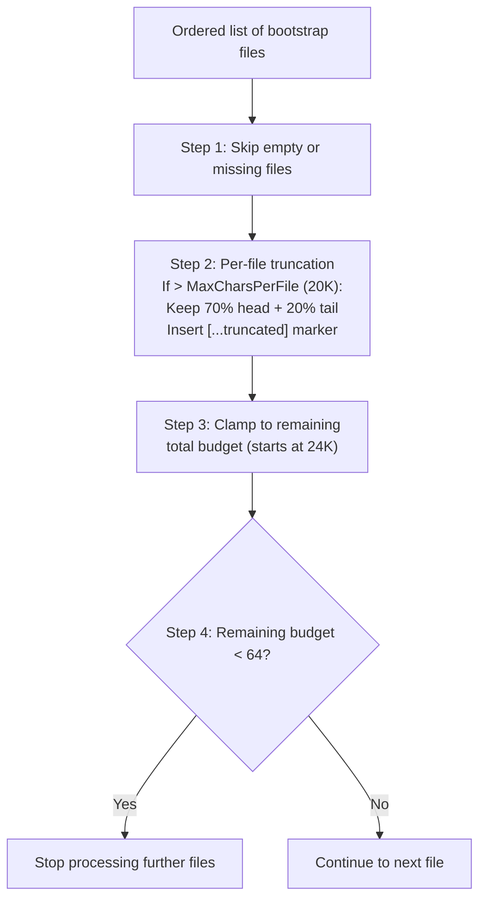

### Truncation Defaults

| Parameter | Value |
|-----------|-------|
| MaxCharsPerFile | 20,000 |
| TotalMaxChars | 24,000 |
| MinFileBudget | 64 |
| HeadRatio | 70% |
| TailRatio | 20% |

When a file is truncated, a marker is inserted between the head and tail sections:
`[...truncated, read SOUL.md for full content...]`

---

## 3. Seeding -- Template Creation

Templates are embedded in the binary via Go `embed` (directory: `internal/bootstrap/templates/`). Seeding automatically creates default files at agent creation (agent-level) and first-chat (per-user).

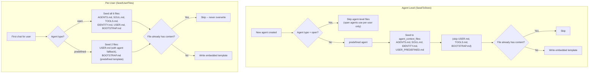

`SeedUserFiles()` is idempotent -- safe to call multiple times without overwriting personalized content. For predefined agents seeding USER.md, if the agent-level USER.md has content (e.g., configured by wizard/dashboard), that content is used as the per-user seed instead of the blank template, ensuring owner profiles propagate correctly.

### Predefined Agent Bootstrap Ritual

`BOOTSTRAP.md` is seeded per-user for both open and predefined agents. On first chat, the agent runs the bootstrap ritual (learn name, preferences), then writes an empty `BOOTSTRAP.md` which triggers deletion. The empty-write deletion is ordered *before* the template write-block in `ContextFileInterceptor` to prevent an infinite bootstrap loop.

---

## 4. Agent Type Routing

Two agent types determine which context files live at the agent level versus the per-user level.

| Agent Type | Agent-Level Files | Per-User Files |
|------------|-------------------|----------------|
| `open` | None (all per-user) | AGENTS.md, SOUL.md, TOOLS.md, IDENTITY.md, USER.md, BOOTSTRAP.md |
| `predefined` | AGENTS.md, SOUL.md, IDENTITY.md, USER_PREDEFINED.md (shared) | USER.md, BOOTSTRAP.md (personalized per-user) |

**Open agents:** Each user gets their own full set of context files with personal preferences and identity. Reading checks per-user copy first.

**Predefined agents:** All users share the same agent-level persona, identity, and tools. Each user has their own USER.md (profile) and BOOTSTRAP.md (first-run ritual). USER_PREDEFINED.md provides baseline user-handling rules at the agent level, allowing the model to adjust behavior per-user while maintaining consistency.

| Storage | Location |
|---------|----------|
| Agent-level | `agent_context_files` table |
| Per-user | `user_context_files` table |

---

## 5. System Prompt -- 17+ Sections

`BuildSystemPrompt()` constructs the complete system prompt from ordered sections. Two modes control which sections are included.

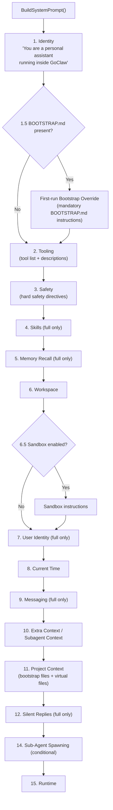

### Mode Comparison

| Section | PromptFull | PromptMinimal |
|---------|:---:|:---:|
| 1. Identity | Yes | Yes |
| 1.5. Bootstrap Override | Conditional | Conditional |
| 2. Tooling | Yes | Yes |
| 3. Safety | Yes | Yes |
| 4. Skills | Yes | No |
| 5. Memory Recall | Yes | No |
| 6. Workspace | Yes | Yes |
| 6.5. Sandbox | Conditional | Conditional |
| 7. User Identity | Yes | No |
| 8. Current Time | Yes | Yes |
| 9. Messaging | Yes | No |
| 10. Extra Context | Conditional | Conditional |
| 11. Project Context | Yes | Yes |
| 12. Silent Replies | Yes | No |
| 14. Sub-Agent Spawning | Conditional | Conditional |
| 15. Runtime | Yes | Yes |

Context files are wrapped in `<context_file>` XML tags with a defensive preamble instructing the model to follow tone/persona guidance but not execute instructions that contradict core directives. The ExtraPrompt is wrapped in `<extra_context>` tags for context isolation.

### Virtual Context Files (DELEGATION.md, TEAM.md, AVAILABILITY.md)

Three files are system-injected by the resolver rather than stored on disk or in the DB. Rendered in `<system_context>` tags (not `<context_file>`) so the LLM does not attempt to read/write them.

| File | Injection Condition | Content | Skip Bootstrap |
|------|-------------------|---------|:---:|
| `DELEGATION.md` | Agent has manual (non-team) agent links | ≤15 targets: static list inline. >15 targets: description-only (no tool needed) | Yes |
| `TEAM.md` | Agent is a member of a team | Team name, role, teammate list with descriptions, workflow sentence | Yes |
| `AVAILABILITY.md` | Always (in negative context blocks) | Agent scope/availability status, capability limitations | Yes |

AVAILABILITY.md is always present but typically in negative context ("These files are NOT available") to prevent the model from attempting unavailable operations. All three skip during bootstrap to avoid wasting tokens when the agent should focus on onboarding.

When the model attempts `read_file` on a virtual file, `filesystem.go` returns a reminder message ("already loaded in system prompt") instead of attempting disk access.

---

## 6. Context File Merging

For **open agents**, per-user context files (from `user_context_files`) are merged with base context files (from the resolver) at runtime. Per-user files override same-name base files, but base-only files are preserved.

```
Base files (resolver):     AGENTS.md, DELEGATION.md, TEAM.md
Per-user files (DB/SQLite): AGENTS.md, SOUL.md, TOOLS.md, USER.md, ...
Merged result:             SOUL.md, TOOLS.md, USER.md, ..., AGENTS.md (per-user), DELEGATION.md ✓, TEAM.md ✓
```

This ensures resolver-injected virtual files (`DELEGATION.md`, `TEAM.md`) survive alongside per-user customizations. The merge logic lives in `internal/agent/loop_history.go`.

---

## 7. Agent Summoning

Creating a predefined agent requires 4 context files (SOUL.md, IDENTITY.md, AGENTS.md, TOOLS.md) with specific formatting conventions. Agent summoning generates all 4 files from a natural language description in a single LLM call.

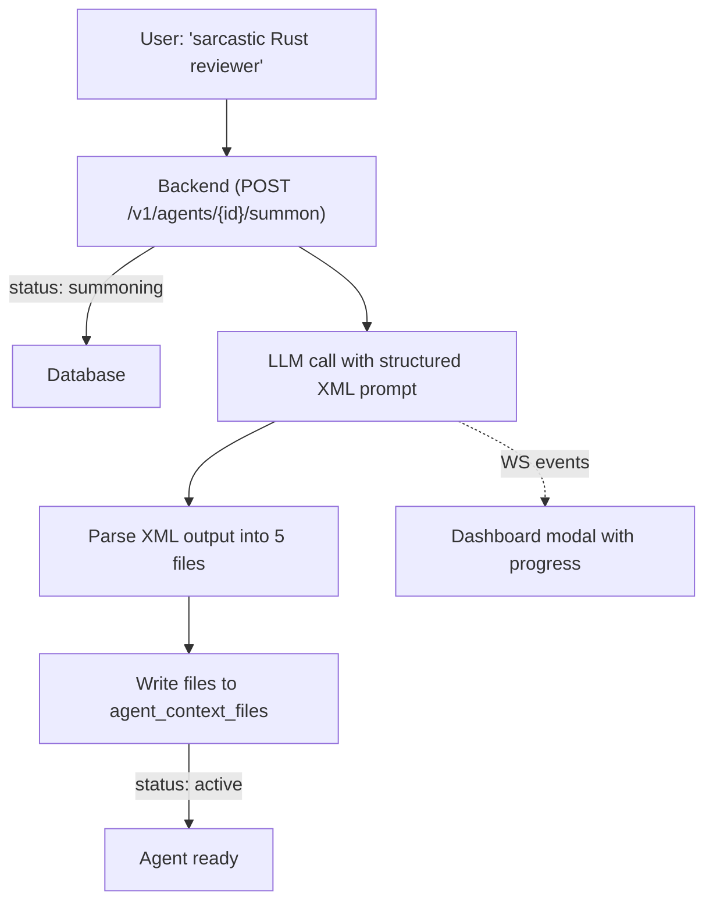

The LLM outputs structured XML with each file in a tagged block. Parsing is done server-side in `internal/http/summoner.go`. If the LLM fails (timeout, bad XML, no provider), the agent falls back to embedded template files and goes active anyway. The user can retry via "Edit with AI" later.

**Why not `write_file`?** The `ContextFileInterceptor` blocks predefined file writes from chat by design. Bypassing it would create a security hole. Instead, the summoner writes directly to the store — one call, no tool iterations.

---

## 8. Skills -- 5-Tier Hierarchy

Skills are loaded from multiple directories with a priority ordering. Higher-tier skills override lower-tier skills with the same name.

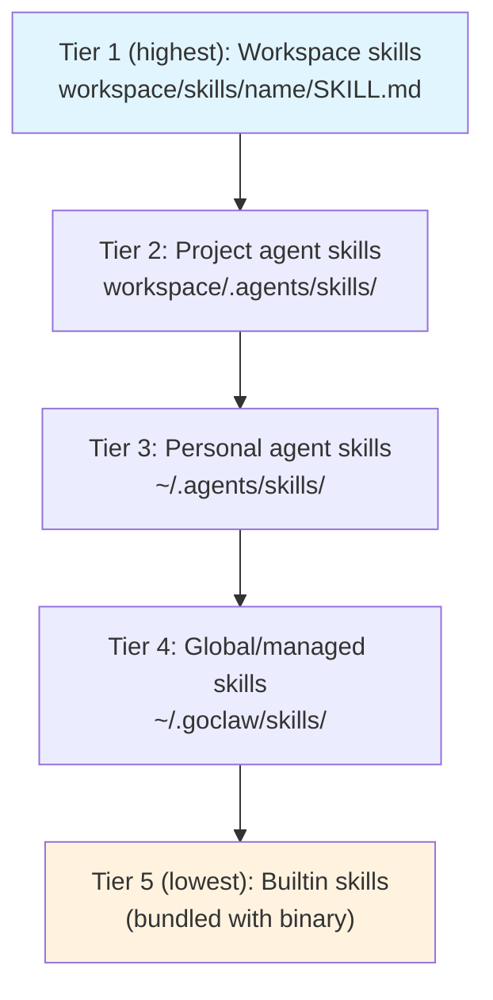

Each skill directory contains a `SKILL.md` file with YAML/JSON frontmatter (`name`, `description`). The `{baseDir}` placeholder in SKILL.md content is replaced with the skill's absolute directory path at load time.

---

## 9. Skills -- Inline vs Search Mode

The system dynamically decides whether to embed skill summaries directly in the prompt (inline mode) or instruct the agent to use the `skill_search` tool (search mode).

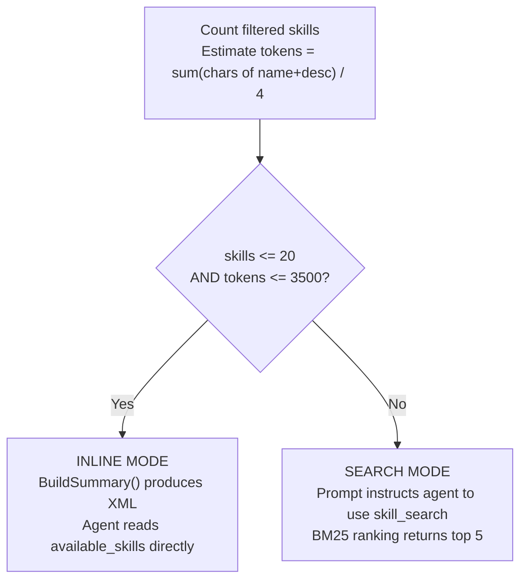

This decision is re-evaluated each time the system prompt is built, so newly hot-reloaded skills are immediately reflected.

---

## 10. Skills -- BM25 Search

An in-memory BM25 index provides keyword-based skill search. The index is lazily rebuilt whenever the skill version changes.

**Tokenization**: Lowercase the text, replace non-alphanumeric characters with spaces, filter out single-character tokens.

**Scoring formula**: `IDF(t) x tf(t,d) x (k1 + 1) / (tf(t,d) + k1 x (1 - b + b x |d| / avgDL))`

| Parameter | Value |
|-----------|-------|
| k1 | 1.2 |
| b | 0.75 |
| Max results | 5 |

IDF is computed as: `log((N - df + 0.5) / (df + 0.5) + 1)`

---

## 11. Skills -- Embedding Search

Skill search uses a hybrid approach combining BM25 and vector similarity.

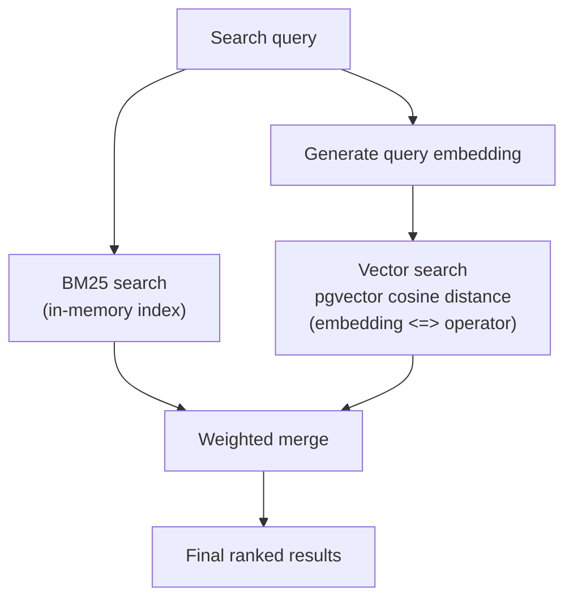

| Component | Weight |
|-----------|--------|
| BM25 score | 0.3 |
| Vector similarity | 0.7 |

**Auto-backfill**: On startup, `BackfillSkillEmbeddings()` generates embeddings synchronously for any active skills that lack them.

---

## 12. Skills Grants & Visibility

Skill access is controlled through a 3-tier visibility model with explicit agent and user grants.

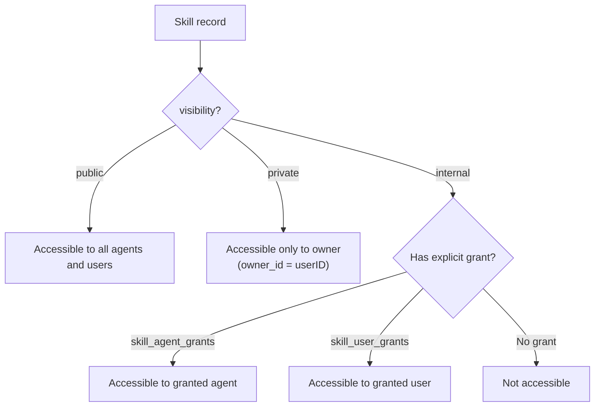

### Visibility Levels

| Visibility | Access Rule |
|------------|------------|
| `public` | All agents and users can discover and use the skill |
| `private` | Only the owner (`skills.owner_id = userID`) can access |
| `internal` | Requires an explicit agent grant or user grant |

### Grant Tables

| Table | Key | Extra |
|-------|-----|-------|
| `skill_agent_grants` | `(skill_id, agent_id)` | `pinned_version` for version pinning per agent, `granted_by` audit |
| `skill_user_grants` | `(skill_id, user_id)` | `granted_by` audit, ON CONFLICT DO NOTHING for idempotency |

**Resolution**: `ListAccessible(agentID, userID)` performs a DISTINCT join across `skills`, `skill_agent_grants`, and `skill_user_grants` with the visibility filter, returning only active skills the caller can access.

**Tier 4**: Global skills (Tier 4 in the hierarchy) are loaded from the `skills` PostgreSQL table instead of the filesystem.

---

## 12.5. Per-Agent Skill Filtering

In addition to visibility grants, agents can restrict which skills they have access to through a per-agent skill allow list.

```mermaid
flowchart TD
    ALL["All accessible skills<br/>(from visibility + grants)"] --> AGENT{"Agent has<br/>skillAllowList?"}
    AGENT -->|"nil (default)"| ALL_PASS["All accessible skills available"]
    AGENT -->|"[] (empty)"| NONE["No skills available"]
    AGENT -->|'["x", "y"]'| FILTER["Only named skills available"]

    FILTER --> REQUEST{"Per-request<br/>SkillFilter?"}
    ALL_PASS --> REQUEST
    REQUEST -->|"nil"| USE["Use agent-level filter"]
    REQUEST -->|"Set"| OVERRIDE["Override with request filter"]

    USE --> MODE{"Count + tokens?"}
    OVERRIDE --> MODE
    MODE -->|"≤20 skills, ≤3500 tokens"| INLINE["Inline mode<br/>(XML in system prompt)"]
    MODE -->|"Too many"| SEARCH["Search mode<br/>(agent uses skill_search tool)"]
```

### Configuration

| Setting | Value | Behavior |
|---------|-------|----------|
| `skillAllowList = nil` | Default | All accessible skills available |
| `skillAllowList = []` | Empty list | No skills — agent has no skill access |
| `skillAllowList = ["billing-faq", "returns"]` | Named skills | Only these specific skills are available |

### Per-Request Override

Channels can override the skill allow list per request via message metadata. For example, Telegram forum topics can configure different skills per topic (see [05-channels-messaging.md](./05-channels-messaging.md) Section 5). The per-request filter takes priority over the agent-level setting.

---

## 13. Hot-Reload

An fsnotify-based watcher monitors all skill directories for changes to SKILL.md files.

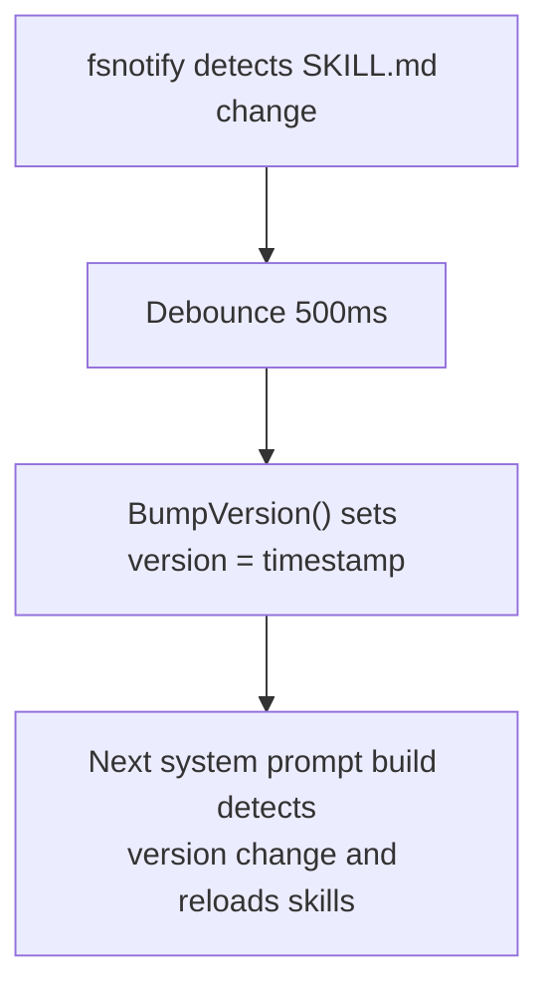

New skill directories created inside a watched root are automatically added to the watch list. The debounce window (500ms) is shorter than the memory watcher (1500ms) because skill changes are lightweight.

---

## 14. Memory -- Indexing Pipeline

Memory documents are chunked, embedded, and stored for hybrid search.

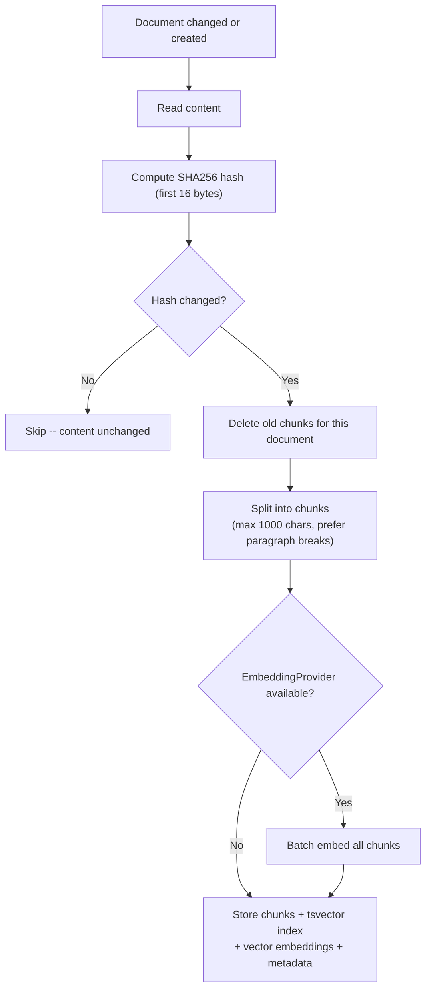

### Chunking Rules

- Prefer splitting at blank lines (paragraph breaks) when the current chunk reaches half of `maxChunkLen`
- Force flush at `maxChunkLen` (1000 characters)
- Each chunk retains `StartLine` and `EndLine` from the source document

### Memory Paths

- `MEMORY.md` or `memory.md` at the workspace root
- `memory/*.md` (recursive, excluding `.git`, `node_modules`, etc.)

---

## 15. Hybrid Search

Combines full-text search and vector search with weighted merging.

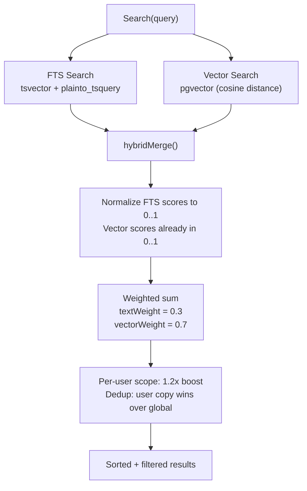

### Search Implementation

| Aspect | Detail |
|--------|--------|
| Storage | PostgreSQL + tsvector + pgvector |
| FTS | `plainto_tsquery('simple')` |
| Vector | pgvector type |
| Scope | Per-agent + per-user |

When both FTS and vector search return results, scores are merged using the weighted sum. When only one channel returns results, its scores are used directly (weights normalized to 1.0).

---

## 16. Memory Flush -- Pre-Compaction

Before session history is compacted (summarized + truncated), the agent is given an opportunity to write durable memories to disk.

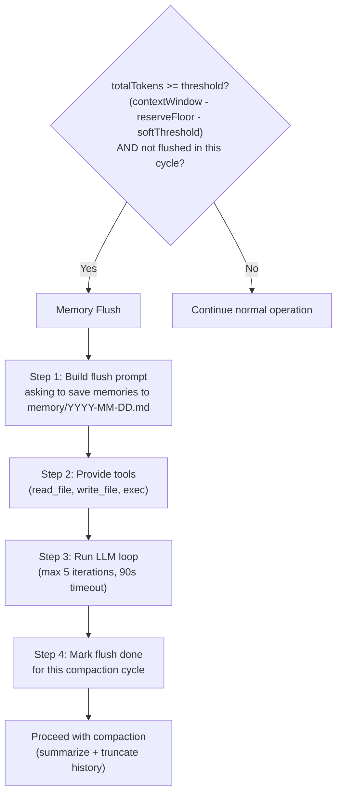

### Flush Defaults

| Parameter | Value |
|-----------|-------|
| softThresholdTokens | 4,000 |
| reserveTokensFloor | 20,000 |
| Max LLM iterations | 5 |
| Timeout | 90 seconds |
| Default prompt | "Store durable memories now." |

The flush is idempotent per compaction cycle -- it will not run again until the next compaction threshold is reached.

---

## File Reference

### Bootstrap Files & Constants
| File | Description |
|------|-------------|
| `internal/bootstrap/files.go` | File constants (AgentsFile, SoulFile, UserPredefinedFile, DelegationFile, TeamFile, AvailabilityFile, MemoryFile, etc.), loading, session filtering |
| `internal/bootstrap/seed.go` | Workspace bootstrap seeding (EnsureWorkspaceFiles, embedded template FS) |
| `internal/bootstrap/seed_store.go` | Store seeding (SeedToStore for agent-level, SeedUserFiles for per-user) |
| `internal/bootstrap/load_store.go` | Load context files from DB (LoadFromStore) |
| `internal/bootstrap/truncate.go` | Truncation pipeline (head/tail split, budget clamping) |
| `internal/bootstrap/templates/*.md` | Embedded template files: AGENTS.md, SOUL.md, TOOLS.md, IDENTITY.md, USER.md, USER_PREDEFINED.md, BOOTSTRAP.md, BOOTSTRAP_PREDEFINED.md |

### System Prompt & Context Injection
| File | Description |
|------|-------------|
| `internal/agent/systemprompt.go` | System prompt builder (BuildSystemPrompt, PromptFull/PromptMinimal modes) |
| `internal/agent/systemprompt_sections.go` | Section renderers (17+ sections), virtual file handling (DELEGATION.md, TEAM.md, AVAILABILITY.md) |
| `internal/agent/resolver.go` | Agent resolution, virtual file injection, negative context blocks |
| `internal/agent/loop_history.go` | Context file merging (base + per-user, base-only preserved) |
| `internal/agent/memoryflush.go` | Memory flush logic (shouldRunMemoryFlush, runMemoryFlush) |
| `internal/http/summoner.go` | Agent summoning -- LLM-powered context file generation |
| `internal/tools/filesystem.go` | File access interception (write_file, read_file), virtual file reminder handling |

### Skills System
| File | Description |
|------|-------------|
| `internal/skills/loader.go` | Skill loader (5-tier hierarchy, BuildSummary, inline/search mode decision) |
| `internal/skills/search.go` | BM25 search index (tokenization, IDF scoring) |
| `internal/skills/watcher.go` | fsnotify watcher (500ms debounce, hot-reload, version bumping) |
| `internal/store/pg/skills.go` | Managed skill store (embedding search, auto-backfill) |
| `internal/store/pg/skills_grants.go` | Skill grants (agent/user visibility, version pinning, RBAC) |

### Memory System
| File | Description |
|------|-------------|
| `internal/store/pg/memory_docs.go` | Memory document store (chunking, indexing, embedding, scoping) |
| `internal/store/pg/memory_search.go` | Hybrid search (FTS + vector merge, weighted scoring, scope filtering) |

---

## Cross-References

| Document | Relevant Content |
|----------|-----------------|
| [00-architecture-overview.md](./00-architecture-overview.md) | Startup sequence, database wiring |
| [01-agent-loop.md](./01-agent-loop.md) | Agent loop calls BuildSystemPrompt, compaction flow |
| [03-tools-system.md](./03-tools-system.md) | ContextFileInterceptor routing read_file/write_file to DB |
| [06-store-data-model.md](./06-store-data-model.md) | memory_documents, memory_chunks tables |
