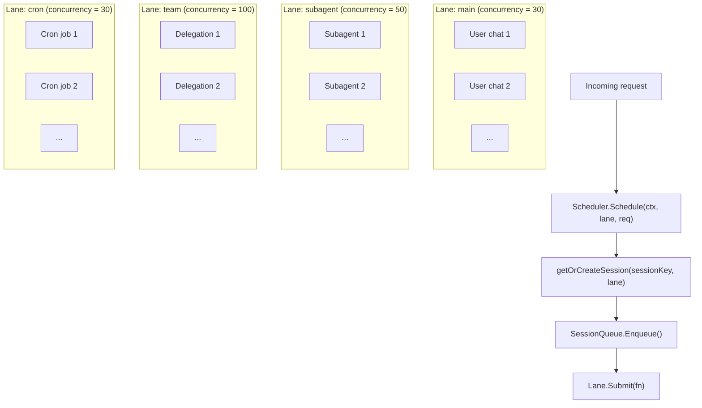
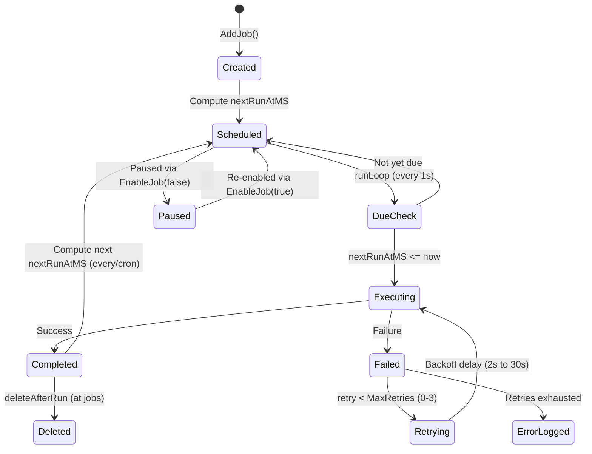

# 08 - Scheduling & Cron

Concurrency control and periodic task execution. The scheduler provides lane-based isolation and per-session serialization. Cron extends the agent loop with time-triggered behavior.

> Cron jobs and run logs are stored in the `cron_jobs` and `cron_run_logs` PostgreSQL tables. Cache invalidation propagates via the `cache:cron` event on the message bus.

### Responsibilities

- Scheduler: lane-based concurrency control, per-session message queue serialization
- Cron: three schedule kinds (at/every/cron), run logging, retry with exponential backoff

---

## 1. Scheduler Lanes

Named worker pools (semaphore-based) with configurable concurrency limits. Each lane processes requests independently. Unknown lane names fall back to the `main` lane.

### Lane Defaults

| Lane | Concurrency | Env Override | Purpose |
|------|:-----------:|-------------|---------|
| `main` | 30 | `GOCLAW_LANE_MAIN` | Primary user chat sessions |
| `subagent` | 50 | `GOCLAW_LANE_SUBAGENT` | Sub-agents spawned by the main agent |
| `team` | 100 | `GOCLAW_LANE_TEAM` | Agent team/delegation executions |
| `cron` | 30 | `GOCLAW_LANE_CRON` | Scheduled cron jobs (per-session serialization prevents same-job races) |

`GetOrCreate()` allows creating new lanes on demand with custom concurrency. All lane concurrency values are configurable via environment variables.

---

## 2. Session Queue

Each session key gets a dedicated queue that manages agent runs. The queue supports configurable concurrent runs per session and adaptive throttling.

### Concurrent Runs

The scheduler configuration defines a default `MaxConcurrent` value (typically 1 for serial execution). Per-request overrides are available via `ScheduleWithOpts()`:

| Context | `maxConcurrent` | Rationale |
|---------|:--------------:|-----------|
| DMs | 1 | Single-threaded per user (no interleaving) |
| Groups | 3+ | Multiple users can get responses in parallel |

Application code (not the scheduler) decides whether to override based on channel type.

**Adaptive throttle**: When session history exceeds 60% of the context window, concurrency automatically drops to 1 to prevent context window overflow. Controlled by optional `TokenEstimateFunc` callback set on the scheduler.

### Queue Modes

| Mode | Behavior |
|------|----------|
| `queue` (default) | FIFO -- messages wait until a run slot is available |
| `followup` | Same as `queue` -- messages are queued as follow-ups |
| `interrupt` | Cancel the active run, drain the queue, start the new message immediately |

### Drop Policies

When the queue reaches capacity, one of two drop policies applies.

| Policy | When Queue Is Full | Error Returned |
|--------|-------------------|----------------|
| `old` (default) | Drop the oldest queued message, add the new one | `ErrQueueDropped` |
| `new` | Reject the incoming message | `ErrQueueFull` |

### Queue Config Defaults

| Parameter | Default | Description |
|-----------|---------|-------------|
| `mode` | `queue` | Queue mode (queue, followup, interrupt) |
| `cap` | 10 | Maximum messages in the queue |
| `drop` | `old` | Drop policy when full (old or new) |
| `debounce_ms` | 800 | Collapse rapid messages within this window |

---

## 3. /stop and /stopall Commands

Cancel commands for Telegram and other channels.

| Command | Behavior |
|---------|----------|
| `/stop` | Cancel the oldest running task; others keep going |
| `/stopall` | Cancel all running tasks + drain the queue |

### Implementation Details

- **Debouncer bypass**: `/stop` and `/stopall` are intercepted before the 800ms debouncer to avoid being merged with the next user message
- **Cancel mechanism**: `SessionQueue.CancelOne()` (for `/stop`) and `SessionQueue.CancelAll()` (for `/stopall`) expose the cancel functions. Context cancellation propagates to the agent loop
- **Stale message skipping**: `/stopall` sets an abort cutoff timestamp. Messages enqueued before the cutoff are skipped on next scheduling, preventing old messages from running after an abort
- **Empty outbound**: On cancel, an empty outbound message is published to trigger cleanup (stop typing indicator, clear reactions)
- **Trace finalization**: When `ctx.Err() != nil`, trace finalization falls back to `context.Background()` for the final DB write. Status is set to `"cancelled"`
- **Context survival**: Context values (traceID, collector) survive cancellation -- only the Done channel fires
- **Generation counter**: Each `SessionQueue` tracks a generation counter. When reset (e.g., during SIGUSR1 in-process restart), old generations are ignored, preventing stale completions from interfering with new requests

---

## 4. Adaptive Concurrency Control

The scheduler can automatically reduce concurrency based on token usage. When a session's context history approaches the summary threshold (60% of context window), the effective `MaxConcurrent` is reduced to 1, enforcing serial execution to prevent overflow.

**Implementation:**
- Set via `Scheduler.SetTokenEstimateFunc(fn TokenEstimateFunc)`
- `TokenEstimateFunc` returns `(tokens int, contextWindow int)` for a session
- Checked in `SessionQueue.effectiveMaxConcurrent()` before starting new runs
- Does not affect already-running tasks, only gates new task starts

---

## 5. Cron Lifecycle

Scheduled tasks that run agent turns automatically. The run loop checks every second for due jobs.

### Schedule Types

| Type | Parameter | Example |
|------|-----------|---------|
| `at` | `atMs` (epoch ms) | Reminder at 3PM tomorrow, auto-deleted after execution |
| `every` | `everyMs` | Every 30 minutes (1,800,000 ms) |
| `cron` | `expr` (5-field) | `"0 9 * * 1-5"` (9AM on weekdays) |

### Job States

Jobs have an `Enabled` boolean flag. When `false`, the job is skipped during the due-job check. When re-enabled, the next run is recomputed. Run results are logged in-memory (last 200 entries) and persisted to the PostgreSQL `cron_run_logs` table. Job state changes propagate via the message bus cache invalidation (`cache:cron` event).

### Retry -- Exponential Backoff with Jitter

When a cron job execution fails, it's automatically retried with exponential backoff before being logged as an error.

| Parameter | Default |
|-----------|---------|
| MaxRetries | 3 |
| BaseDelay | 2 seconds |
| MaxDelay | 30 seconds |

**Formula**: `delay = min(base × 2^attempt, max) ± 25% jitter`

Example retry sequence: fail → wait 2s → retry → fail → wait 4s → retry → fail → wait 8s → retry → fail → wait 16s → stop.

Retries are transparent to the user; final run status (ok or error) is logged to the `cron_run_logs` table.

---

## File Reference

### Scheduler (Lane-Based Concurrency)
| File | Description |
|------|-------------|
| `internal/scheduler/lanes.go` | Lane and LaneManager (semaphore-based worker pools) |
| `internal/scheduler/queue.go` | SessionQueue, Scheduler, drop policies, debounce, cancel mechanics |
| `internal/scheduler/scheduler.go` | Scheduler top-level API, draining mode for graceful shutdown |
| `internal/scheduler/errors.go` | Error types: ErrQueueFull, ErrQueueDropped, ErrMessageStale, ErrGatewayDraining, ErrLaneCleared |

### Cron Service (In-Memory)
| File | Description |
|------|-------------|
| `internal/cron/service.go` | Cron service lifecycle (start/stop), job CRUD |
| `internal/cron/service_execution.go` | Run loop (every 1s), job execution, schedule parsing, persistence |
| `internal/cron/retry.go` | Retry with exponential backoff + jitter, output truncation |
| `internal/cron/types.go` | Job, Schedule, JobState, RunLogEntry types |

### Cron Persistence (PostgreSQL)
| File | Description |
|------|-------------|
| `internal/store/cron_store.go` | CronStore interface (jobs + run logs) |
| `internal/store/pg/cron.go` | PostgreSQL cron operations (create, list, update, delete) |
| `internal/store/pg/cron_crud.go` | CRUD helpers for job mutations |
| `internal/store/pg/cron_scheduler.go` | PG job cache, due-job detection, execution |
| `internal/store/pg/cron_exec.go` | Execution flow and result recording |
| `internal/store/pg/cron_scan.go` | Row scanning for jobs and run logs |
| `internal/store/pg/cron_update.go` | Job state updates in PostgreSQL |

### Gateway Integration
| File | Description |
|------|-------------|
| `cmd/gateway_cron.go` | makeCronJobHandler (routes cron execution to scheduler) |
| `cmd/gateway_agents.go` | Agent initialization and run loop setup |
| `internal/gateway/methods/cron.go` | RPC method handlers (list, create, update, delete, toggle, run, runs) |

---

## Cross-References

| Document | Relevant Content |
|----------|-----------------|
| [00-architecture-overview.md](./00-architecture-overview.md) | Scheduler lanes in startup sequence |
| [01-agent-loop.md](./01-agent-loop.md) | Agent loop triggered by scheduler |
| [06-store-data-model.md](./06-store-data-model.md) | cron_jobs, cron_run_logs tables |
