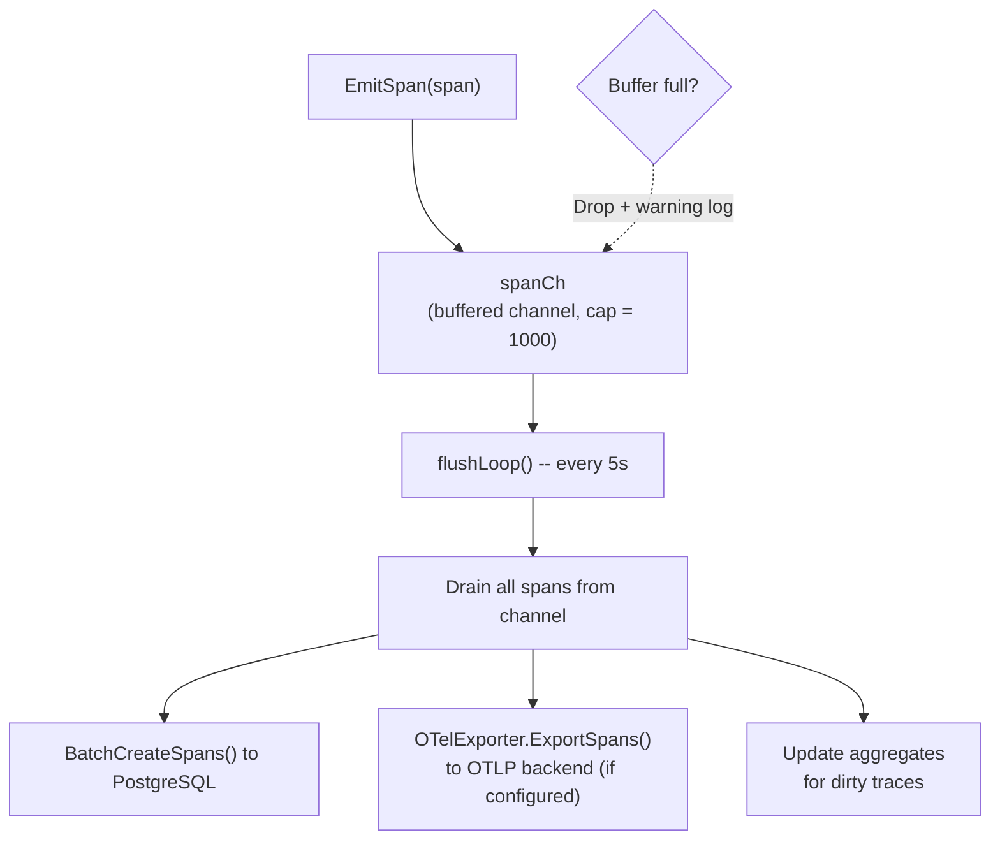
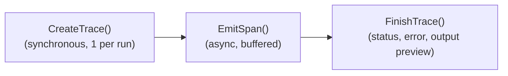
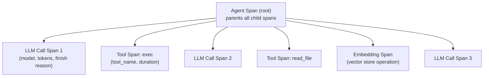
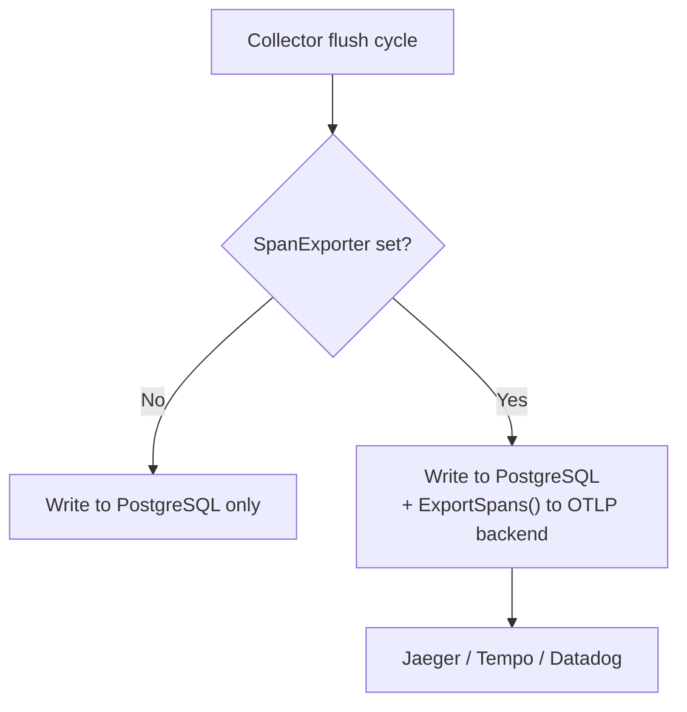

# 10 - Tracing & Observability

Records agent run activities asynchronously. Spans are buffered in memory and flushed to the TracingStore in batches, with optional export to external OpenTelemetry backends.

> Tracing uses PostgreSQL. The `traces` and `spans` tables store all tracing data. Optional OTel export sends spans to external backends (Jaeger, Grafana Tempo, Datadog) in addition to PostgreSQL.

---

## 1. Collector -- Buffer-Flush Architecture



### Trace Lifecycle



### Cancel Handling

When a run is cancelled via `/stop` or `/stopall`, the run context is cancelled but trace finalization still needs to persist. `FinishTrace()` detects `ctx.Err() != nil` and switches to `context.Background()` for the final database write. The trace status is set to `"cancelled"` instead of `"error"`.

Context values (traceID, collector) survive cancellation -- only `ctx.Done()` and `ctx.Err()` change. This allows trace finalization to find everything it needs with a fresh context for the DB call.

---

## 2. Span Types & Hierarchy

| Type | Description | OTel Kind |
|------|-------------|-----------|
| `llm_call` | LLM provider call | Client |
| `tool_call` | Tool execution | Internal |
| `agent` | Root agent span (parents all child spans) | Internal |
| `embedding` | Embedding generation (vector store operations) | Internal |
| `event` | Discrete event marker (no duration) | Internal |



### Token Aggregation

Token counts are aggregated **only from `llm_call` spans** (not `agent` spans) to avoid double-counting. The `BatchUpdateTraceAggregates()` method sums `input_tokens` and `output_tokens` from spans where `span_type = 'llm_call'` and writes the totals to the parent trace record.

---

## 3. Verbose Mode

| Mode | InputPreview | OutputPreview |
|------|:---:|:---:|
| Normal | Not recorded | 500 characters max |
| Verbose (`GOCLAW_TRACE_VERBOSE=1`) | Up to 200KB | Up to 200KB |

Verbose mode is useful for debugging LLM conversations. When enabled via `GOCLAW_TRACE_VERBOSE=1`:

- **LLM spans**: Full input messages (including system prompt, history, and tool results) are serialized as JSON and stored in `InputPreview` (truncated at 200KB). LLM response content is stored in `OutputPreview` (truncated at 200KB, includes `<thinking>` tag if present).
- **Tool spans**: Tool input and output are both recorded up to 200KB.
- **Agent span**: Input message and output are both recorded up to 200KB.

In normal mode, previews are truncated to 500 characters max to minimize storage overhead.

---

## 4. OTel Export

Optional OpenTelemetry OTLP exporter that sends spans to external observability backends.



### OTel Configuration

| Parameter | Description |
|-----------|-------------|
| `endpoint` | OTLP endpoint (e.g., `localhost:4317` for gRPC, `localhost:4318` for HTTP) |
| `protocol` | `grpc` (default) or `http` |
| `insecure` | Skip TLS for local development |
| `service_name` | OTel service name (default: `goclaw-gateway`) |
| `headers` | Extra headers (auth tokens, etc.) |

### Batch Processing

| Parameter | Value |
|-----------|-------|
| Max batch size | 100 spans |
| Batch timeout | 5 seconds |

The exporter lives in a separate sub-package (`internal/tracing/otelexport/`) so its gRPC and protobuf dependencies are isolated. Commenting out the import and wiring removes approximately 15-20MB from the binary. The exporter is attached to the Collector via `SetExporter()`.

---

## 5. Cost Calculation

Per-span cost is calculated using the `CalculateCost()` function in `internal/tracing/cost.go`. For each LLM call span:

```
Cost = (PromptTokens × InputCostPerMillion) / 1,000,000
      + (CompletionTokens × OutputCostPerMillion) / 1,000,000
      + (CacheReadTokens × CacheReadCostPerMillion) / 1,000,000
      + (CacheCreationTokens × CacheCreateCostPerMillion) / 1,000,000
```

Model pricing is loaded from `config.ModelPricing` and keyed by `provider/model` (with fallback to `model` only). Cost is stored in the `total_cost` field of each LLM call span. The trace aggregation sums costs from all child `llm_call` spans to compute the trace-level `total_cost`.

Cache token costs (read + create) are optional and only applied if the pricing config specifies non-zero values.

---

## 6. Snapshot Worker -- Realtime Usage Aggregation

The `SnapshotWorker` periodically aggregates trace and span data into hourly `usage_snapshots` for realtime analytics and dashboard displays.

### Operation

- **Schedule**: Ticks every hour at HH:05:00 UTC (5 minutes past the hour)
- **Catch-up**: On startup and after each tick, computes snapshots for all missed hours
- **Backfill**: `Backfill()` method populates historical snapshots from the earliest trace to now

### Snapshot Dimensions

For each hour `[00:00, 01:00)`, the worker creates two types of snapshot rows:

1. **Totals Row** (`provider=""`, `model=""`) — Aggregated from traces:
   - `request_count` — Count of root traces
   - `error_count` — Count of failed traces
   - `unique_users` — Distinct `user_id` in traces
   - `input_tokens`, `output_tokens` — Sum from all child `llm_call` spans
   - `total_cost` — Sum of costs from all child `llm_call` spans
   - `tool_call_count` — Sum from traces
   - `avg_duration_ms` — Average trace duration
   - `memory_docs`, `memory_chunks` — Point-in-time count (attached to agent's totals row only)
   - `kg_entities`, `kg_relations` — Point-in-time count (attached to agent's totals row only)

2. **Detail Rows** (`provider` + `model` specified) — Aggregated from `llm_call` spans:
   - `llm_call_count` — Count of LLM calls for this provider/model
   - `input_tokens`, `output_tokens` — Sum of tokens
   - `total_cost` — Sum of per-call costs
   - `cache_read_tokens`, `cache_create_tokens`, `thinking_tokens` — Sum from span metadata

Grouping: by `(agent_id, channel)` for totals; by `(agent_id, channel, provider, model)` for details.

### Usage

```go
worker := tracing.NewSnapshotWorker(db, snapshotStore)
worker.Start()

// Later:
hoursBackfilled, err := worker.Backfill(ctx)
worker.Stop()
```

---

## 7. Trace HTTP API

| Method | Path | Description |
|--------|------|-------------|
| GET | `/v1/traces` | List traces with pagination and filters |
| GET | `/v1/traces/{id}` | Get trace details with all spans |

### Query Filters

| Parameter | Type | Description |
|-----------|------|-------------|
| `agent_id` | UUID | Filter by agent |
| `user_id` | string | Filter by user |
| `status` | string | Filter by status (running, success, error, cancelled) |
| `from` / `to` | timestamp | Date range filter |
| `limit` | int | Page size (default 50) |
| `offset` | int | Pagination offset |

---

## 8. Delegation History

Delegation history records are stored in the `delegation_history` table and exposed alongside traces for cross-referencing agent interactions.

| Channel | Endpoint | Details |
|---------|----------|---------|
| WebSocket RPC | `delegations.list` / `delegations.get` | Results truncated (500 runes for list, 8000 for detail) |
| HTTP API | `GET /v1/delegations` / `GET /v1/delegations/{id}` | Full records |
| Agent tool | `delegate(action="history")` | Agent self-checking past delegations |

Delegation history is automatically recorded by `DelegateManager.saveDelegationHistory()` for every delegation (sync/async). Each record includes source agent, target agent, input, result, duration, and status.

---

## File Reference

| File | Description |
|------|-------------|
| `internal/tracing/collector.go` | Collector buffer-flush, EmitSpan, FinishTrace, verbose mode |
| `internal/tracing/context.go` | Trace context propagation (TraceID, ParentSpanID, DelegateParentTraceID) |
| `internal/tracing/cost.go` | Cost calculation and pricing lookup |
| `internal/tracing/snapshot_worker.go` | Hourly usage aggregation into snapshots |
| `internal/tracing/otelexport/exporter.go` | OTel OTLP exporter (gRPC + HTTP) |
| `internal/store/tracing_store.go` | TracingStore interface, span/trace type constants |
| `internal/store/pg/tracing.go` | PostgreSQL trace/span persistence + aggregation |
| `internal/http/traces.go` | Trace HTTP API handler (GET /v1/traces) |
| `internal/agent/loop_tracing.go` | Span emission from agent loop (LLM, tool, agent spans) |
| `internal/http/delegations.go` | Delegation history HTTP API handler |
| `internal/gateway/methods/delegations.go` | Delegation history RPC handlers |

---

## Cross-References

| Document | Relevant Content |
|----------|-----------------|
| [01-agent-loop.md](./01-agent-loop.md) | Span emission during agent execution, cancel handling |
| [03-tools-system.md](./03-tools-system.md) | Delegation system, delegation history via agent tool |
| [06-store-data-model.md](./06-store-data-model.md) | traces/spans tables schema, delegation_history table |
| [08-scheduling-cron.md](./08-scheduling-cron.md) | Scheduler lanes, /stop and /stopall commands |
| [09-security.md](./09-security.md) | Rate limiting, RBAC access control |
