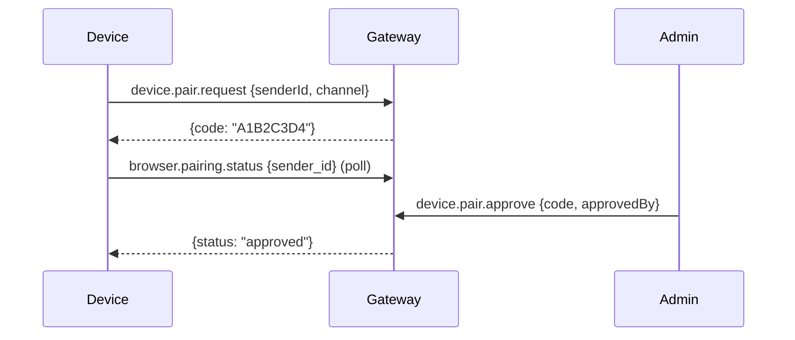

# 19 — WebSocket RPC Methods

GoClaw's primary control plane is a WebSocket-based JSON-RPC protocol (v3). Clients connect to `/ws`, authenticate via `connect`, then exchange request/response/event frames.

For the wire protocol, frame format, and connection lifecycle, see [04 — Gateway Protocol](04-gateway-protocol.md). This document catalogs every available RPC method.

---

## 1. Connection & System

### `connect`

Establish an authenticated session. Must be the first request after WebSocket upgrade.

**Request:**

```json
{
  "token": "gateway-token-or-api-key",
  "user_id": "external-user-id",
  "sender_id": "optional-device-id",
  "locale": "en"
}
```

**Response:**

```json
{
  "protocol": 3,
  "role": "admin",
  "user_id": "user-123",
  "server": {
    "version": "1.0.0",
    "uptime": "2h30m"
  }
}
```

**Auth flow:** Gateway token → timing-safe compare → admin role. If no match, SHA-256 hash → API key lookup → role derived from scopes. Pairing codes also accepted for channel devices.

### `health`

Server health and connected clients.

**Response:**

```json
{
  "status": "ok",
  "version": "1.0.0",
  "uptime": "2h30m",
  "mode": "managed",
  "database": "ok",
  "tools": ["exec", "web_fetch", "memory", "..."],
  "clients": [{"id": "...", "role": "admin", "user_id": "..."}],
  "currentId": "client-uuid"
}
```

### `status`

Quick agent/session/client counts.

**Response:**

```json
{
  "agents": [{"id": "...", "name": "...", "isRunning": false}],
  "agentTotal": 5,
  "clients": 2,
  "sessions": 42
}
```

---

## 2. Chat

### `chat.send`

Send a message to an agent and trigger execution.

**Request:**

```json
{
  "message": "Hello, agent",
  "agentId": "uuid-or-key",
  "sessionKey": "optional-session",
  "stream": true,
  "media": [{"type": "image", "url": "..."}]
}
```

**Response:**

```json
{
  "runId": "uuid",
  "content": "Agent response text",
  "usage": {"input_tokens": 100, "output_tokens": 50},
  "media": []
}
```

When `stream: true`, intermediate events are emitted: `chunk`, `tool.call`, `tool.result`, `run.started`, `run.completed`.

### `chat.history`

Retrieve chat history for a session.

**Request:** `{agentId, sessionKey}`
**Response:** `{messages: [{role, content, timestamp, ...}]}`

### `chat.abort`

Cancel running agent invocations.

**Request:** `{sessionKey?, runId?}`
**Response:** `{ok: true, aborted: 1, runIds: ["..."]}`

### `chat.inject`

Inject a message into the session transcript without triggering the agent.

**Request:** `{sessionKey, message, label}`
**Response:** `{ok: true, messageId: "..."}`

---

## 3. Agents

### `agents.list`

List all agents.

**Response:** `{agents: [{id, name, key, emoji, avatar, agent_type, ...}]}`

### `agent`

Get single agent status.

**Request:** `{agentId}`
**Response:** `{id, isRunning}`

### `agent.wait`

Wait for agent completion.

**Request:** `{agentId}`
**Response:** `{id, status}`

### `agent.identity.get`

Get agent identity (name, emoji, avatar, description).

**Request:** `{agentId?, sessionKey?}`
**Response:** `{agentId, name, emoji, avatar, description}`

### `agents.create`

Create a new agent (admin only).

**Request:**

```json
{
  "name": "My Agent",
  "workspace": "~/agents/my-agent",
  "emoji": "🤖",
  "agent_type": "open",
  "owner_ids": ["user-1"],
  "tools_config": {},
  "memory_config": {},
  "sandbox_config": {}
}
```

**Response:** `{ok: true, agentId: "uuid", name, workspace}`

### `agents.update`

Update agent properties (admin only).

**Request:** `{agentId, name?, model?, avatar?, tools_config?, ...}`
**Response:** `{ok: true, agentId}`

### `agents.delete`

Delete an agent (admin only).

**Request:** `{agentId, deleteFiles: false}`
**Response:** `{ok: true, agentId, removedBindings: 2}`

### Agent Context Files

| Method | Description |
|--------|-------------|
| `agents.files.list` | List allowed context files |
| `agents.files.get` | Get file content |
| `agents.files.set` | Save file content |

**Request:** `{agentId, name?, content?}`

### Agent Links (Delegations)

| Method | Description |
|--------|-------------|
| `agents.links.list` | List delegation links (direction: from/to/all) |
| `agents.links.create` | Create link between agents |
| `agents.links.update` | Update link settings |
| `agents.links.delete` | Delete link |

---

## 4. Sessions

| Method | Description |
|--------|-------------|
| `sessions.list` | List sessions (paginated) |
| `sessions.preview` | Get session history + summary |
| `sessions.patch` | Update label, model, metadata |
| `sessions.delete` | Delete session |
| `sessions.reset` | Clear session messages |

**`sessions.list` request:** `{agentId, limit, offset}`
**Response:** `{sessions[], total, limit, offset}`

---

## 5. Config

### `config.get`

Get current configuration.

**Response:** `{config: {...}, hash: "sha256", path: "/path/to/config.json"}`

### `config.apply`

Replace entire config (admin only). Uses optimistic locking via `baseHash`.

**Request:** `{raw: "json5 content", baseHash: "sha256"}`
**Response:** `{ok, path, config, hash, restart: false}`

### `config.patch`

Merge partial config update (admin only).

**Request:** `{raw: "{gateway: {port: 9090}}", baseHash: "sha256"}`
**Response:** `{ok, path, config, hash, restart: true}`

### `config.schema`

Get JSON schema for config form generation.

**Response:** `{json: {...schema...}}`

---

## 6. Skills

| Method | Description |
|--------|-------------|
| `skills.list` | List all available skills |
| `skills.get` | Get skill metadata and content |
| `skills.update` | Update skill metadata (DB-backed only) |

---

## 7. Cron

| Method | Description |
|--------|-------------|
| `cron.list` | List cron jobs |
| `cron.create` | Create scheduled job |
| `cron.update` | Update job settings |
| `cron.delete` | Delete job |
| `cron.toggle` | Enable/disable job |
| `cron.status` | Get scheduler status |
| `cron.run` | Trigger immediate execution |
| `cron.runs` | List execution history |

### `cron.create` Request

```json
{
  "name": "daily-report",
  "schedule": "every day at 09:00",
  "message": "Generate daily report",
  "deliver": "channel",
  "channel": "telegram",
  "to": "chat-id",
  "agentId": "uuid"
}
```

---

## 8. Channels

| Method | Description |
|--------|-------------|
| `channels.list` | List enabled channels |
| `channels.status` | Get channel connection status |

### Channel Instances

| Method | Description |
|--------|-------------|
| `channels.instances.list` | List instances |
| `channels.instances.get` | Get instance details |
| `channels.instances.create` | Create instance |
| `channels.instances.update` | Update instance |
| `channels.instances.delete` | Delete instance |

---

## 9. Device Pairing

| Method | Description | Auth |
|--------|-------------|------|
| `device.pair.request` | Request pairing (from device) | Unauthenticated |
| `device.pair.approve` | Approve request (from admin) | Admin |
| `device.pair.deny` | Deny request | Admin |
| `device.pair.list` | List pending + paired devices | Admin |
| `device.pair.revoke` | Revoke device | Admin |
| `browser.pairing.status` | Poll pairing status | Unauthenticated |

### Pairing Flow



---

## 10. Teams

### Team CRUD

| Method | Description |
|--------|-------------|
| `teams.list` | List all teams |
| `teams.create` | Create team (admin only) |
| `teams.get` | Get team with members |
| `teams.update` | Update team properties |
| `teams.delete` | Delete team |

### Members

| Method | Description |
|--------|-------------|
| `teams.members.add` | Add agent to team with role |
| `teams.members.remove` | Remove agent from team |

### Tasks

| Method | Description |
|--------|-------------|
| `teams.tasks.list` | List team tasks (filterable) |
| `teams.tasks.get` | Get task with comments/events |
| `teams.tasks.create` | Create task |
| `teams.tasks.approve` | Approve task |
| `teams.tasks.reject` | Reject task |
| `teams.tasks.comment` | Add comment |
| `teams.tasks.comments` | List comments |
| `teams.tasks.events` | List task events |
| `teams.tasks.assign` | Assign to member |

### Workspace

| Method | Description |
|--------|-------------|
| `teams.workspace.list` | List workspace items |
| `teams.workspace.read` | Read workspace file |
| `teams.workspace.delete` | Delete workspace item |

---

## 11. Exec Approvals

| Method | Description |
|--------|-------------|
| `exec.approval.list` | List pending command approvals |
| `exec.approval.approve` | Approve (optionally always for this command) |
| `exec.approval.deny` | Deny command execution |

---

## 12. Delegations

| Method | Description |
|--------|-------------|
| `delegations.list` | List delegation history (filterable) |
| `delegations.get` | Get delegation record |

**Filters:** `source_agent_id`, `target_agent_id`, `team_id`, `user_id`, `status`

---

## 13. Usage & Quotas

| Method | Description |
|--------|-------------|
| `usage.get` | Get usage records by agent |
| `usage.summary` | Get summary of token usage |
| `quota.usage` | Get quota consumption |

---

## 14. API Keys

Admin-only methods.

| Method | Description |
|--------|-------------|
| `api_keys.list` | List API keys (masked) |
| `api_keys.create` | Create new API key |
| `api_keys.revoke` | Revoke an API key |

See [20 — API Keys & Auth](20-api-keys-auth.md) for the full authentication model.

---

## 15. Messaging

### `send`

Route an outbound message to a channel.

**Request:** `{channel: "telegram", to: "chat-id", message: "Hello"}`
**Response:** `{ok: true, channel, to}`

---

## 16. Logs

### `logs.tail`

Start or stop live log streaming.

**Request:** `{action: "start", level: "info"}`
**Response:** `{status: "started", level: "info"}`

Log entries are delivered as events while tailing is active.

---

## 17. Permission Matrix

Methods are gated by role. The role is determined at `connect` time from the token type and scopes.

| Role | Access |
|------|--------|
| **Admin** | All methods |
| **Operator** | Read + write operations (chat, sessions, cron, approvals, send) |
| **Viewer** | Read-only (list, get, preview, status, history) |

### Admin-Only Methods

`config.apply`, `config.patch`, `agents.create`, `agents.update`, `agents.delete`, `agents.links.*`, `channels.toggle`, `device.pair.approve`, `device.pair.deny`, `device.pair.revoke`, `teams.*`, `api_keys.*`

### Write Methods (Operator+)

`chat.send`, `chat.abort`, `chat.inject`, `sessions.delete`, `sessions.reset`, `sessions.patch`, `cron.*`, `skills.update`, `exec.approval.*`, `send`, `teams.tasks.*`

### Read Methods (Viewer+)

All other methods: list, get, preview, status, history, etc.

---

## 18. Events

The server pushes events to connected clients via event frames. Key event types:

| Event | Description |
|-------|-------------|
| `run.started` | Agent run began |
| `run.completed` | Agent run finished |
| `chunk` | Streaming text chunk |
| `tool.call` | Tool invocation started |
| `tool.result` | Tool invocation completed |
| `session.updated` | Session metadata changed |
| `agent.updated` | Agent config changed |
| `cron.fired` | Cron job triggered |
| `team.task.*` | Team task lifecycle events |
| `exec.approval.pending` | Command awaiting approval |

---

## File Reference

| File | Purpose |
|------|---------|
| `internal/gateway/router.go` | Method dispatch + auth + connect handler |
| `internal/gateway/client.go` | WebSocket client + frame reading |
| `internal/gateway/server.go` | Server + mux setup |
| `internal/gateway/methods/chat.go` | Chat send/history/abort/inject |
| `internal/gateway/methods/agents.go` | Agent list/status |
| `internal/gateway/methods/agents_create.go` | Agent creation |
| `internal/gateway/methods/agents_update.go` | Agent update |
| `internal/gateway/methods/agents_delete.go` | Agent deletion |
| `internal/gateway/methods/agents_files.go` | Agent context files |
| `internal/gateway/methods/agents_identity.go` | Agent identity |
| `internal/gateway/methods/agent_links.go` | Agent delegation links |
| `internal/gateway/methods/config.go` | Config get/apply/patch/schema |
| `internal/gateway/methods/sessions.go` | Session CRUD |
| `internal/gateway/methods/skills.go` | Skill list/get/update |
| `internal/gateway/methods/cron.go` | Cron job management |
| `internal/gateway/methods/channels.go` | Channel listing |
| `internal/gateway/methods/channel_instances.go` | Channel instance CRUD |
| `internal/gateway/methods/pairing.go` | Device pairing flow |
| `internal/gateway/methods/teams.go` | Team list |
| `internal/gateway/methods/teams_crud.go` | Team CRUD |
| `internal/gateway/methods/teams_members.go` | Team membership |
| `internal/gateway/methods/teams_tasks.go` | Team task management |
| `internal/gateway/methods/teams_workspace.go` | Team workspace |
| `internal/gateway/methods/exec_approval.go` | Exec approval flow |
| `internal/gateway/methods/delegations.go` | Delegation history |
| `internal/gateway/methods/usage.go` | Usage records |
| `internal/gateway/methods/quota_methods.go` | Quota consumption |
| `internal/gateway/methods/api_keys.go` | API key management |
| `internal/gateway/methods/send.go` | Outbound messaging |
| `internal/gateway/methods/logs.go` | Log tailing |
| `internal/permissions/policy.go` | RBAC policy engine |
| `pkg/protocol/methods.go` | Method name constants |
