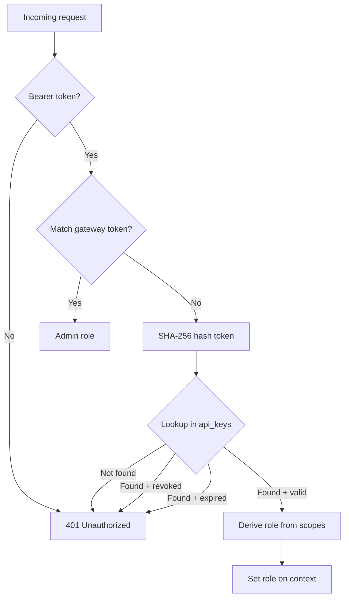

# 20 — API Keys & Authentication

GoClaw supports two authentication mechanisms: a single gateway token (configured at startup) and multiple API keys with fine-grained RBAC scopes. Both work across HTTP REST and WebSocket RPC.

---

## 1. Gateway Token

The gateway token is set in `config.json` under `gateway.token`. It grants full admin access.

```json5
{
  "gateway": {
    "token": "my-secret-token"
  }
}
```

Used as a Bearer token:

```
Authorization: Bearer my-secret-token
```

Or in WebSocket `connect`:

```json
{"method": "connect", "params": {"token": "my-secret-token", "user_id": "admin"}}
```

> The gateway token is compared using timing-safe comparison to prevent timing attacks.

---

## 2. API Keys

API keys provide scoped, revocable access for CI/CD, integrations, and third-party clients.

### Key Format

```
goclaw_a1b2c3d4e5f6789012345678901234567890abcdef
```

- **Prefix:** `goclaw_` (6 chars)
- **Random:** 32 hex characters (128 bits of entropy)
- **Display prefix:** `goclaw_` + first 8 hex chars (shown in UI after creation)

### Security Model

Keys are hashed with SHA-256 before storage — the raw key is never persisted. This follows the same pattern as GitHub Personal Access Tokens.

```
raw key → SHA-256 → stored hash
```

On authentication, the incoming token is hashed and looked up in the `api_keys` table via a partial index on non-revoked keys.

### Show-Once Pattern

The raw key is returned **only once** in the create response. All subsequent list/get calls show only the `prefix` field (first 8 chars after `goclaw_`). Users must copy the key immediately.

---

## 3. RBAC Scopes

Each API key is assigned one or more scopes that determine what operations it can perform.

| Scope | Description | Derived Role |
|-------|-------------|-------------|
| `operator.admin` | Full access (equivalent to gateway token) | Admin |
| `operator.read` | Read-only access to all resources | Viewer |
| `operator.write` | Read + write access (chat, sessions, cron) | Operator |
| `operator.approvals` | Manage exec approvals | Operator |
| `operator.pairing` | Manage device pairings | Operator |

### Role Derivation

The highest-privilege scope determines the effective role:

```
admin scope present    → RoleAdmin
write/approvals/pairing → RoleOperator
read only              → RoleViewer
```

The role is then used by the `PolicyEngine` to gate method access (see [19 — WebSocket RPC](19-websocket-rpc.md#17-permission-matrix)).

---

## 4. Authentication Flow



This flow is identical for both HTTP (`internal/http/auth.go`) and WebSocket (`internal/gateway/router.go` — connect handler).

### Last-Used Tracking

On successful API key authentication, `last_used_at` is updated asynchronously (via goroutine) to avoid blocking the request path.

---

## 5. Database Schema

```sql
CREATE TABLE api_keys (
    id          UUID PRIMARY KEY DEFAULT gen_random_uuid(),
    name        TEXT        NOT NULL,
    prefix      TEXT        NOT NULL,
    key_hash    TEXT        NOT NULL,
    scopes      TEXT[]      NOT NULL DEFAULT '{}',
    expires_at  TIMESTAMPTZ,
    last_used_at TIMESTAMPTZ,
    revoked     BOOLEAN     NOT NULL DEFAULT FALSE,
    created_by  TEXT        NOT NULL DEFAULT '',
    created_at  TIMESTAMPTZ NOT NULL DEFAULT now(),
    updated_at  TIMESTAMPTZ NOT NULL DEFAULT now()
);

CREATE INDEX idx_api_keys_hash_active
    ON api_keys (key_hash)
    WHERE NOT revoked;
```

The partial index ensures only active (non-revoked) keys are searched during authentication, keeping lookups fast regardless of how many keys have been revoked over time.

---

## 6. API Endpoints

### HTTP REST

| Method | Path | Description |
|--------|------|-------------|
| `GET` | `/v1/api-keys` | List all keys (masked) |
| `POST` | `/v1/api-keys` | Create key |
| `DELETE` | `/v1/api-keys/{id}` | Revoke key |

### WebSocket RPC

| Method | Description |
|--------|-------------|
| `api_keys.list` | List all keys (masked) |
| `api_keys.create` | Create key |
| `api_keys.revoke` | Revoke key |

All API key management operations require admin access (gateway token or API key with `operator.admin` scope).

### Create Request

```json
{
  "name": "ci-deploy",
  "scopes": ["operator.read", "operator.write"],
  "expires_in": 2592000
}
```

| Field | Type | Required | Description |
|-------|------|----------|-------------|
| `name` | string | Yes | Human-readable label |
| `scopes` | string[] | Yes | Permission scopes |
| `expires_in` | int | No | TTL in seconds (omit for no expiry) |

### Create Response

```json
{
  "id": "01961234-5678-7abc-def0-123456789012",
  "name": "ci-deploy",
  "prefix": "goclaw_a1b2c3d4",
  "key": "goclaw_a1b2c3d4e5f6789012345678901234567890abcdef",
  "scopes": ["operator.read", "operator.write"],
  "expires_at": "2026-04-14T12:00:00Z",
  "created_at": "2026-03-15T12:00:00Z"
}
```

### List Response

```json
[
  {
    "id": "01961234-...",
    "name": "ci-deploy",
    "prefix": "goclaw_a1b2c3d4",
    "scopes": ["operator.read", "operator.write"],
    "expires_at": "2026-04-14T12:00:00Z",
    "last_used_at": "2026-03-15T14:30:00Z",
    "revoked": false,
    "created_by": "admin",
    "created_at": "2026-03-15T12:00:00Z"
  }
]
```

> Note: `key` field is absent in list responses. Only `prefix` is shown.

---

## 7. Backward Compatibility

The gateway token continues to work exactly as before. API keys are an additional authentication path — no breaking changes to existing integrations.

| Auth method | Before | After |
|------------|--------|-------|
| Gateway token | Admin access | Admin access (unchanged) |
| API key | N/A | Scoped access per key |
| Device pairing | Operator access | Operator access (unchanged) |

---

## 8. Web UI

The API Keys management page is accessible from the sidebar under **System > API Keys** (admin only).

Features:
- **Create dialog:** Name, scope checkboxes, optional expiry (1 day, 7 days, 30 days, 90 days, never)
- **Show-once dialog:** Displays the raw key with copy button after creation
- **List view:** Searchable, paginated table with name, prefix, scopes, expiry, last used, status
- **Revoke:** Confirmation dialog before revoking a key

---

## 9. Usage Examples

### cURL with API Key

```bash
# List agents (read scope required)
curl -H "Authorization: Bearer goclaw_a1b2c3d4..." \
     http://localhost:9090/v1/agents

# Send chat message (write scope required)
curl -X POST -H "Authorization: Bearer goclaw_a1b2c3d4..." \
     -H "Content-Type: application/json" \
     -d '{"model":"goclaw:my-agent","messages":[{"role":"user","content":"Hello"}]}' \
     http://localhost:9090/v1/chat/completions
```

### WebSocket with API Key

```json
{"id": 1, "method": "connect", "params": {
  "token": "goclaw_a1b2c3d4e5f6...",
  "user_id": "ci-bot"
}}
```

### Create Key via API

```bash
curl -X POST -H "Authorization: Bearer gateway-admin-token" \
     -H "Content-Type: application/json" \
     -d '{"name":"ci","scopes":["operator.read","operator.write"]}' \
     http://localhost:9090/v1/api-keys
```

---

## File Reference

| File | Purpose |
|------|---------|
| `internal/crypto/apikey.go` | Key generation + SHA-256 hashing |
| `internal/store/api_key_store.go` | Store interface + `APIKeyData` struct |
| `internal/store/pg/api_keys.go` | PostgreSQL implementation |
| `internal/http/api_keys.go` | HTTP API handler |
| `internal/http/auth.go` | HTTP auth middleware (resolveAPIKey) |
| `internal/gateway/router.go` | WebSocket connect auth (API key path) |
| `internal/gateway/methods/api_keys.go` | WebSocket RPC methods |
| `internal/permissions/policy.go` | RBAC policy engine |
| `internal/permissions/scope.go` | Scope constants + RoleFromScopes |
| `migrations/000020_api_keys.up.sql` | Database migration |
| `ui/web/src/pages/api-keys/` | Web UI components |
