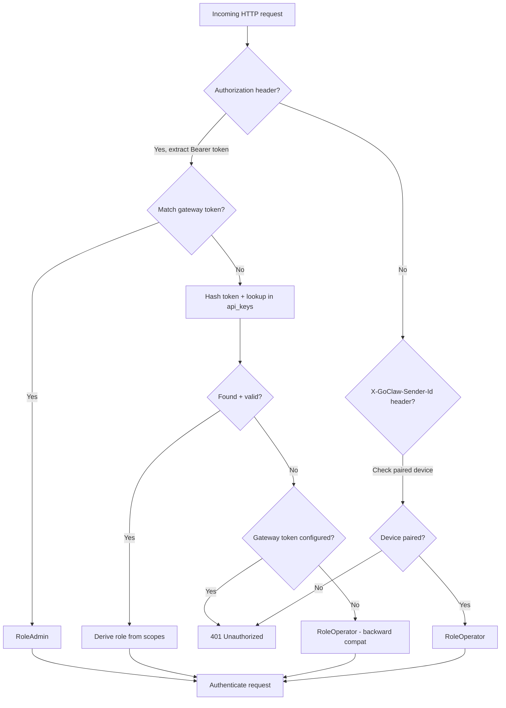

# 20 — API Keys & Authentication

GoClaw supports two authentication mechanisms: a single gateway token (configured at startup) and multiple API keys with fine-grained RBAC scopes. Both work across HTTP REST and WebSocket RPC.

---

## 1. Gateway Token

The gateway token is set in `config.json` under `gateway.token`. It grants full admin access.

```json5
{
  "gateway": {
    "token": "my-secret-token"
  }
}
```

Used as a Bearer token:

```
Authorization: Bearer my-secret-token
```

Or in WebSocket `connect`:

```json
{"method": "connect", "params": {"token": "my-secret-token", "user_id": "admin"}}
```

### Security

The gateway token is compared using **constant-time comparison** (`crypto/subtle.ConstantTimeCompare`) in both HTTP (`auth.go:tokenMatch`) and WebSocket (`router.go:handleConnect`) to prevent timing attacks. The comparison reveals no information about where the provided token first differs from the expected token.

---

## 2. API Keys

API keys provide scoped, revocable access for CI/CD, integrations, and third-party clients.

### Key Format

```
goclaw_a1b2c3d4e5f6789012345678901234567890abcdef
```

- **Prefix:** `goclaw_` (6 chars)
- **Random:** 32 hex characters (128 bits of entropy)
- **Display prefix:** `goclaw_` + first 8 hex chars (shown in UI after creation)

### Security Model

Keys are hashed with SHA-256 before storage — the raw key is never persisted. This follows the same pattern as GitHub Personal Access Tokens.

```
raw key → SHA-256 → stored hash
```

On authentication, the incoming token is hashed and looked up in the `api_keys` table via a partial index on non-revoked keys.

### Show-Once Pattern

The raw key is returned **only once** in the create response. All subsequent list/get calls show only the `prefix` field (8 hex characters representing the first 4 bytes of the random component). Users must copy the key immediately after creation, as it cannot be retrieved again.

---

## 3. RBAC Scopes

Each API key is assigned one or more scopes that determine what operations it can perform. Scopes are validated against the set of valid scopes at creation time.

| Scope | Description |
|-------|-------------|
| `operator.admin` | Full access — equivalent to gateway token, can manage API keys and SecureCLI configs |
| `operator.read` | Read-only access to agents, sessions, skills, chat history, and metadata |
| `operator.write` | Read + write access — can send chat messages, manage sessions, trigger cron jobs |
| `operator.approvals` | Manage shell command execution approvals (approve/deny exec requests) |
| `operator.pairing` | Manage browser device pairings (list, revoke paired devices) |

### Role Derivation

The highest-privilege scope determines the effective role via `RoleFromScopes()` in `permissions/policy.go`:

```
if admin scope present           → RoleAdmin
if write/approvals/pairing scope → RoleOperator
if read scope only               → RoleViewer
default                          → RoleViewer
```

The derived role is then used by the `PolicyEngine.CanAccess()` method to gate RPC method access (see [19 — WebSocket RPC](19-websocket-rpc.md#17-permission-matrix)).

---

## 4. Authentication Flow

### Prioritized Auth Paths

GoClaw tries authentication methods in this priority order:

1. **Gateway token** (exact match via constant-time comparison) → `RoleAdmin`
2. **API key** (SHA-256 hash lookup in `api_keys` table) → role from scopes
3. **Browser pairing** (sender ID must be paired with "browser" device type) → `RoleOperator` (HTTP only; requires `X-GoClaw-Sender-Id` header)
4. **No auth configured** (backward compatibility: if no gateway token is set) → `RoleOperator`
5. **No valid auth found** → `401 Unauthorized`

### HTTP Request Flow



### WebSocket Connect Flow

The same auth paths apply for WebSocket `connect` messages. The connection parameter `token` is checked against the gateway token first, then API keys, then browser pairing.

### API Key Caching

API keys are cached in-memory with a 5-minute TTL to reduce database load. The cache:
- Maps SHA-256 hash → `APIKeyData` + derived role
- Supports **negative caching** (tracks failed lookups) to prevent repeated DB queries for invalid tokens
- Caps negative cache to 10,000 entries to prevent memory exhaustion from token spraying attacks
- Is invalidated globally via pubsub on key creation, revocation, or update

### Last-Used Tracking

On successful API key authentication, `last_used_at` is updated asynchronously (fire-and-forget goroutine with 5-second timeout) to avoid blocking the request path. This tracks API usage without slowing down authentication.

---

## 5. Authentication Priority & Backward Compatibility

### HTTP Request Headers

- **Bearer token**: `Authorization: Bearer <token>` — checked first for gateway token or API key
- **User ID**: `X-GoClaw-User-Id: <user-id>` — optional external user identifier (max 255 chars)
- **Browser pairing**: `X-GoClaw-Sender-Id: <sender-id>` — identifies a previously-paired browser device
- **Locale**: `Accept-Language` — user's preferred language (en, vi, zh; default: en)

### Backward Compatibility

If no gateway token is configured (`gateway.token` is empty in `config.json`), all unauthenticated requests are granted `RoleOperator` access. This enables self-hosted deployments without strict authentication. Once a gateway token is configured, all requests must authenticate or use browser pairing.

---

## 5. Database Schema

```sql
CREATE TABLE api_keys (
    id            UUID PRIMARY KEY,
    name          VARCHAR(100) NOT NULL,
    prefix        VARCHAR(8)   NOT NULL,              -- first 8 chars for display
    key_hash      VARCHAR(64)  NOT NULL UNIQUE,       -- SHA-256 hex digest (unique constraint)
    scopes        TEXT[]       NOT NULL DEFAULT '{}', -- e.g. {'operator.admin','operator.read'}
    expires_at    TIMESTAMPTZ,                        -- NULL = never expires
    last_used_at  TIMESTAMPTZ,
    revoked       BOOLEAN      NOT NULL DEFAULT false,
    created_by    VARCHAR(255),                       -- user ID who created the key
    created_at    TIMESTAMPTZ  NOT NULL DEFAULT now(),
    updated_at    TIMESTAMPTZ  NOT NULL DEFAULT now()
);

-- Fast lookup by hash (only active, non-revoked keys)
CREATE INDEX idx_api_keys_key_hash ON api_keys (key_hash) WHERE NOT revoked;

-- Fast lookup by prefix (for display/search in web UI)
CREATE INDEX idx_api_keys_prefix ON api_keys (prefix);
```

The partial index on `key_hash` ensures only active (non-revoked) keys are searched during authentication, keeping lookups fast regardless of how many keys have been revoked over time. The `key_hash` column has a UNIQUE constraint, so only one key can have a given hash.

---

## 6. API Endpoints

### HTTP REST

| Method | Path | Description |
|--------|------|-------------|
| `GET` | `/v1/api-keys` | List all keys (masked) |
| `POST` | `/v1/api-keys` | Create key |
| `POST` | `/v1/api-keys/{id}/revoke` | Revoke key |

### WebSocket RPC

| Method | Description |
|--------|-------------|
| `api_keys.list` | List all keys (masked) |
| `api_keys.create` | Create key |
| `api_keys.revoke` | Revoke key |

All API key management operations require admin access (gateway token or API key with `operator.admin` scope).

### Create Request

```json
{
  "name": "ci-deploy",
  "scopes": ["operator.read", "operator.write"],
  "expires_in": 2592000
}
```

| Field | Type | Required | Description |
|-------|------|----------|-------------|
| `name` | string | Yes | Human-readable label |
| `scopes` | string[] | Yes | Permission scopes |
| `expires_in` | int | No | TTL in seconds (omit for no expiry) |

### Create Response

```json
{
  "id": "01961234-5678-7abc-def0-123456789012",
  "name": "ci-deploy",
  "prefix": "goclaw_a1b2c3d4",
  "key": "goclaw_a1b2c3d4e5f6789012345678901234567890abcdef",
  "scopes": ["operator.read", "operator.write"],
  "expires_at": "2026-04-14T12:00:00Z",
  "created_at": "2026-03-15T12:00:00Z"
}
```

### List Response

```json
[
  {
    "id": "01961234-...",
    "name": "ci-deploy",
    "prefix": "goclaw_a1b2c3d4",
    "scopes": ["operator.read", "operator.write"],
    "expires_at": "2026-04-14T12:00:00Z",
    "last_used_at": "2026-03-15T14:30:00Z",
    "revoked": false,
    "created_by": "admin",
    "created_at": "2026-03-15T12:00:00Z"
  }
]
```

> Note: `key` field is absent in list responses. Only `prefix` is shown.

---

## 7. Backward Compatibility

The gateway token continues to work exactly as before. API keys are an additional authentication path — no breaking changes to existing integrations.

| Auth method | Before | After |
|------------|--------|-------|
| Gateway token | Admin access | Admin access (unchanged) |
| API key | N/A | Scoped access per key |
| Device pairing | Operator access | Operator access (unchanged) |

---

## 8. SecureCLI — CLI Credential Injection

SecureCLI is a feature that allows GoClaw to automatically inject credentials into CLI tools (e.g., `gh`, `gcloud`, `aws`) without requiring the agent to handle plaintext secrets. Credentials are stored encrypted at rest and injected at process startup.

### Use Case

When an agent needs to run `gh auth`, `gcloud auth`, or other authenticated CLI commands, the admin can configure a SecureCLI binary with encrypted environment variables. The agent never sees the raw credentials — they are injected directly into the child process environment via Direct Exec Mode.

### Database Schema

```sql
CREATE TABLE secure_cli_binaries (
    id              UUID PRIMARY KEY,
    binary_name     TEXT NOT NULL,        -- "gh", "gcloud", "aws", etc.
    binary_path     TEXT,                 -- optional absolute path (auto-resolved if null)
    description     TEXT,
    encrypted_env   BYTEA NOT NULL,       -- AES-256-GCM encrypted JSON
    deny_args       JSONB DEFAULT '[]',   -- regex patterns to block subcommands
    deny_verbose    JSONB DEFAULT '[]',   -- verbose flag patterns
    timeout_seconds INTEGER DEFAULT 30,
    tips            TEXT,                 -- injected into TOOLS.md context for agents
    agent_id        UUID,                 -- null = global (all agents), else agent-specific
    enabled         BOOLEAN DEFAULT true,
    created_by      TEXT,
    created_at      TIMESTAMPTZ,
    updated_at      TIMESTAMPTZ
);
```

### HTTP REST API

| Method | Path | Description |
|--------|------|-------------|
| `GET` | `/v1/cli-credentials` | List all SecureCLI configurations |
| `POST` | `/v1/cli-credentials` | Create a new SecureCLI credential config |
| `GET` | `/v1/cli-credentials/{id}` | Get a specific SecureCLI config |
| `PUT` | `/v1/cli-credentials/{id}` | Update a SecureCLI config |
| `DELETE` | `/v1/cli-credentials/{id}` | Delete a SecureCLI config |
| `POST` | `/v1/cli-credentials/{id}/test` | Dry-run test (requires admin) |
| `GET` | `/v1/cli-credentials/presets` | List preset templates for common CLIs |

### Features

- **Agent-specific or global:** Configs can be scoped to a single agent or shared across all agents (agent_id = null)
- **Encryption:** Environment variables are encrypted with AES-256-GCM (same as other secrets)
- **Deny patterns:** Regex patterns to block dangerous subcommands (e.g., prevent `gh auth logout`)
- **Timeout:** Per-config timeout override for long-running CLI operations
- **Tips:** Admin-provided hints injected into agent TOOLS.md context to guide which CLI commands are safe

### Example Configuration

```json
{
  "binary_name": "gh",
  "binary_path": "/usr/local/bin/gh",
  "description": "GitHub CLI for PRs and issues",
  "encrypted_env": {
    "GH_TOKEN": "ghp_xxxxxxxxxxxx"
  },
  "deny_args": ["auth", "logout"],
  "deny_verbose": ["--verbose", "-v"],
  "timeout_seconds": 60,
  "tips": "Use 'gh pr list' to search PRs, 'gh issue create' to open issues. Avoid 'auth' and 'logout' commands.",
  "agent_id": null
}
```

---

## 9. Web UI

The API Keys management page is accessible from the sidebar under **System > API Keys** (admin only).

Features:
- **Create dialog:** Name, scope checkboxes, optional expiry (1 day, 7 days, 30 days, 90 days, never)
- **Show-once dialog:** Displays the raw key with copy button after creation
- **List view:** Searchable, paginated table with name, prefix, scopes, expiry, last used, status
- **Revoke:** Confirmation dialog before revoking a key

---

## 10. Usage Examples

### cURL with API Key

```bash
# List agents (read scope required)
curl -H "Authorization: Bearer goclaw_a1b2c3d4..." \
     http://localhost:9090/v1/agents

# Send chat message (write scope required)
curl -X POST -H "Authorization: Bearer goclaw_a1b2c3d4..." \
     -H "Content-Type: application/json" \
     -d '{"model":"goclaw:my-agent","messages":[{"role":"user","content":"Hello"}]}' \
     http://localhost:9090/v1/chat/completions
```

### WebSocket with API Key

```json
{"id": 1, "method": "connect", "params": {
  "token": "goclaw_a1b2c3d4e5f6...",
  "user_id": "ci-bot"
}}
```

### Create Key via API

```bash
curl -X POST -H "Authorization: Bearer gateway-admin-token" \
     -H "Content-Type: application/json" \
     -d '{"name":"ci","scopes":["operator.read","operator.write"]}' \
     http://localhost:9090/v1/api-keys
```

---

## 11. File Reference

| File | Purpose |
|------|---------|
| `internal/crypto/apikey.go` | Key generation + SHA-256 hashing |
| `internal/store/api_key_store.go` | Store interface + `APIKeyData` struct |
| `internal/store/secure_cli_store.go` | SecureCLI store interface + `SecureCLIBinary` struct |
| `internal/store/pg/api_keys.go` | PostgreSQL API key implementation |
| `internal/store/pg/secure_cli.go` | PostgreSQL SecureCLI implementation |
| `internal/http/api_keys.go` | HTTP API handler for API keys |
| `internal/http/secure_cli.go` | HTTP API handler for SecureCLI |
| `internal/http/auth.go` | HTTP auth middleware (resolveAPIKey, tokenMatch) |
| `internal/http/api_key_cache.go` | In-memory API key cache with TTL + pubsub invalidation |
| `internal/gateway/router.go` | WebSocket connect auth (API key path) |
| `internal/gateway/methods/api_keys.go` | WebSocket RPC methods for API keys |
| `internal/permissions/policy.go` | RBAC policy engine + role derivation + scope validation |
| `migrations/000020_secure_cli_and_api_keys.up.sql` | Database migration (api_keys + secure_cli_binaries) |
| `ui/web/src/pages/api-keys/` | Web UI components |
