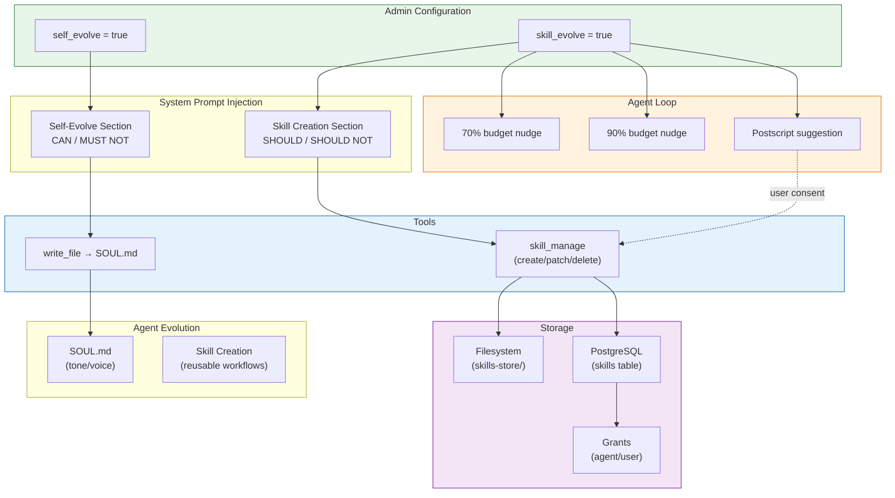
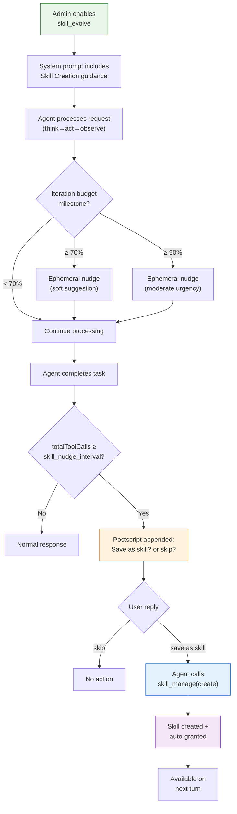
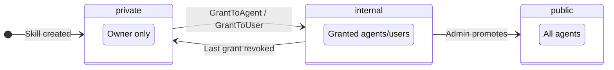
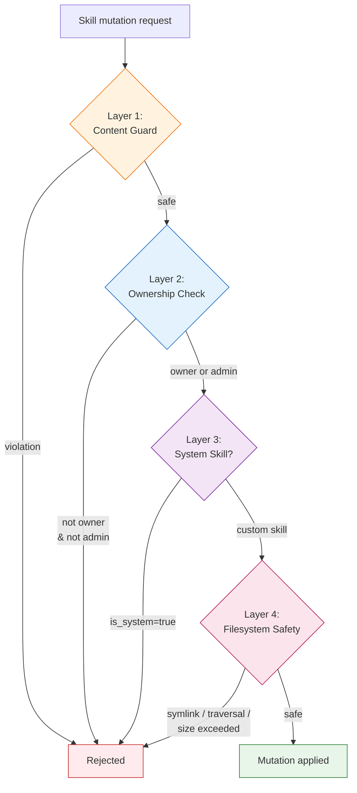

# 21 - Agent Evolution & Skill Management

Three subsystems enable agents to evolve their behavior and capture reusable workflows over time. All restricted to **predefined agents** only.

| Subsystem | Purpose | Mechanism | Config Key |
|-----------|---------|-----------|------------|
| Self-Evolution | Agent refines its own tone/voice | write_file → SOUL.md | `self_evolve` |
| Skill Learning | Agent learns to create skills from experience | System prompt guidance + nudges + consent | `skill_evolve` |
| Skill Management | Create, patch, delete, grant skills | `skill_manage` tool + HTTP/WS API | (always available when skill_evolve=true) |



---

## 1. Self-Evolution (SOUL.md)

### 1.1 What It Does

Predefined agents can refine their communication style by updating their own `SOUL.md` file through conversation. No dedicated tool needed — the agent uses the standard `write_file` tool. Context file interceptor ensures only SOUL.md is writable; IDENTITY.md and AGENTS.md remain locked.

### 1.2 Configuration

| Key | Type | Default | Location |
|-----|------|---------|----------|
| `self_evolve` | boolean | `false` | `agents.other_config` JSONB |

- **Predefined agents only.** Open agents ignore this setting.
- **UI:** General tab → Self-Evolution toggle (shown only for predefined agents).

### 1.3 System Prompt Guidance

Injected by `buildSelfEvolveSection()` when `self_evolve=true` AND `agent_type=predefined` AND not in bootstrap mode.

```
## Self-Evolution

You have self-evolution enabled. You may update your SOUL.md file to
refine your communication style over time.

What you CAN evolve in SOUL.md:
- Tone, voice, and manner of speaking
- Response style and formatting preferences
- Vocabulary and phrasing patterns
- Interaction patterns based on user feedback

What you MUST NOT change:
- Your name, identity, or contact information
- Your core purpose or role
- Any content in IDENTITY.md or AGENTS.md (these remain locked)

Make changes incrementally. Only update SOUL.md when you notice clear
patterns in user feedback or interaction style preferences.
```

**Token cost:** ~95 tokens per request.

### 1.4 Security

| Layer | Enforcement |
|-------|-------------|
| System prompt | CAN/MUST NOT guidance limits scope |
| Context file interceptor | Validates only SOUL.md is writable |
| File locking | IDENTITY.md, AGENTS.md always read-only |

---

## 2. Skill Learning Loop (skill_evolve)

### 2.1 What It Does

Encourages agents to capture reusable workflows as skills after complex tasks. Three touch points in the agent loop:

1. **System prompt guidance** — SHOULD/SHOULD NOT criteria for skill creation
2. **Budget nudges** — ephemeral reminders at 70% and 90% of iteration budget
3. **Postscript suggestion** — appended to final response, requires user consent

No skill is created without explicit user approval ("save as skill" or "skip").

### 2.2 Configuration

| Key | Type | Default | Description |
|-----|------|---------|-------------|
| `skill_evolve` | boolean | `false` | Enable skill learning loop |
| `skill_nudge_interval` | integer | `15` | Minimum tool calls before postscript fires |

Both stored in `agents.other_config` JSONB. Parsed by `ParseSkillEvolve()` and `ParseSkillNudgeInterval()` in `agent_store.go`.

**Predefined agents only.** Enforced at resolver level:

```go
// resolver.go:346
SkillEvolve: ag.AgentType == "predefined" && ag.ParseSkillEvolve(),
```

Open agents always get `skillEvolve=false` regardless of DB setting.

**UI:** Config tab → Skill Learning section (toggle + interval input).

### 2.3 Lifecycle Flow



### 2.4 System Prompt Guidance

Injected by `buildSkillsSection()` when `HasSkillManage=true` (requires both `skill_evolve=true` AND `skill_manage` tool registered).

```
### Skill Creation (recommended after complex tasks)

After completing a complex task (5+ tool calls), consider:
"Would this process be useful again in the future?"

SHOULD create skill when:
- Process is repeatable with different inputs
- Multiple steps that are easy to forget
- Domain-specific workflow others could benefit from

SHOULD NOT create skill when:
- One-time task specific to this user/context
- Debugging or troubleshooting (too context-dependent)
- Simple tasks (< 5 tool calls)
- User explicitly said "skip" or declined

Creating: skill_manage(action="create", content="---\nname: ...\n...")
Improving: skill_manage(action="patch", slug="...", find="...", replace="...")
Removing: skill_manage(action="delete", slug="...")

Constraints:
- You can only manage skills you created (not system or other users' skills)
- Quality over quantity — one excellent skill beats five mediocre ones
- Ask user before creating if unsure
```

If no skills are inlined and no `skill_search` is available, a parent `## Skills` header is added automatically.

**Token cost:** ~135 tokens per request.

### 2.5 Budget Nudges

Ephemeral user messages injected mid-loop. Not persisted to session history. Sent at most once per run each.

**70% iteration budget:**
```
[System] You are at 70% of your iteration budget. Consider whether any
patterns from this session would make a good skill.
```

**90% iteration budget:**
```
[System] You are at 90% of your iteration budget. If this session involved
reusable patterns, consider saving them as a skill before completing.
```

| Property | Value |
|----------|-------|
| Message role | `user` (consistent with bootstrap nudge pattern) |
| Prefix | `[System]` (consistent with existing system nudges) |
| Ephemeral | Yes — in-memory only, not persisted to session |
| i18n | `i18n.T(locale, MsgSkillNudge70Pct)` / `MsgSkillNudge90Pct` |
| Token cost | ~31 / ~48 tokens each |

### 2.6 Postscript Suggestion

Appended to the agent's final response when conditions are met. User sees it inline and can explicitly consent.

**Conditions:** `skill_evolve=true` AND `skill_nudge_interval > 0` AND `totalToolCalls >= skill_nudge_interval` AND response not empty AND not silent AND not already sent this run.

**Text (English):**
```
---
_This task involved several steps. Want me to save the process as a
reusable skill? Reply "save as skill" or "skip"._
```

| Property | Value |
|----------|-------|
| Once per run | Yes — `skillPostscriptSent` flag |
| i18n | `i18n.T(locale, MsgSkillNudgePostscript)` |
| Token cost | ~35 tokens (persisted in session) |

### 2.7 Tool Gating

When `skill_evolve=false`, `skill_manage` is completely hidden from the LLM:

1. **API params** (`loop.go:528-537`): filtered from `toolDefs` before sending to provider
2. **System prompt tooling** (`loop_history.go:135-144`): filtered from `toolNames` used in prompt construction

The tool remains in the shared registry (admin can see it) but the agent has zero awareness of it.

---

## 3. Skill Management

### 3.1 Overview

Two paths for creating skills programmatically:

| Path | Interface | Use Case |
|------|-----------|----------|
| `skill_manage` | Content string (SKILL.md body) | Agent creates during conversation (learning loop) |
| `publish_skill` | Directory path | Agent creates via filesystem (see [doc 16](./16-skill-publishing.md)) |

Admin management via HTTP API + WebSocket RPC. Grants system controls per-agent and per-user access.

### 3.2 skill_manage Tool

**Parameters:**

| Parameter | Type | Required | Description |
|-----------|------|----------|-------------|
| `action` | string | yes | `create`, `patch`, or `delete` |
| `slug` | string | patch/delete | Unique skill identifier (auto-derived from name on create) |
| `content` | string | create | Full SKILL.md including YAML frontmatter |
| `find` | string | patch | Exact text to find in current SKILL.md |
| `replace` | string | patch | Replacement text |

**Operations flow:**

```mermaid
flowchart LR
    subgraph CREATE["action = create"]
        direction TB
        C1["Content string"] --> C2["Size ≤ 100KB?"]
        C2 --> C3["Security scan"]
        C3 --> C4["Parse frontmatter"]
        C4 --> C5["Slug validation"]
        C5 --> C6["System skill<br/>conflict check"]
        C6 --> C7["Write SKILL.md<br/>to versioned dir"]
        C7 --> C8["DB insert<br/>(advisory lock)"]
        C8 --> C9["Auto-grant +<br/>dep scan"]
    end

    subgraph PATCH["action = patch"]
        direction TB
        P1["slug + find/replace"] --> P2["Exists?<br/>System skill?"]
        P2 --> P3["Ownership check"]
        P3 --> P4["Read current +<br/>apply patch"]
        P4 --> P5["Security scan<br/>patched content"]
        P5 --> P6["New version<br/>(advisory lock)"]
        P6 --> P7["Copy companions +<br/>DB update"]
    end

    subgraph DELETE["action = delete"]
        direction TB
        D1["slug"] --> D2["Exists?<br/>System skill?"]
        D2 --> D3["Ownership check"]
        D3 --> D4["Move to .trash/"]
        D4 --> D5["DB archive +<br/>cascade grants"]
    end

    style CREATE fill:#e8f5e9,stroke:#2e7d32
    style PATCH fill:#fff3e0,stroke:#ef6c00
    style DELETE fill:#ffebee,stroke:#c62828
```



### 3.3 publish_skill Tool

Directory-based alternative. See [16 - Skill Publishing System](./16-skill-publishing.md) for full details.

| Dimension | `skill_manage` | `publish_skill` |
|-----------|---------------|-----------------|
| Input | Content string | Directory path |
| Files | SKILL.md only (patch copies companions) | Entire directory (scripts, assets, etc.) |
| Dependency scan | Yes (warn only) | Yes (warn only) |
| Auto-grant | Yes | Yes |
| Skill creation guidance | Yes (skill_evolve prompt) | No (uses skill-creator core skill) |
| Gated by | `skill_evolve` config | Always available (builtin tool toggle) |

### 3.4 HTTP API

All endpoints require authentication (`authMiddleware`). Mutation endpoints require ownership or admin role.

| Method | Path | Description |
|--------|------|-------------|
| `GET` | `/v1/skills` | List all skills (admin) |
| `GET` | `/v1/skills/{id}` | Get skill details |
| `PUT` | `/v1/skills/{id}` | Update metadata (owner/admin) |
| `DELETE` | `/v1/skills/{id}` | Delete/archive skill (owner/admin) |
| `POST` | `/v1/skills/{id}/toggle` | Enable/disable skill (owner/admin) |
| `POST` | `/v1/skills/{id}/grants/agent` | Grant skill to agent (owner/admin) |
| `DELETE` | `/v1/skills/{id}/grants/agent` | Revoke agent grant (owner/admin) |
| `POST` | `/v1/skills/{id}/grants/user` | Grant skill to user (owner/admin) |
| `DELETE` | `/v1/skills/{id}/grants/user` | Revoke user grant (owner/admin) |
| `POST` | `/v1/skills/upload` | Upload custom skill ZIP |
| `POST` | `/v1/skills/rescan-deps` | Re-scan all enabled skills |
| `POST` | `/v1/skills/install-deps` | Install all missing deps |
| `GET` | `/v1/skills/runtimes` | Check python3/node availability |

### 3.5 WebSocket RPC

| Method | Description |
|--------|-------------|
| `skills.list` | List skills with enabled/status/deps |
| `skills.get` | Get skill content by name |
| `skills.update` | Update metadata (ownership-protected) |

### 3.6 Grants & Visibility



**Access resolution** (`ListAccessible` query):

| Visibility | Who can access |
|------------|---------------|
| `public` | All agents |
| `internal` | Agents/users with explicit grants |
| `private` | Owner only |
| `is_system=true` | All agents (always) |

Grant/revoke operations require **ownership or admin role**.

---

## 4. Security Model



### 4.1 Content Guard (`guard.go`)

Line-by-line regex scan of SKILL.md content **before** any disk write. Hard-reject on ANY violation. 25 rules in 6 categories:

| Category | Examples |
|----------|----------|
| Destructive shell | `rm -rf /`, fork bomb, `dd of=/dev/`, `mkfs`, `shred` |
| Code injection | `base64 -d \| sh`, `eval $(...)`, `curl \| bash`, `python -c exec()` |
| Credential exfil | `/etc/passwd`, `.ssh/id_rsa`, `AWS_SECRET_ACCESS_KEY`, `GOCLAW_DB_URL` |
| Path traversal | `../../../` deep traversal |
| SQL injection | `DROP TABLE`, `TRUNCATE TABLE`, `DROP DATABASE` |
| Privilege escalation | `sudo`, world-writable `chmod`, `chown root` |

Not exhaustive — defense-in-depth layer. GoClaw's `exec` tool has its own runtime deny-list for shell commands.

### 4.2 Ownership Enforcement

Three-layer ownership check across all mutation paths:

| Layer | File | Check |
|-------|------|-------|
| Tool | `skill_manage.go` | `GetSkillOwnerIDBySlug(slug)` before patch/delete |
| HTTP | `skills.go`, `skills_grants.go` | `GetSkillOwnerID(uuid)` + `permissions.HasMinRole` admin bypass |
| WS Gateway | `gateway/methods/skills.go` | `skillOwnerGetter` interface + `client.Role()` admin bypass |

System skills (`is_system=true`) cannot be modified through any path.

### 4.3 Filesystem Safety

| Protection | Implementation |
|------------|----------------|
| Symlink detection | `filepath.WalkDir` + `d.Type()&os.ModeSymlink` check |
| Path traversal | `strings.Contains(rel, "..")` rejection |
| Content size limit | 100KB max for SKILL.md content |
| Companion size limit | 20MB max total for companion files (scripts, assets) |
| Soft-delete | Files moved to `.trash/`, never hard-deleted |

---

## 5. Versioning & Storage

Skills use immutable versioned directories. Each create or patch produces a new version:

```
skills-store/
├── my-skill/
│   ├── 1/
│   │   ├── SKILL.md
│   │   └── scripts/
│   └── 2/          ← patch creates new version
│       ├── SKILL.md
│       └── scripts/  (copied from v1)
├── .trash/
│   └── old-skill.1710000000   ← soft-deleted
```

**Concurrency control:** `pg_advisory_xact_lock` keyed on FNV-64a hash of slug serializes concurrent version creation for the same skill.

**Database:** `CreateSkillManaged` uses `ON CONFLICT(slug) DO UPDATE` + `RETURNING id` to handle upserts atomically. Version computed inside the transaction via `COALESCE(MAX(version), 0) + 1`.

---

## 6. Token Cost

| Component | When Active | ~Tokens | Persistent? |
|-----------|-------------|---------|-------------|
| Self-evolve section | `self_evolve=true` | ~95 | Every request |
| Skill creation guidance | `skill_evolve=true` | ~135 | Every request |
| `skill_manage` tool definition | `skill_evolve=true` | ~290 | Every request |
| Budget nudge 70% | iter >= 70% of max | ~31 | No (ephemeral) |
| Budget nudge 90% | iter >= 90% of max | ~48 | No (ephemeral) |
| Postscript | toolCalls >= interval | ~35 | Yes (in session) |

**Total maximum overhead per run:** ~305 tokens for skill learning (~1.5% of 128K context).

When both features are disabled (default), zero token overhead.

---

## 7. File Reference

| File | Purpose |
|------|---------|
| `internal/agent/systemprompt.go` | `buildSelfEvolveSection()`, `buildSkillsSection()` |
| `internal/agent/loop.go` | Budget nudges (70%/90%), postscript, tool gating |
| `internal/agent/loop_history.go` | `HasSkillManage` flag, tool name filtering |
| `internal/agent/resolver.go` | Predefined-only enforcement for both features |
| `internal/store/agent_store.go` | `ParseSelfEvolve()`, `ParseSkillEvolve()`, `ParseSkillNudgeInterval()` |
| `internal/tools/skill_manage.go` | `skill_manage` tool (create/patch/delete) |
| `internal/tools/publish_skill.go` | `publish_skill` tool (directory-based) |
| `internal/tools/context_file_interceptor.go` | SOUL.md write validation for self-evolve |
| `internal/skills/guard.go` | Content security scanner (25 regex rules) |
| `internal/store/pg/skills_crud.go` | `CreateSkillManaged`, `GetNextVersionLocked`, advisory lock |
| `internal/store/pg/skills_content.go` | `GetSkillOwnerID`, `GetSkillOwnerIDBySlug` |
| `internal/store/pg/skills_grants.go` | Grant/revoke operations, visibility auto-promotion |
| `internal/http/skills.go` | HTTP skill management endpoints |
| `internal/http/skills_grants.go` | HTTP grant/revoke endpoints |
| `internal/gateway/methods/skills.go` | WebSocket skill methods |
| `internal/i18n/keys.go` | `MsgSkillNudgePostscript`, `MsgSkillNudge70Pct`, `MsgSkillNudge90Pct` |
| `internal/i18n/catalog_en.go` | English nudge translations |
| `internal/i18n/catalog_vi.go` | Vietnamese nudge translations |
| `internal/i18n/catalog_zh.go` | Chinese nudge translations |
| `cmd/gateway_builtin_tools.go` | `skill_manage` builtin tool seed entry |

---

## 8. Cross-References

- [14 - Skills Runtime](./14-skills-runtime.md) — Python/Node runtime environment for skill scripts
- [15 - Core Skills System](./15-core-skills-system.md) — Bundled system skills, startup seeding, dependency checking
- [16 - Skill Publishing System](./16-skill-publishing.md) — `publish_skill` tool and `skill-creator` core skill
