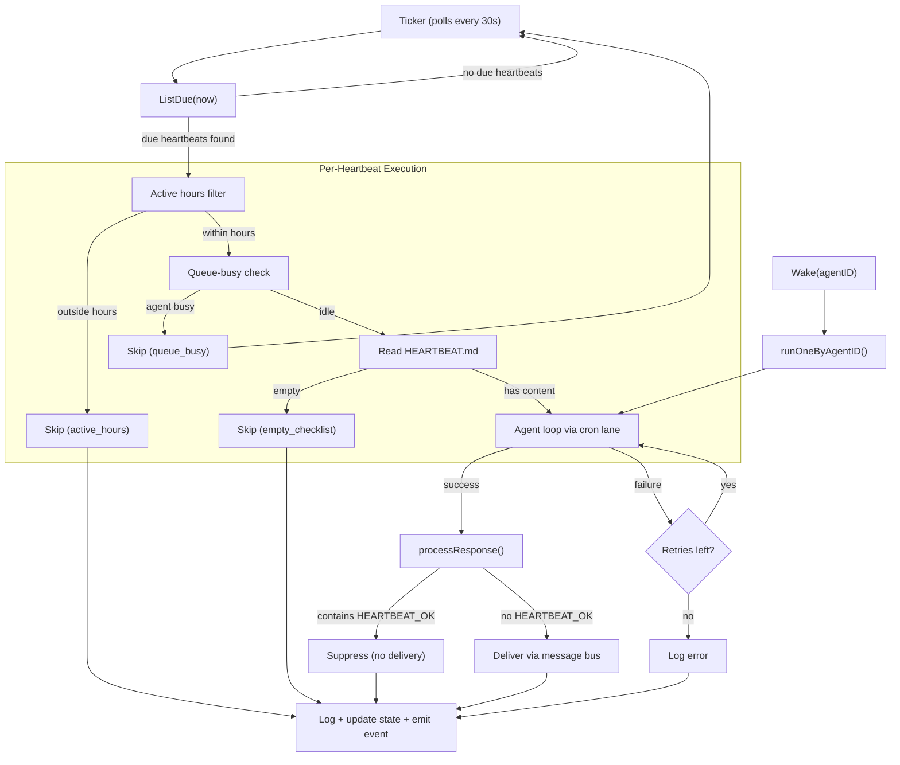

# 22 - Heartbeat System

Periodic agent check-in mechanism. Agents execute a HEARTBEAT.md checklist on a configurable schedule and deliver results to messaging channels — or suppress delivery when everything is fine.

> Heartbeat configs are stored in `agent_heartbeats`, execution logs in `heartbeat_run_logs`. Cache invalidation propagates via the `cache:heartbeat` event on the message bus.

### Not WebSocket Keep-Alive

The heartbeat system is an **application-level** feature — agents proactively run tasks on a timer. It has nothing to do with WebSocket ping/pong frames or connection liveness. The underlying `gorilla/websocket` library handles transport-level keep-alive separately.

---

## 1. Architecture



### Responsibilities

- **Ticker**: Background goroutine polling for due heartbeats, dispatching wake signals
- **Scheduler (cron lane)**: Isolates heartbeat runs from user chat sessions
- **Agent loop**: Executes the checklist as a normal agent turn with tools
- **Message bus**: Delivers results to Telegram/Discord/Feishu channels

---

## 2. Configuration

One heartbeat per agent (unique constraint on `agent_id`). Created via RPC `heartbeat.set` or the `heartbeat` agent tool.

| Field | Type | Default | Constraint | Description |
|-------|------|---------|------------|-------------|
| `enabled` | bool | `false` | — | Master on/off switch |
| `interval_sec` | int | 1800 | min 300 | Seconds between runs |
| `prompt` | string | null | — | Custom check-in prompt (default: "Execute your heartbeat checklist now.") |
| `provider_id` | UUID | null | FK `llm_providers` | LLM provider override |
| `model` | string | null | — | Model override for heartbeat runs |
| `isolated_session` | bool | `true` | — | Fresh session per run (cleanup after) |
| `light_context` | bool | `false` | — | Skip agent context files, only inject checklist |
| `ack_max_chars` | int | 300 | ≥ 0 | Reserved for future threshold logic |
| `max_retries` | int | 2 | 0–10 | Retry attempts on failure |
| `active_hours_start` | string | null | "HH:MM" | Active window start (null = 24/7) |
| `active_hours_end` | string | null | "HH:MM" | Active window end |
| `timezone` | string | null | IANA | Timezone for active hours (default: UTC) |
| `channel` | string | null | — | Delivery channel (telegram, discord, feishu) |
| `chat_id` | string | null | — | Delivery target chat/group ID |

---

## 3. Ticker Loop

The ticker is a background goroutine started at gateway boot and stopped on graceful shutdown.

```go
func (t *Ticker) loop() {
    ticker := time.NewTicker(30 * time.Second)
    for {
        select {
        case <-t.stopCh:       return
        case <-ticker.C:       t.runDueHeartbeats()
        case agentID := <-t.wakeCh:  go t.runOneByAgentID(agentID)
        }
    }
}
```

### Poll Cycle

1. `ListDue(now)` queries `agent_heartbeats WHERE enabled AND next_run_at <= now`
2. Due heartbeats run concurrently (each in its own goroutine)
3. After completion, `next_run_at` advances by `interval_sec`

### Wake Channel

A buffered channel (capacity 16) for on-demand runs. Sources:

| Source | Trigger |
|--------|---------|
| `heartbeat.test` RPC | User clicks "Test" in UI |
| Agent `heartbeat` tool | Agent calls `{"action":"test"}` |
| Cron wake | Cron job with `WakeHeartbeat: true` completes |

Non-blocking send — if the channel is full, the wake is silently dropped.

### Stagger Mechanism

Prevents thundering herd when multiple agents have the same interval. Uses FNV-1a hash of the agent UUID to produce a deterministic offset capped at 10% of `interval_sec`.

```
offset = FNV-1a(agentID) % (intervalSec / 10)
nextRunAt = now + intervalSec + offset     // initial enable only
```

Stagger is applied **only when first enabling** a heartbeat (via `heartbeat.set` RPC or agent tool). Subsequent runs advance `next_run_at` by `interval_sec` without stagger — spreading is a one-time effect.

Example: 30-minute interval → initial offsets spread across 0–180 seconds.

---

## 4. Execution Flow

Each heartbeat run follows this sequence:

| Step | Action | Skip Condition |
|------|--------|----------------|
| 1 | Active hours filter | Current time outside `active_hours_start`–`active_hours_end` in configured timezone |
| 2 | Queue-busy check | Agent has active sessions in the scheduler |
| 3 | Read HEARTBEAT.md | File empty or missing from `agent_context_files` |
| 4 | Emit `"running"` event | — |
| 5 | Build prompt + extra system instructions | — |
| 6 | Run agent loop via scheduler cron lane | — |
| 7 | Process response (suppress or deliver) | — |
| 8 | Log result + update state + emit event | — |

### Active Hours

Supports midnight wraparound (e.g. `22:00`–`06:00`). When `active_hours_start` and `active_hours_end` are both null, the heartbeat runs 24/7.

### Queue-Aware Skip

If an agent is busy (active chat sessions in the scheduler), the heartbeat is skipped **without advancing `next_run_at`** — it will be retried on the next 30-second poll. This prevents heartbeat runs from competing with user conversations.

### Session Key

```go
sessions.BuildHeartbeatSessionKey(agentID, isolatedSession)
```

When `isolated_session` is true (default), each run gets a unique session key. The session is deleted after completion since results are persisted in `heartbeat_run_logs`.

---

## 5. Retry

Exponential backoff on agent loop failure. Delay formula: `2^attempt` seconds (attempt is zero-indexed).

| Attempt | Delay Before | Notes |
|---------|-------------|-------|
| 1 | — | Immediate (first try) |
| 2 | 1s | `2^0 = 1s` |
| 3 | 2s | `2^1 = 2s` |

Total attempts = `max_retries + 1`. Default `max_retries=2` means 3 total attempts.

If all attempts fail, the run is logged with status `"error"` and `next_run_at` advances normally.

---

## 6. Suppression

The agent signals "all clear" by including `HEARTBEAT_OK` anywhere in its response. The ticker checks for this token after the agent loop completes.

```
Contains "HEARTBEAT_OK" → suppress (no delivery, status="suppressed")
No "HEARTBEAT_OK"       → deliver to channel (status="ok")
```

**When to use HEARTBEAT_OK**: Monitoring checks passed, no alerts, nothing to report. The system prompt explicitly instructs the agent:

> "Use HEARTBEAT_OK ONLY when there is nothing to deliver. Do NOT include HEARTBEAT_OK if the checklist asks you to send content."

Suppressed runs are counted separately (`suppress_count`) for monitoring the signal-to-noise ratio.

---

## 7. Delivery

When a response is not suppressed, it's published to the message bus for channel delivery.

```go
t.msgBus.PublishOutbound(bus.OutboundMessage{
    Channel: *hb.Channel,    // "telegram", "discord", "feishu"
    ChatID:  *hb.ChatID,     // target chat/group ID
    Content: cleaned,
})
```

**Delivery targets** are discovered via `heartbeat.targets` RPC, which lists distinct `(channel, chatID)` pairs from the agent's session history. The UI presents these as a dropdown for easy selection.

---

## 8. RPC Methods

All methods are registered under the `heartbeat.*` namespace on the WebSocket method router.

| Method | Params | Description |
|--------|--------|-------------|
| `heartbeat.get` | `agentId` | Fetch heartbeat config (returns null if not configured) |
| `heartbeat.set` | `agentId`, partial config fields | Create or update heartbeat config (upsert) |
| `heartbeat.toggle` | `agentId`, `enabled` | Enable/disable heartbeat |
| `heartbeat.test` | `agentId` | Trigger immediate run via wake channel |
| `heartbeat.logs` | `agentId`, `limit`, `offset` | Paginated run history |
| `heartbeat.checklist.get` | `agentId` | Read HEARTBEAT.md content |
| `heartbeat.checklist.set` | `agentId`, `content` | Write HEARTBEAT.md content |
| `heartbeat.targets` | `agentId` | List known delivery targets from session history |

### Validation Rules (heartbeat.set)

- `intervalSec` must be ≥ 300
- `ackMaxChars` must be ≥ 0
- `maxRetries` must be 0–10
- `providerName` is resolved to `provider_id` via `ProviderStore.GetProviderByName()`

---

## 9. Agent Tool

The `heartbeat` tool lets agents self-manage their heartbeat configuration during conversations.

| Action | Permission Required | Description |
|--------|:-------------------:|-------------|
| `status` | No | One-line status summary |
| `get` | No | Full JSON config |
| `set` | Yes | Create/update config |
| `toggle` | Yes | Enable/disable |
| `set_checklist` | Yes | Write HEARTBEAT.md |
| `get_checklist` | No | Read HEARTBEAT.md |
| `test` | No | Trigger immediate run |
| `logs` | No | View run history |

### Permission Model

Mutation actions (`set`, `toggle`, `set_checklist`) check the `agent_config_permissions` table:

1. Check deny list → allow list for `(agent_id, scope, "heartbeat", user_id)`
2. Fallback: allow if user is the agent owner
3. System context (cron, subagent) always allowed

### Auto-Fill Delivery

When `channel` and `chat_id` are not provided, the tool auto-fills from the current conversation context (`ToolChannelFromCtx`, `ToolChatIDFromCtx`).

---

## 10. Frontend Integration

### useAgentHeartbeat Hook

Central React hook managing all heartbeat UI state. Located at `ui/web/src/pages/agents/hooks/use-agent-heartbeat.ts`.

| Feature | Implementation |
|---------|---------------|
| Config fetch | `HEARTBEAT_GET` RPC on mount |
| Auto-polling | When `nextRunAt` expires, polls every 5s until backend updates |
| Delayed refresh | 2s delay after config changes for backend to compute `nextRunAt` |
| Toggle | `HEARTBEAT_TOGGLE` → delayed refresh |
| Update | `HEARTBEAT_SET` → delayed refresh |
| Test run | `HEARTBEAT_TEST` |
| Logs | `HEARTBEAT_LOGS` with pagination |
| Checklist | `HEARTBEAT_CHECKLIST_GET` / `HEARTBEAT_CHECKLIST_SET` |
| Targets | `HEARTBEAT_TARGETS` for delivery channel dropdown |

### UI Components

| Component | Location | Purpose |
|-----------|----------|---------|
| `overview-sections/heartbeat-card.tsx` | Agent overview tab | Status display with enable/disable toggle |
| `heartbeat-config-dialog.tsx` | Agent detail | Full settings dialog (interval, active hours, delivery, model) |
| `heartbeat-logs-dialog.tsx` | Agent detail | Run history viewer with status badges |

---

## 11. Event Broadcasting

Heartbeat lifecycle events are broadcast to all connected WebSocket clients.

```json
{
  "type": "event",
  "event": "heartbeat",
  "payload": {
    "action": "running",
    "agentId": "uuid",
    "agentKey": "my_agent",
    "status": "",
    "error": "",
    "reason": ""
  }
}
```

### Event Actions

| Action | When | Notable Fields |
|--------|------|----------------|
| `running` | Agent loop started | `agentId`, `agentKey` |
| `ok` | Completed and delivered | `status: "ok"` |
| `suppressed` | Completed with HEARTBEAT_OK | `status: "suppressed"` |
| `error` | All retries exhausted | `error: "..."` |
| `skipped` | Pre-execution filter hit | `reason: "active_hours"`, `"queue_busy"`, or `"empty_checklist"` |

---

## 12. Database Schema

### agent_heartbeats

One row per agent. Unique constraint on `agent_id`.

```sql
CREATE INDEX idx_heartbeats_due ON agent_heartbeats (next_run_at)
    WHERE enabled = true AND next_run_at IS NOT NULL;
```

The partial index makes `ListDue()` efficient — only scans enabled heartbeats with a scheduled next run.

### heartbeat_run_logs

Append-only execution log. Every run (including skips) is recorded.

| Index | Columns | Purpose |
|-------|---------|---------|
| `idx_hb_logs_heartbeat` | `(heartbeat_id, ran_at DESC)` | Logs per heartbeat config |
| `idx_hb_logs_agent` | `(agent_id, ran_at DESC)` | Logs per agent (survives config recreation) |

### Run Log Statuses

| Status | Meaning |
|--------|---------|
| `ok` | Executed and delivered to channel |
| `suppressed` | Executed, agent responded with HEARTBEAT_OK |
| `error` | All retry attempts failed |
| `skipped` | Pre-execution filter (with `skip_reason`) |

### agent_config_permissions

Shared permission table for heartbeat, cron, and other agent config mutations. Lookup index on `(agent_id, scope, config_type)`.

---

## 13. Heartbeat vs Cron

Both are periodic execution systems routed through the scheduler's cron lane, but they serve different purposes.

| Aspect | Heartbeat | Cron |
|--------|-----------|------|
| **Purpose** | Health monitoring + proactive check-in | General-purpose scheduled tasks |
| **Schedule types** | Fixed interval only (`interval_sec`) | `at` (one-shot), `every` (interval), `cron` (5-field expr) |
| **Minimum interval** | 300 seconds (5 minutes) | No minimum |
| **Poll interval** | 30 seconds | 1 second |
| **Checklist** | HEARTBEAT.md (agent context file) | User message stored in job |
| **Suppression** | `HEARTBEAT_OK` token suppresses delivery | No suppression — always delivers |
| **Delivery** | To configured channel/chatID | To originating session |
| **Session isolation** | Configurable (`isolated_session`, default true) | Uses existing session key |
| **Retry** | Exponential backoff (1s base, configurable max) | Exponential backoff (2s base, 30s max, with jitter) |
| **Max retries** | 0–10 (default 2) | 0–3 (default 3) |
| **Active hours** | Built-in (HH:MM range + timezone) | Not built-in |
| **Queue-aware** | Skips if agent is busy | Runs regardless |
| **Model override** | Per-heartbeat `provider_id` + `model` | Not configurable |
| **Light context** | Configurable (`light_context`) | Not configurable |
| **Stagger** | FNV-1a hash offset (10% of interval) | Not needed (cron expressions already distribute) |
| **DB tables** | `agent_heartbeats` + `heartbeat_run_logs` | `cron_jobs` + `cron_run_logs` |
| **Cardinality** | One per agent | Many per agent |
| **Agent tool** | `heartbeat` tool (self-manage) | `cron` tool (self-manage) |
| **RPC namespace** | `heartbeat.*` (8 methods) | `cron.*` (7 methods) |

### Shared Patterns

- Both use the **scheduler's cron lane** for execution isolation
- Both log runs to dedicated `*_run_logs` tables with status, duration, tokens
- Both support **exponential backoff** on failure
- Both emit **WebSocket events** for real-time UI updates
- Both have **agent-facing tools** for self-management
- Both support **cache invalidation** via the message bus

---

## File Reference

### Backend Core
| File | Description |
|------|-------------|
| `internal/heartbeat/ticker.go` | Ticker loop, execution flow, suppression, active hours, stagger |
| `internal/store/heartbeat_store.go` | Store interface, types (AgentHeartbeat, HeartbeatRunLog, HeartbeatEvent, DeliveryTarget), StaggerOffset |
| `internal/store/pg/heartbeat.go` | PostgreSQL implementation (Get, Upsert, ListDue, UpdateState, InsertLog, ListLogs, ListDeliveryTargets) |
| `internal/tools/heartbeat.go` | Agent-facing tool (8 actions, permission checks, auto-fill delivery) |
| `internal/gateway/methods/heartbeat.go` | RPC handlers (8 methods, validation, cache invalidation, audit) |

### Scheduler Integration
| File | Description |
|------|-------------|
| `cmd/gateway_heartbeat.go` | `makeHeartbeatRunFn` — routes heartbeat runs through scheduler cron lane |
| `cmd/gateway.go` | Ticker initialization, event callback wiring, shutdown |
| `cmd/gateway_methods.go` | RPC method registration |
| `cmd/gateway_cron.go` | Cron wake integration (`WakeHeartbeat` flag) |

### Database
| File | Description |
|------|-------------|
| `migrations/000022_agent_heartbeats.up.sql` | Schema: `agent_heartbeats`, `heartbeat_run_logs`, `agent_config_permissions` |
| `migrations/000022_agent_heartbeats.down.sql` | Rollback |

### Protocol
| File | Description |
|------|-------------|
| `pkg/protocol/methods.go` | RPC method constants (`MethodHeartbeatGet`, etc.) |
| `pkg/protocol/events.go` | `EventHeartbeat = "heartbeat"` |

### Frontend
| File | Description |
|------|-------------|
| `ui/web/src/pages/agents/hooks/use-agent-heartbeat.ts` | React hook (config, polling, CRUD, logs, targets) |
| `ui/web/src/pages/agents/agent-detail/heartbeat-config-dialog.tsx` | Settings dialog |
| `ui/web/src/pages/agents/agent-detail/heartbeat-logs-dialog.tsx` | Run history viewer |
| `ui/web/src/pages/agents/agent-detail/overview-sections/heartbeat-card.tsx` | Status display card |
| `ui/web/src/api/protocol.ts` | RPC + event constants |

---

## Cross-References

| Document | Relevant Content |
|----------|-----------------|
| [00-architecture-overview.md](./00-architecture-overview.md) | Gateway startup sequence, component wiring |
| [01-agent-loop.md](./01-agent-loop.md) | RunRequest/RunResult, agent execution model |
| [04-gateway-protocol.md](./04-gateway-protocol.md) | WebSocket frame types, event broadcasting |
| [06-store-data-model.md](./06-store-data-model.md) | agent_heartbeats, heartbeat_run_logs tables |
| [08-scheduling-cron.md](./08-scheduling-cron.md) | Scheduler lanes, cron lane, session queues |
