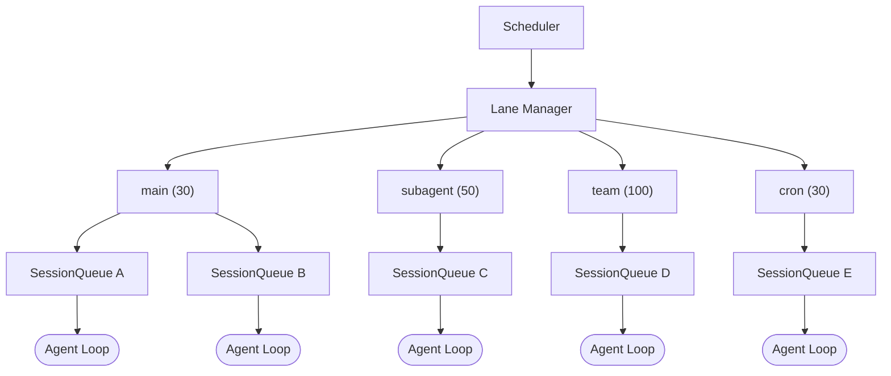
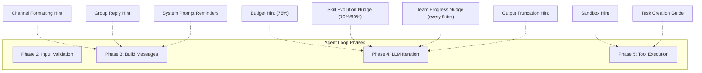
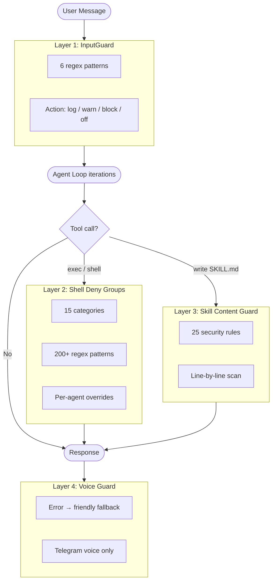
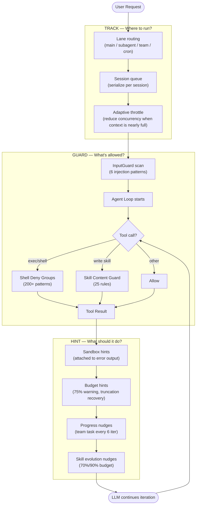

# Model Steering System — Track, Hint & Guard

> How GoClaw steers and assists small models (MiniMax, Qwen, Gemini Flash...) through 3 control layers.

---

## 1. Overview

Small models (< 70B params) commonly face 3 issues when running agent loops:

| Problem | Symptom |
|---------|---------|
| **Losing direction** | Uses up iteration budget without answering, loops meaningless tool calls |
| **Forgetting context** | Doesn't report progress, doesn't leverage existing information |
| **Safety violations** | Runs dangerous commands, falls to prompt injection, writes malicious code |

GoClaw addresses these with **3 steering layers** operating concurrently:

```mermaid
flowchart LR
    REQ([Request]) --> TRACK

    subgraph TRACK["Track — Where to run?"]
        direction TB
        T1[Lane routing]
        T2[Concurrency control]
        T3[Session serialization]
    end

    TRACK --> GUARD

    subgraph GUARD["Guard — What's allowed?"]
        direction TB
        G1[Input validation]
        G2[Shell deny patterns]
        G3[Skill content scan]
    end

    GUARD --> HINT

    subgraph HINT["Hint — What should it do?"]
        direction TB
        H1[Budget warnings]
        H2[Error guidance]
        H3[Progress nudges]
    end

    HINT --> LOOP([Agent Loop])
```

**Design principles:**
- **Track** = infrastructure — the model doesn't know which lane it's running on
- **Guard** = hard boundary — blocks dangerous behavior regardless of model
- **Hint** = soft guidance — suggests via messages, model can ignore (but usually doesn't)

---

## 2. Track System (Lane-based Scheduling)

Track routes requests by work type. Each lane has its own concurrency, ensuring workloads don't contend for resources.

### 2.1 Lane Architecture

### 2.2 Lane Assignment

| Lane | Concurrency | Request Source | Purpose |
|------|:-----------:|---------------|---------|
| `main` | 30 | User chat via WS/channel | Primary conversation sessions |
| `subagent` | 50 | Subagent announce | Child agents spawned by main |
| `team` | 100 | Team task dispatch | Members in agent teams |
| `cron` | 30 | Cron scheduler | Scheduled periodic jobs |

Lane assignment is **deterministic** — based on request type, not agent config.

### 2.3 Per-session Queue

Each session within a lane has its own queue:
- **DM**: `maxConcurrent = 1` — serial, no overlap
- **Group**: `maxConcurrent = 3` — allows parallel replies
- **Adaptive throttle**: When session history > 60% context window → reduces to 1

This prevents small models from overwhelming themselves when context is nearly full.

### 2.4 Reference Keywords

`Scheduler`, `LaneManager`, `Lane`, `SessionQueue`, `LaneMain`, `LaneSubagent`, `LaneTeam`, `LaneCron`, `DefaultLanes()`, `ScheduleWithOpts()`

---

## 3. Hint System (Contextual Guidance Injection)

Hints are **messages injected into the conversation** at strategic moments during the agent loop. Small models especially need hints because they tend to forget initial instructions as conversations grow long.

### 3.1 Overview of 8 Hint Types

### 3.2 Detailed Breakdown

#### A. Budget Hints — Preventing Directionless Looping

When the model uses up its iteration budget without answering the user:

| Trigger | Message (summary) |
|---------|-------------------|
| 75% iterations used, no text response yet | "You've used 75% of your budget. Start synthesizing results." |
| Max iterations reached | Loop stops, returns final result |

Especially effective with small models — instead of letting them loop indefinitely, forces early summarization.

#### B. Output Truncation Hints — Error Recovery

When LLM response is cut off due to `max_tokens`:

> "[System] Output was truncated. Tool call arguments are incomplete. Retry with shorter content — split writes or reduce text."

Small models often don't recognize their output was truncated. This hint helps them understand the cause and adjust.

#### C. Skill Evolution Nudges — Encouraging Self-Improvement

| Trigger | Content |
|---------|---------|
| 70% iteration budget | Suggests creating a skill to reuse the workflow |
| 90% iteration budget | Stronger reminder about skill creation |

Characteristics: **i18n** (en/vi/zh), **ephemeral** (only exists in current run, not persisted to session).

#### D. Team Task Progress Nudges — Progress Reporting Reminders

Every 6 iterations when the agent is working on a team task:

> "[System] You're at iteration 12/20 (~60% budget) for task #3: 'Implement auth module'. Report progress now: `team_tasks(action="progress", percent=60, text="...")`"

Small models tend to forget progress reporting → lead agent doesn't know the status → causes bottlenecks. This hint addresses it directly.

#### E. Sandbox Hints — Explaining Environment Errors

When a command running in a Docker sandbox encounters an error, hints are **attached directly to the error output**:

| Error Pattern | Hint |
|---------------|------|
| Exit code 127 / "command not found" | Binary not installed in sandbox image |
| "permission denied" / EACCES | Workspace mounted read-only |
| "network is unreachable" / DNS fail | `--network none` is enabled |
| "read-only file system" / EROFS | Writing outside workspace volume |
| "no space left" / ENOSPC | Disk/memory exhausted in container |
| "no such file" | File doesn't exist in sandbox |

Priority-based: checks exit code 127 first, then pattern matches in priority order.

#### F. Channel Formatting Hints — Platform-Specific

Injected into system prompt based on channel type:
- **Zalo**: "Use plain text, no markdown, no HTML"
- **Group chat**: Instructions on using `NO_REPLY` token when a message doesn't need a response

#### G. Task Creation Guidance — Guiding Task Creation

When the model lists/searches team tasks, the response includes:
- List of members + their models
- 4 rules: self-contained descriptions, split complex tasks, match complexity to model strength, ensure independence

Especially useful for small models (MiniMax, Qwen) acting as lead agents — they tend to create vague tasks or misassign complexity.

#### H. System Prompt Reminders — Recency Zone Reinforcement

Injected at the end of the system prompt (recency zone — where the model pays the most attention):
- Remind to search memory before answering
- Reinforce persona/character if agent has custom identity
- Bootstrap onboarding nudges for new users

### 3.3 Summary Table

| Hint | Trigger | Ephemeral? | Injection Point |
|------|---------|:----------:|-----------------|
| Budget 75% | iteration == max*3/4, no text yet | Yes | Message list (Phase 4) |
| Output Truncation | `finish_reason == "length"` | Yes | Message list (Phase 4) |
| Skill Nudge 70% | iteration/max >= 0.70 | Yes | Message list (Phase 4) |
| Skill Nudge 90% | iteration/max >= 0.90 | Yes | Message list (Phase 4) |
| Team Progress | iteration % 6 == 0, has TeamTaskID | Yes | Message list (Phase 4) |
| Sandbox Error | Pattern match on stderr/exit code | No | Tool result suffix (Phase 5) |
| Channel Format | Channel type == "zalo" etc. | No | System prompt (Phase 3) |
| Group Reply | PeerKind == "group" | No | System prompt (Phase 3) |
| Task Creation | team_tasks list/search response | No | Tool result JSON (Phase 5) |
| Memory/Persona | Config flags | No | System prompt (Phase 3) |

---

## 4. Guard System (Safety Boundaries)

Guards create **hard boundaries** — they don't depend on model compliance. Even though small models are more susceptible to prompt injection, guards ensure dangerous behavior is blocked at the infrastructure level.

### 4.1 4-Layer Guard Architecture

### 4.2 Layer 1: InputGuard — Prompt Injection Detection

Scans **every user message** before it enters the agent loop.

| Pattern | Detects |
|---------|---------|
| `ignore_instructions` | "Ignore all previous instructions..." |
| `role_override` | "You are now a...", "Pretend you are..." |
| `system_tags` | `<system>`, `[SYSTEM]`, `[INST]`, `<<SYS>>`, `<\|im_start\|>system` |
| `instruction_injection` | "New instructions:", "Override:", "System prompt:" |
| `null_bytes` | `\x00` characters (null byte injection) |
| `delimiter_escape` | "End of system", `</instructions>`, `</prompt>` |

**4 action modes** (config `gateway.injection_action`):
- `log` — logs info, doesn't block
- `warn` — logs warning (default)
- `block` — rejects message, returns error
- `off` — disables scanning

**Scans at 3 points:**
1. Incoming user message (Phase 2)
2. Mid-run injected messages (`processInjectedMessage`)
3. Results from `web_fetch` / `web_search` (tool result scan)

Small models are more susceptible to injection than large models → InputGuard plays a more critical role with small models.

### 4.3 Layer 2: Shell Deny Groups — Command Safety

15 deny groups, all **ON by default** — admin must explicitly allow.

| Group | Example Patterns |
|-------|-----------------|
| `destructive_ops` | `rm -rf`, `mkfs`, `dd if=`, `shutdown`, fork bomb |
| `data_exfiltration` | `curl \| sh`, `wget POST`, DNS lookup, `/dev/tcp/` |
| `reverse_shell` | `nc`, `socat`, `openssl s_client`, Python/Perl socket |
| `code_injection` | `eval $()`, `base64 -d \| sh` |
| `privilege_escalation` | `sudo`, `su`, `doas`, `pkexec`, `runuser`, `nsenter` |
| `dangerous_paths` | `chmod`/`chown` on system paths |
| `env_injection` | `LD_PRELOAD`, `BASH_ENV`, `GIT_EXTERNAL_DIFF` |
| `container_escape` | Docker socket, `/proc/sys/`, `/sys/` |
| `crypto_mining` | `xmrig`, `cpuminer`, `stratum+tcp://` |
| `filter_bypass` | `sed -e`, `git --exec`, `rg --pre` |
| `network_recon` | `nmap`, `ssh`/`scp`/`sftp`, tunneling |
| `package_install` | `pip install`, `npm install`, `apk add` |
| `persistence` | `crontab`, shell RC file writes |
| `process_control` | `kill -9`, `killall`, `pkill` |
| `env_dump` | `env`, `printenv`, `/proc/*/environ`, `GOCLAW_*` |

**Special case:** `package_install` → approval flow (not hard deny), all others → hard block.

**Per-agent override:** Admin can allow specific groups for specific agents via DB config.

### 4.4 Layer 3: Skill Content Guard

Scans **SKILL.md content** before writing the file. 25 regex rules detect:
- Shell injection & destructive ops
- Code obfuscation (`base64 -d`, `eval`, `curl | sh`)
- Credential theft (`/etc/passwd`, `.ssh/id_rsa`, `AWS_SECRET_ACCESS_KEY`)
- Path traversal (`../../..`)
- SQL injection (`DROP TABLE`, `TRUNCATE`)
- Privilege escalation (`sudo`, `chmod 777`)

**Hard reject** — any violation → file is not written.

### 4.5 Layer 4: Voice Guard

Specialized for Telegram voice agents:
- When voice/audio processing encounters technical errors
- Replaces error messages with friendly fallback for end users
- Not a security guard — it's a UX guard

### 4.6 Summary Table

| Guard | Scope | Default Action | Configurable? |
|-------|-------|:--------------:|:-------------:|
| InputGuard | All user messages + injected + tool results | warn | Yes (log/warn/block/off) |
| Shell Deny | All `exec`/`shell` tool calls | hard block | Yes (per-agent group override) |
| Skill Content | SKILL.md file writes | hard reject | No |
| Voice Guard | Telegram voice error replies | friendly fallback | No |

---

## 5. How the 3 Systems Work Together

### Role Summary

| Layer | Question | Mechanism | Nature |
|-------|----------|-----------|--------|
| **Track** | Where to run? | Lane + Queue + Semaphore | Infrastructure, invisible to model |
| **Guard** | What's allowed? | Regex pattern matching, hard deny | Security boundary, model-agnostic |
| **Hint** | What should it do? | Message injection into conversation | Soft guidance, model can ignore |

### Why 3 Layers Instead of 1?

- **Track** doesn't depend on the model — operates at the scheduler level
- **Guard** doesn't trust the model — blocks dangerous behavior regardless of instructions
- **Hint** collaborates with the model — provides context that small models lack

When using large models (Claude, GPT-4): Guard is still needed, Hint is less critical.
When using small models (MiniMax, Qwen, Gemini Flash): all 3 layers are critical.

---

## Reference Keywords

| Keyword | File/Package |
|---------|-------------|
| `Scheduler`, `LaneManager`, `Lane` | `internal/scheduler/` |
| `SessionQueue`, `DefaultLanes()` | `internal/scheduler/lanes.go`, `queue.go` |
| `InputGuard`, `Scan()`, `guardPattern` | `internal/agent/input_guard.go` |
| `DenyGroupRegistry`, `DenyGroup` | `internal/tools/shell_deny_groups.go` |
| `GuardSkillContent()`, `GuardViolation` | `internal/skills/guard.go` |
| `MaybeSandboxHint()`, `MaybeFsBridgeHint()` | `internal/tools/sandbox_hints.go` |
| `buildChannelFormattingHint()` | `internal/agent/systemprompt_sections.go` |
| `buildCreateHint()` | `internal/tools/team_tasks_read.go` |
| `IsSilentReply()` (NO_REPLY) | `internal/agent/sanitize.go` |
| `i18n.MsgSkillNudge70Pct` / `90Pct` | `internal/i18n/` |
| `WithIterationProgress()` | `internal/tools/` |
